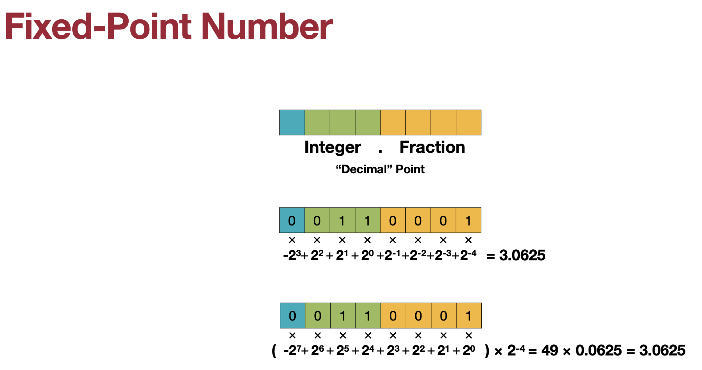
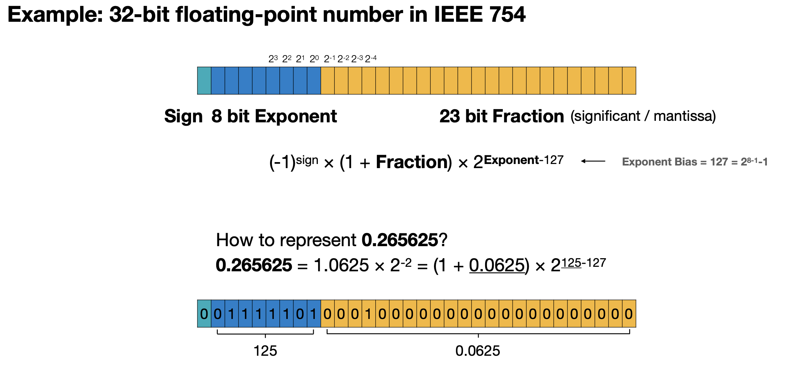
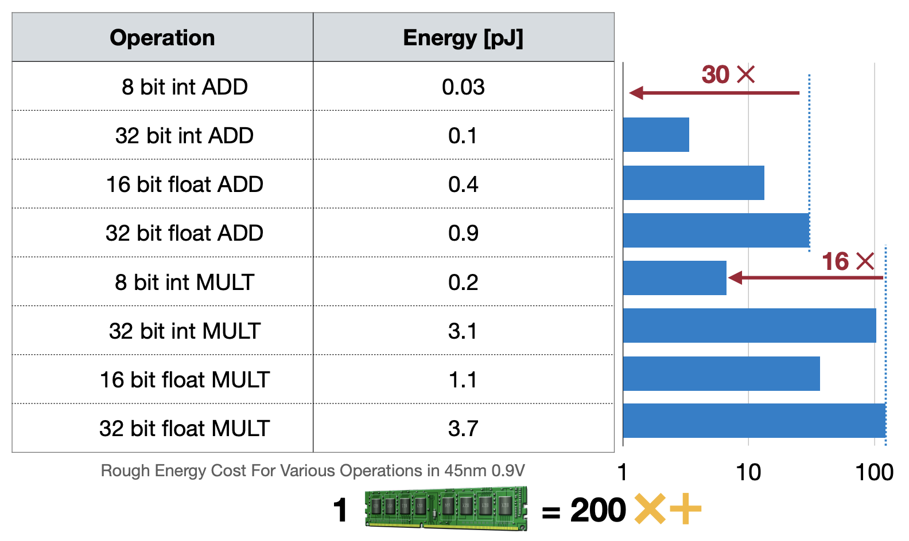

# 1. 量化(Quantification)章节说明

整体暂定三～四个章节

## 1.0 前置知识学习：

## 1.1：我们为什么需要量化（Why）
为什么要做量化（量化的意义是什么），然后讲量化的基本原理是什么，以及量化的分类（PTQ和QAT，weight-only 和 weight-act），原理讲解+基本原理代码，

## 1.2：经典的量化方法（How-part1:PTQ）
第二章讲经典的PTQ量化LLM.int8，SQ，GPTQ（涵盖weight-only 和 weight-act）-方式：原理讲解+代码，

## 1.3：经典的量化方法（How-part2:QAT）
第三章讲经典QAT的LLM-QAT，OQ（涵盖weight-only 和 weight-act）-方式：原理讲解+代码，

## 1.4：量化的前沿方法
第四章讲一些相关量化方面的前沿工作，总结和扩展。（总结+扩展文献）

欢迎👏有兴趣的小伙伴和我沟通交流哦（特别是有相关基础的，或者对相关方面有了解并且有较长时间学习的小伙伴（需要总结和学习以及根据相关代码复现量化流程））。

---
## 1.0 前置知识学习：

### 1.0.1 数值类型
本文旨在深入探讨LLM（Large Language Models，大型语言模型）在训练和推理过程中所使用的三种不同精度格式：FP16（Half-precision floating-point，半精度浮点数）、BF16（Brain Floating-point，脑浮点数）和FP32（Single-precision floating-point，单精度浮点数）。这些精度格式在数值表示、计算效率、显存占用以及模型性能等方面各有优劣。通过PyTorch的演示，我们将直观展示这些精度的实际应用和转换方法，帮助读者更好地理解并选择合适的精度格式以优化LLM的训练和推理过程。

由于模型量化涉及计算机的数值存储知识，所以我们首先要知道计算机中的数值类型，接下来就带大家回顾一下相关知识：

大家了解图像中的像素值吗？像素值由0～255表示，0表示黑色，255表示白色，中间的数值表示灰度值，灰度值越大，颜色越浅，灰度值越小，颜色越深。
为什么像素值是0～255呢？
这是由于计算机中存储的数值是二进制，二进制由0和1组成，而计算的单位是字节，一个字节由8个二进制位组成，而0和1可以表示为2的幂次方，所以0～255是 $\sum_{i=0}^{7} 0\cdot2^i$ 到 $\sum_{i=0}^{7} 1\cdot2^i$，即0～255。所以一个字节可以表示0～255的数值。

那么接下来我们简单回顾一下计算机的数值类型，这会在接下来的知识中用到：

首先是整数：

整数是由符号位和数值位组成的，符号位表示正负，数值位表示数值的大小。

浮点数：

浮点数是由符号位、指数位和尾数位组成的，符号位表示正负，指数位表示数值的大小，尾数位表示数值的精度。

这是一个32-bit（也就是4字节）的浮点数规定（IEEE 754）


---

#### 1）FP32

FP32，即float32，是单精度浮点数，使用32位二进制表示。其结构包括1位符号位、8位指数位和23位尾数位，尾数位隐含了首位的1，实际精度为24位。

**特点与应用**：

- **优点**：FP32提供了较高的精度和较大的数值表示范围，适合对数值精度要求较高的应用场景，如科学计算和精确求解。
- **缺点**：显存占用较大，计算速度相对较慢，不适合大规模并行计算。

**PyTorch演示**：

```python
# 获取FP32的信息
finfo_fp32 = torch.finfo(torch.float32)
print(finfo_fp32)

# FP32转换（通常默认为FP32，无需显式转换）
num_fp32 = torch.tensor(num)  # 默认dtype为torch.float32
print(num_fp32)  # 结果保持高精度
```

**显存占用与精度转换**：

- **显存占用**：FP32的显存占用是FP16和BF16的两倍。
- **精度转换**：在PyTorch中，FP32与FP16、BF16之间的转换可通过`.to()`方法指定dtype实现。

---

#### 2）FP16

FP16，即float16，是半精度浮点数，使用16位二进制表示。其结构包括1位符号位、5位指数位和10位尾数位。FP16的指数位通过引入偏置值15来表示范围从-14到+15的整数部分，尾数位隐含了首位的1，因此实际精度为11位。

**特点与应用**：

- **优点**：FP16显著减少了显存占用，加快了计算速度，适合在GPU上进行大规模并行计算。
- **缺点**：由于精度较低，可能导致数值溢出或下溢，影响模型训练的稳定性和准确性。

**PyTorch演示**：

```python
import torch

# 获取FP16的信息
finfo_fp16 = torch.finfo(torch.float16)
print(finfo_fp16)

# 转换示例
num = 3.14159
num_fp16 = torch.tensor(num, dtype=torch.float16)
print(num_fp16)  # 结果可能显示为3.1406，因精度限制
```

**显存占用与精度转换**：

- **显存占用**：FP16相比FP32减少了一半的显存需求。
- **精度转换**：在PyTorch中，可以使用`.to(torch.float16)`或`.half()`方法将张量转换为FP16格式，反之使用`.to(torch.float32)`或`.float()`转换为FP32。

---

#### 3）BF16

BF16，即bfloat16，是一种专为深度学习设计的浮点数格式，同样使用16位二进制表示。其结构包括1位符号位、8位指数位和7位尾数位，尾数位同样隐含了首位的1，实际精度为8位。

**特点与应用**：

- **优点**：BF16在保持较低显存占用的同时，通过增加指数位的宽度，扩大了数值表示范围，有效减少了数值溢出问题，适合深度学习中的梯度累积和反向传播。
- **缺点**：相比FP16，BF16的尾数位宽度减少，导致精度有所下降。

**PyTorch演示**：

```python
# 获取BF16的信息（注意：BF16在某些PyTorch版本中可能需要额外安装或配置）
finfo_bf16 = torch.finfo(torch.bfloat16)
print(finfo_bf16)

# 转换示例
num_bf16 = torch.tensor(num, dtype=torch.bfloat16)
print(num_bf16)  # 结果可能显示为3.142（因精度和舍入策略而异）
```

**显存占用与精度转换**：

- **显存占用**：与FP16相同，BF16也减少了一半的显存需求。
- **精度转换**：在PyTorch中，BF16的转换方法与FP16类似，使用`.to(torch.bfloat16)`或`.bfloat16()`进行转换。

---

在LLM的训练和推理过程中，选择合适的精度格式对于平衡模型性能、显存占用和计算效率至关重要。FP16和BF16通过减少显存占用和加速计算，有助于在大规模模型训练中提高效率；而FP32则因其高精度，更适合对数值精度要求较高的场景。在实际应用中，可以根据模型的具体需求、硬件条件以及训练策略来灵活选择和使用这些精度格式，下图是不同精度下能耗的估计。



