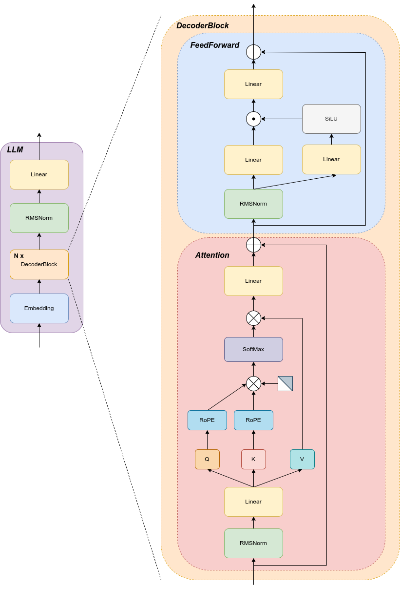
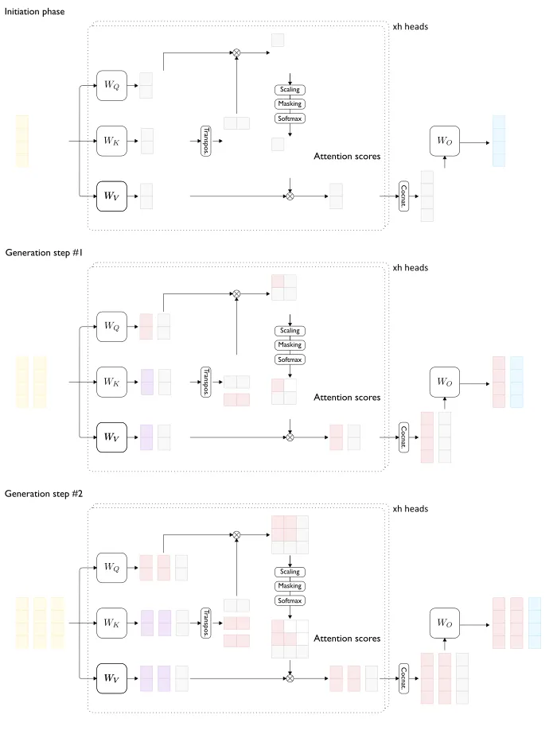

# 10.1 KV-Cache
随着大模型技术的快速发展与火爆，近两年也诞生出了众多针对大模型推理优化的技术，在大模型广泛应用的今天，这些技术已十分成熟与普及，本文也将介绍一些常见的，已成为大模型推理标配的推理技术。

现在的大模型架构大多数是基于 Transformer 架构，并且是仅使用解码器，即 Decoder-Only Transformer 架构，故本文将针对此种模型架构所使用的显存优化技术 KV-Cache 进行阐述。

## 1. 引言

KV Cache 是针对 Transformer Decoder 在解码过程中产生的计算复杂度以及重复计算问题而提出的一种算法，该算法对大模型的推理性能进行了优化，并且不影响任何计算精度，是一种典型的以空间换时间的算法。

## 2. Decoder 架构与 KV Cache




Decoder-Only 架构的模型是只取用了 Transformer 模型的 Decoder（解码器）部分，这是一种自回归模型。对于给定的输入文本，模型经过一系列的推理，会输出相应的回答，在模型推理的过程中，实际上进行了与输出长度相等的推理过程，也就是说，模型每次推理仅输出一个 token ，此后这个输出的 token 会与输入的 token 进行拼接然后再次输入模型进行下一次的推理，如此循环直至输出终止符。



如上图所示，模型的推理过程是逐 token 推理，这样就导致了一个问题，每次推理都会重复计算上一次推理所计算过的部分参数，因而导致计算推理速度变慢，难以满足生产要求。在此背景下，  KV Cache 应运而生，在一定程度上解决了推理速度慢的问题。


## 3. Attention 计算与 KV Cache 方法

大模型架构中的核心算法之一为注意力机制(Attention)，Attention 具体计算公式如下：
$$
Attention(Q, K, V) = Softmax(\frac{QK^T}{\sqrt{d_k}})V
\\
Q = XW_q， K = XW_k，V=XW_v
$$
在大模型架构中的 Attention 算法还采用了 Mask 机制，使模型只能“向左看”，由此，我们可以计算每一步推理 Attention 的过程，并能借此得出计算中冗余的部分。在大模型推理前，需要将输入的句子变为向量的形式，句子经过分词后转化为 token ，每个 token 会对应一个词向量，则一个句子（batch_size=1）经向量化后得到 shape 为 (1, sentence_len, hidden_size) 的向量，那么每一步的 Attention 计算如下（只取某一层进行计算）：
$$
Att_{step1}(Q,K,V) = softmax(Q_1K_1^T)\vec{V_1} = softmaxed(Q_1K_1^T)\vec{V_1}
$$

$$
Att_{step2}(Q, K, V) = \operatorname{softmax}\left(\begin{bmatrix}
Q_1K_1^T & -\infty \\
Q_2K_1^T & Q_2K_2^T
\end{bmatrix}\right) \begin{bmatrix}
\vec{V_1} \\
\vec{V_2}
\end{bmatrix}
\\

= \begin{bmatrix}
\operatorname{softmaxed}(Q_1K_1^T) & \operatorname{softmaxed}(-\infty) \\
\operatorname{softmaxed}(Q_2K_1^T) & \operatorname{softmaxed}(Q_2K_2^T)
\end{bmatrix} \begin{bmatrix}
\vec{V_1} \\
\vec{V_2}
\end{bmatrix}
\\

= \begin{bmatrix}
\operatorname{softmaxed}(Q_1K_1^T) & 0 \\
\operatorname{softmaxed}(Q_2K_1^T) & \operatorname{softmaxed}(Q_2K_2^T)
\end{bmatrix} \begin{bmatrix}
\vec{V_1} \\
\vec{V_2}
\end{bmatrix}
\\

= \begin{pmatrix}
\operatorname{softmaxed}(Q_1K_1^T) \times \vec{V_1} + 0 \times \vec{V_2} \\
\operatorname{softmaxed}(Q_2K_1^T) \times \vec{V_1} + \operatorname{softmaxed}(Q_2K_2^T) \times \vec{V_2}
\end{pmatrix}
\\

= \begin{pmatrix}
\operatorname{softmaxed}(Q_1K_1^T) \times \vec{V_1} \\
\operatorname{softmaxed}(Q_2K_1^T) \times \vec{V_1} + \operatorname{softmaxed}(Q_2K_2^T) \times \vec{V_2}
\end{pmatrix}
$$

$$
Att_{step3}(Q, K, V) = \operatorname{softmax}\left(\begin{bmatrix}
Q_1K_1^T & -\infty & -\infty \\
Q_2K_1^T & Q_2K_2^T & -\infty \\
Q_3K_1^T & Q_3K_2^T & Q_3K_3^T
\end{bmatrix}\right) \begin{bmatrix}
\vec{V_1} \\
\vec{V_2} \\
\vec{V_3}
\end{bmatrix}
\\

= \begin{bmatrix}
\operatorname{softmaxed}(Q_1K_1^T) & \operatorname{softmaxed}(-\infty) & \operatorname{softmaxed}(-\infty) \\
\operatorname{softmaxed}(Q_2K_1^T) & \operatorname{softmaxed}(Q_2K_2^T) & \operatorname{softmaxed}(-\infty) \\
\operatorname{softmaxed}(Q_3K_1^T) & \operatorname{softmaxed}(Q_3K_2^T) & \operatorname{softmaxed}(Q_3K_3^T)
\end{bmatrix} \begin{bmatrix}
\vec{V_1} \\
\vec{V_2} \\
\vec{V_3}
\end{bmatrix}
\\

= \begin{bmatrix}
\operatorname{softmaxed}(Q_1K_1^T) & 0 & 0 \\
\operatorname{softmaxed}(Q_2K_1^T) & \operatorname{softmaxed}(Q_2K_2^T) & 0 \\
\operatorname{softmaxed}(Q_3K_1^T) & \operatorname{softmaxed}(Q_3K_2^T) & \operatorname{softmaxed}(Q_3K_3^T)
\end{bmatrix} \begin{bmatrix}
\vec{V_1} \\
\vec{V_2} \\
\vec{V_3}
\end{bmatrix}
\\

= \begin{pmatrix}
\operatorname{softmaxed}(Q_1K_1^T) \times \vec{V_1} \\
\operatorname{softmaxed}(Q_2K_1^T) \times \vec{V_1} + \operatorname{softmaxed}(Q_2K_2^T) \times \vec{V_2} \\
\operatorname{softmaxed}(Q_3K_1^T) \times \vec{V_1} + \operatorname{softmaxed}(Q_3K_2^T) \times \vec{V_2} + \operatorname{softmaxed}(Q_3K_3^T) \times \vec{V_3}
\end{pmatrix}
\\
...
$$

由上述推导可以看出，第n步推理所得的计算结果中第1—(n-1)行的结果为第n-1步的计算结果，同时$V_n$参与的计算也仅与$Q_n$有关。这也就说明了在大模型推理的过程中产生了冗余计算，会导致推理速度变得很慢。

针对以上的推导与说明，可以得出几点结论：

- 在注意力机制的计算过程中，会有大量的冗余计算，即每在生成新的 token 时都会重新计算一次之前已经计算过的 KV 值。
- 每次推理过程中的 $Att_n(Q, K, V)$没有重复计算的值为当前的查询向量$Q_n$，同时与之对应的$V_n$参与的计算也与$Q_n$有关。
- 因此，我们可以在每一步推理生成时仅根据当前的查询向量$Q_n$计算出$Att_n(Q, K, V)$即可，$Att_1——Att_{n-1}$已经在之前的推理过程中计算过了，与此同时，每一步的$KV$值也是参与了运算的，我们将其缓存起来，这就是 KV Cache 的基本原理。


## 4. KV Cache 的步骤

现如今的大模型基本上都带有 KV Cache 技术，大模型推理的过程通常可以分为两个阶段：**Prefill(预填充)和Decode(解码)**。

### 4.1 Prefill

在预填充阶段，模型会将我们输入的 prompt 整个进行 forward 计算，在此过程中，prompt 向量化得到的向量与 $W_k, W_v$ 计算得到的 $K, V$ 保存在 cache_k 与 cache_v 中。在后面推理生成 token 计算 $Attention$ 的过程中可以直接进行运用而不用重复计算，以此达到节省时间的目的。

### 4.2 Decode

Decode 解码阶段是模型生成回答的阶段，再次阶段，模型会根据 Prefill 阶段的结果逐 token 进行生成。由于我们采用了 KV Cache 策略，在生成过程中每进行一次 decode 过程，生成的 response token 的 KV 值就会被缓存起来，进入 cache ，以此达到加速计算的目的。由于 Decode 阶段是采用的逐 token 生成，所以一般来说此阶段在大模型推理中耗时更多。


## 5. KV Cache 的实现

在 transformers 中提供了 KV Cache 的实现，这里以 Llama 的为例：

```python
class LlamaAttention(nn.Module):
    ...
    def forward(
        self,
        hidden_states: torch.Tensor,
        attention_mask: Optional[torch.Tensor] = None,
        position_ids: Optional[torch.LongTensor] = None,
        past_key_value: Optional[Cache] = None,
        output_attentions: bool = False,
        use_cache: bool = False,
        cache_position: Optional[torch.LongTensor] = None,
        position_embeddings: Optional[Tuple[torch.Tensor, torch.Tensor]] = None,  # will become mandatory in v4.46
        **kwargs,
    ) -> Tuple[torch.Tensor, Optional[torch.Tensor], Optional[Tuple[torch.Tensor]]]:
        ...

        if position_embeddings is None:
            logger.warning_once(
                "The attention layers in this model are transitioning from computing the RoPE embeddings internally "
                "through `position_ids` (2D tensor with the indexes of the tokens), to using externally computed "
                "`position_embeddings` (Tuple of tensors, containing cos and sin). In v4.46 `position_ids` will be "
                "removed and `position_embeddings` will be mandatory."
            )
            cos, sin = self.rotary_emb(value_states, position_ids)
        else:
            cos, sin = position_embeddings
        query_states, key_states = apply_rotary_pos_emb(query_states, key_states, cos, sin)

        if past_key_value is not None:
            # sin and cos are specific to RoPE models; cache_position needed for the static cache
            cache_kwargs = {"sin": sin, "cos": cos, "cache_position": cache_position}
            key_states, value_states = past_key_value.update(key_states, value_states, self.layer_idx, cache_kwargs)

        key_states = repeat_kv(key_states, self.num_key_value_groups)
        value_states = repeat_kv(value_states, self.num_key_value_groups)
        attn_weights = torch.matmul(query_states, key_states.transpose(2, 3)) / math.sqrt(self.head_dim)

        ...
        return attn_output, attn_weights, past_key_value

```

transformers 库不仅在模型中实现了 KV Cache ，同时也对 Cache 进行了抽象，实现了各种功能的 Cache，以下是一个示例：

```python
class Cache(torch.nn.Module):
    """
    Base, abstract class for all caches. The actual data structure is specific to each subclass.
    """

    def __init__(self):
        super().__init__()

    def update(
        self,
        key_states: torch.Tensor,
        value_states: torch.Tensor,
        layer_idx: int,
        cache_kwargs: Optional[Dict[str, Any]] = None,
    ) -> Tuple[torch.Tensor, torch.Tensor]:
        """
        Updates the cache with the new `key_states` and `value_states` for the layer `layer_idx`.

        Parameters:
            key_states (`torch.Tensor`):
                The new key states to cache.
            value_states (`torch.Tensor`):
                The new value states to cache.
            layer_idx (`int`):
                The index of the layer to cache the states for.
            cache_kwargs (`Dict[str, Any]`, `optional`):
                Additional arguments for the cache subclass. These are specific to each subclass and allow new types of
                cache to be created.

        Return:
            A tuple containing the updated key and value states.
        """
        raise NotImplementedError("Make sure to implement `update` in a subclass.")

    def get_seq_length(self, layer_idx: Optional[int] = 0) -> int:
        """Returns the sequence length of the cached states. A layer index can be optionally passed."""
        # TODO: deprecate this function in favor of `cache_position`
        raise NotImplementedError("Make sure to implement `get_seq_length` in a subclass.")

    def get_max_length(self) -> Optional[int]:
        """Returns the maximum sequence length of the cached states, if there is any."""
        raise NotImplementedError("Make sure to implement `get_max_length` in a subclass.")

    def get_usable_length(self, new_seq_length: int, layer_idx: Optional[int] = 0) -> int:
        """Given the sequence length of the new inputs, returns the usable length of the cache."""
        # Cache without size limit -> all cache is usable
        # Cache with size limit -> if the length cache plus the length of the new inputs is larger the maximum cache
        #   length, we will need to evict part of the cache (and thus not all cache is usable)
        max_length = self.get_max_length()
        previous_seq_length = self.get_seq_length(layer_idx)
        if max_length is not None and previous_seq_length + new_seq_length > max_length:
            return max_length - new_seq_length
        return previous_seq_length

    def reorder_cache(self, beam_idx: torch.LongTensor):
        """Reorders the cache for beam search, given the selected beam indices."""
        for layer_idx in range(len(self.key_cache)):
            if self.key_cache[layer_idx] != []:
                device = self.key_cache[layer_idx].device
                self.key_cache[layer_idx] = self.key_cache[layer_idx].index_select(0, beam_idx.to(device))
            if self.value_cache[layer_idx] != []:
                device = self.value_cache[layer_idx].device
                self.value_cache[layer_idx] = self.value_cache[layer_idx].index_select(0, beam_idx.to(device))

    @property
    def seen_tokens(self):
        logger.warning_once(
            "The `seen_tokens` attribute is deprecated and will be removed in v4.41. Use the `cache_position` "
            "model input instead."
        )
        if hasattr(self, "_seen_tokens"):
            return self._seen_tokens
        else:
            return None
```

在大模型源码中实现 KV Cache 难度并不大，但是以此能加速计算过程，带来的收益是可观的。

## 6. KV Cache 带来的问题

尽管 KV Cache 能加速计算，但是其是一种以空间换时间的算法，是一种折衷的方案。这种算法会带来 GPU 显存在一定程度上的浪费，在输入序列变长时还会带来推理吞吐量下降等问题，为此也提出了许多优化的方案，使大模型的推理更加高效。


## 参考文章

- https://medium.com/@plienhar/llm-inference-series-3-kv-caching-unveiled-048152e461c8

- https://mp.weixin.qq.com/s/XRtU1cnn1GX2J3oCDHKOtA
