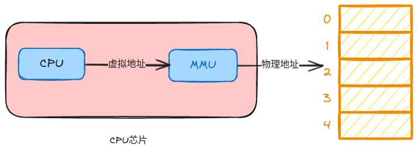
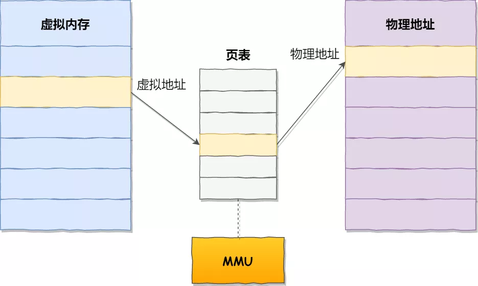
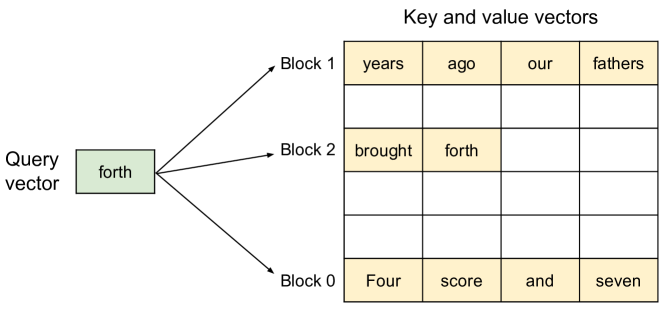
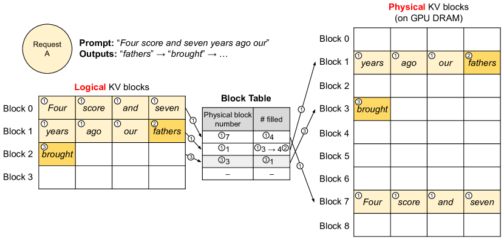
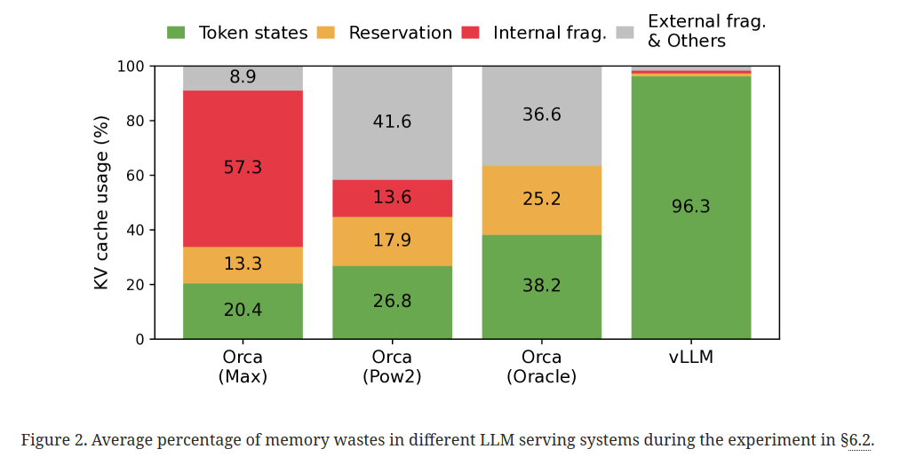

# 10.2 PagedAttention

在上一小节中我们探讨了 KV Cache 产生的背景以及原理，在小节结尾处阐述了 KV Cache 会导致一系列的内存问题，在传统的为 KV Cache 分配管理内存方式中，往往需要预先分配大量的连续、固定的内存空间，以满足可能出现的最大内存需求。然而，这种方式往往会导致大量的内存浪费，尤其是在实际使用中内存需求远小于预先分配的情况下。PagedAttention 的出现打破了这种方式的局限性，提高了推理的性能。

## 10.2.1. PagedAttention 的核心原理

### 10.2.1.1 虚拟内存与分页管理 

PagedAttention 的思想是受操作系统虚拟内存和分页技术启发而来。

虚拟内存是计算机系统内存管理的一种技术。它使得应用程序认为它拥有连续的可用内存（一个连续完整的地址空间），而实际上，它通常是被分隔成多个物理内存碎片，还有部分暂时存储在外部磁盘存储器上，在需要时进行数据交换。虚拟内存的一个重要特征是它定义了一个连续的虚拟地址空间，并且把内存扩展到硬盘空间。

分页管理是实现虚拟内存的一种方式，它将逻辑地址空间和物理内存空间都划分为固定大小的块，这些块被称为页。每个页的大小通常是2的幂次方，例如4KB。在分页系统中，虚拟地址被分成两个部分：页号和页内偏移量。页号作为页表的索引来找到对应的物理页号，而页内偏移量则用于计算出最终的物理地址。

当一个进程试图访问某个虚拟地址时，硬件会查找页表来获取该虚拟页对应的物理页号。如果该页在物理内存中，则可以继续执行；如果不在内存中，则会发生一次缺页中断，操作系统会处理这个中断，将所需的页从磁盘交换到内存中，并更新页表以反映新的映射。

分页管理的一个优点是减少了内存碎片问题，因为内存是按固定大小的页来分配的，而不是根据进程的实际大小来分配的。此外，分页机制还可以提高内存交换的效率，因为每次只交换一个页而不是整个进程。虚拟内存和分页管理是现代操作系统中用来管理内存资源的关键技术。它们不仅解决了内存不足的问题，还提高了内存使用的灵活性和效率。

### 10.2.1.2 PagedAttention 原理

PagedAttention 借鉴操作系统的虚拟内存和分页技术，将大模型中每个序列的 KV Cache 进行分块处理。每个块包含固定数量的 tokens 的键和值张量，例如在一些实际应用中，可能每个块包含几十个或上百个 tokens 的键值对。这样的设计使得 KV Cache的管理更加精细，能够根据实际需求动态分配和回收内存空间。

块在显存中无需连续存储，可灵活管理键值。在 PagedAttention 中，这些块在显存中无需连续存储，这极大地提高了内存管理的灵活性。就像操作系统中的虚拟内存一样，可以将块视为页面，将 token 视为字节，将序列视为进程。通过这种方式，序列的连续逻辑块可以通过块表映射到非连续的物理块。在实际运行中，物理块在生成新 token 时按需分配，只有在序列的最后一个块中可能会出现接近 4% 以下的内存浪费。这种设计不仅减少了内存浪费，还使得不同序列之间可以更高效地共享内存，进一步提高了系统的性能。例如，在并行采样中，同一个提示会生成多个输出序列，这些序列之间可以通过 PagedAttention 的内存共享机制，共享提示的计算和内存，大大降低了内存开销。据统计，这种内存共享功能可以最多减少 55% 的内存使用量，转化为高达 2.2 倍的吞吐量提升。

在图中：

- 请求（request）可理解为操作系统中的一个进程

- 逻辑内存（logical KV blocks）可理解为操作系统中的虚拟内存，每个block类比于虚拟内存中的一个page。每个block的大小是固定的，在vLLM中默认大小为16，即可装16个token的K/V值

- 块表（block table）可理解为操作系统中的虚拟内存到物理内存的映射表

- 物理内存（physical KV blocks）可理解为操作系统中的物理内存，物理块在gpu显存上，每个block类比于虚拟内存中的一个page

## 10.2.2. PagedAttention 的内存管理策略

类比操作系统虚拟内存，将块视为页，token 视为字节，序列视为进程。

在 PagedAttention 的内存管理策略中，这种类比操作系统虚拟内存的方式带来了诸多优势。将块视为页，意味着可以像操作系统管理内存页一样管理 KV Cache 块。每个块都有其特定的功能和作用，就如同内存页在操作系统中的不同状态和用途。

将 token 视为字节进一步细化了内存的管理粒度。在传统的内存管理中，字节是最小的存储单位，而在 PagedAttention 中，token 扮演着类似的角色。通过对 token 的精细管理，可以更好地控制内存的使用和分配。

将序列视为进程则为内存管理提供了更高层次的抽象。不同的序列在大模型的推理过程中可以看作是不同的进程，它们各自有独立的内存需求和使用模式。通过这种类比，可以更好地理解和管理不同序列之间的内存共享和竞争关系。

### 10.2.2.1 通过块表映射连续逻辑块到非连续物理块

PagedAttention 通过块表实现了连续逻辑块到非连续物理块的映射。块表就像是操作系统中的页表一样，记录了逻辑块与物理块之间的对应关系。在大模型的推理过程中，当需要访问某个特定的逻辑块时，PagedAttention 可以通过块表快速找到对应的物理块，从而实现高效的内存访问。

这种映射方式使得内存的分配更加灵活。由于逻辑块和物理块之间的对应关系不是固定的，因此可以根据实际需求动态地调整物理块的分配和释放。例如，当一个序列的长度增加时，可以按需分配新的物理块来存储更多的 KV Cache；当一个序列完成推理任务后，可以释放其占用的物理块，以供其他序列使用。

### 10.2.2.2 按需分配物理块，减少内存浪费

PagedAttention 采用按需分配物理块的策略，极大地减少了内存浪费。在传统的内存管理方式中，往往需要预先分配大量的连续内存空间，以满足可能出现的最大内存需求。然而，这种方式往往会导致大量的内存浪费，尤其是在实际使用中内存需求远小于预先分配的情况下。同时传统方式显存利用不足，易产生碎片化问题。

PagedAttention 则不同，它在生成新 token 时才按需分配物理块。这意味着只有在真正需要的时候才会占用内存空间，从而避免了不必要的内存分配。例如，在大模型的推理过程中，只有当一个序列需要生成新的 token 时，才会为其分配新的物理块来存储 KV Cache。如果一个序列在一段时间内没有生成新的 token，那么就不会占用额外的内存空间。

据统计，这种按需分配物理块的策略可以将内存浪费控制在序列的最后一个块中，且浪费率不到 4%。相比传统的内存管理方式，PagedAttention 的这种策略大大提高了内存的利用率，为大模型的高效推理提供了有力的支持。

## 10.2.3.PagedAttention 的内存共享机制

并行采样中多个输出序列可共享提示的计算和内存。在并行采样中，PagedAttention 展现出强大的内存共享能力。多个输出序列可以共享提示的计算和内存，极大地提高了资源利用率。

### 10.2.3.1 类似进程共享物理页，不同序列逻辑块可映射到同一物理块

PagedAttention 中的不同序列可以像进程共享物理页一样，将其逻辑块映射到同一物理块来共享块。这一机制使得多个输出序列能够在不重复计算和存储的情况下，共同利用相同的内存空间。例如，在处理多个相似的语言任务时，不同的序列可以通过这种方式共享已经计算好的提示信息和中间结果，减少了重复计算的开销。据实际测试，这种共享机制可以将复杂采样算法的内存开销降低高达 55%。

### 10.2.3.2 采用写时复制机制确保安全共享，降低内存开销，提升吞吐量

为了确保安全共享，PagedAttention 采用了写时复制（Copy-on-Write）机制。当多个序列共享同一物理块时，如果某个序列需要修改该块中的数据，系统会先复制一份专用副本给该序列，而其他序列所见到的最初的资源仍然保持不变。这种机制在确保数据安全的同时，最大限度地降低了内存开销。通过这种方式，PagedAttention 不仅减少了内存的占用，还提升了系统的吞吐量。实际应用中，这种内存共享机制可以将吞吐量提高高达 2.2 倍，使得在大模型服务中使用复杂采样方法变得更加实用。

## 10.2.4. PagedAttention 的优势

### 10.2.4.1 支持大批量处理，提高系统吞吐量

PagedAttention 通过其高效的内存管理策略，能够支持大批量处理，从而显著提高系统的吞吐量。传统的内存管理方法在处理大型语言模型的 KV Cache时，往往会因为内存浪费和分配不灵活等问题，限制了批处理的能力。而 PagedAttention 将 KV Cache分块管理，按需分配物理块，减少了内存碎片和浪费，使得更多的请求可以同时被处理。例如，在实际应用中，使用 PagedAttention 的 vLLM 能够实现比传统方法高 2 - 4 倍的吞吐量。据统计，在处理大规模数据和复杂解码任务时，PagedAttention 能够有效地管理 KV Cache的内存占用，使得系统可以同时处理更多的请求，提高了 GPU 的利用率，进而提高了系统的吞吐量。

vLLM 实验在显存利用上的改进效果如图：

### 10.2.4.2 灵活性与扩展性强，适应不同模型和序列长度

PagedAttention 具有很强的灵活性与扩展性，能够适应不同大小的模型和序列长度。由于其将 KV Cache分块管理，不要求数据在内存中连续存储，因此可以灵活地适应不同模型和序列长度的变化。无论是小型模型还是超大规模的模型，PagedAttention 都能够有效地管理内存，提高内存利用率。对于不同长度的序列，PagedAttention 可以根据实际需求动态分配或回收内存块，确保只使用必要的内存空间。例如，在处理长序列时，PagedAttention 可以通过按需分配物理块的方式，避免了传统方法中预先分配大块连续内存所带来的浪费。

同时，PagedAttention 还支持跨请求共享同一个 KV Cache的部分数据，当多个请求使用相似的上下文时，可以复用之前存储的数据，进一步提高了内存利用效率。这种灵活性与扩展性使得 PagedAttention 在面对复杂解码任务时依然能够保持高效的性能表现。

## 参考文章

- https://arxiv.org/pdf/2309.06180
- https://zhuanlan.zhihu.com/p/691038809
- https://github.com/0voice/kernel_memory_management/tree/main