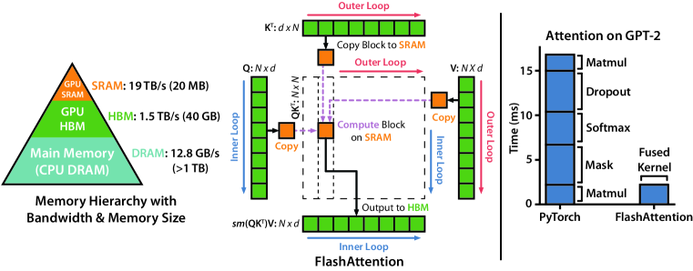
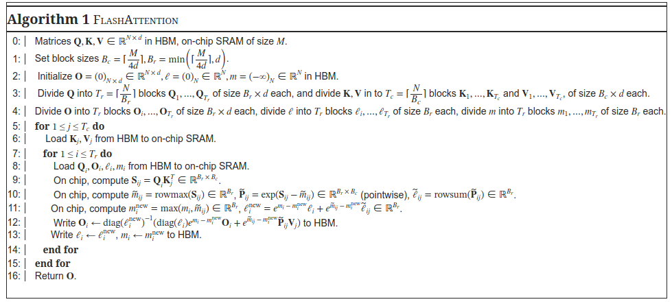
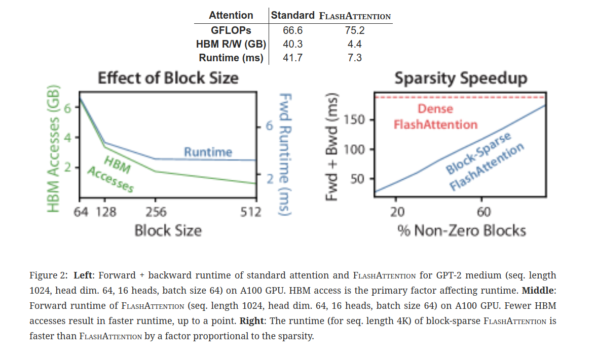

# 10.3 FlashAttention

在大模型中，注意力机制已成为关键技术之一。然而，随着数据规模的不断增大和模型复杂度的提高，注意力机制也面临着一些挑战。其中之一是计算复杂度和存储压力。对于 Transformer 类的模型，其计算复杂度和消耗的存储空间随着输入序列长度的增加呈平方增长，这给计算和存储带来了极大的压力。此外，传统的注意力机制在处理长序列数据时效率不高，容易出现梯度消失或爆炸的问题。

FlashAttention 作为一种行之有效的解决方案，旨在解决 Transformer 模型的复杂度问题。它的命名中包含了其主要特点：Fast and Memory Efficient Exact Attention with IO-Awareness。FlashAttention 通过降低对显存的访问次数来加快整体运算速度，同时巧妙地避开了标准注意力机制中存储压力大的问题，使得存储压力降至更低水平。此外，FlashAttention 做到了完全等同于标准注意力的实现方式，保证了计算的准确性。它的出现为深度学习中注意力机制的发展带来了新的机遇和挑战。

## 1. 背景与动机

### 1.1 Transformer 结构中自注意力机制的时间和存储复杂度问题

在 Transformer 结构中，自注意力机制的时间和存储复杂度与序列的长度呈平方关系。以标准 Attention 计算为例，令  $N$ 表示序列长度，$d$ 表示注意力头维度。那么，$Q$ 、$K$ 和 $V$ 矩阵的 shape 为  $[N, N]$，而中间结果 $S$  和 $P$  的 shape 为 $[N, N]$ 。标准 Attention 计算操作中，首先从 HBM（高带宽内存）中加载 $Q$ 和 $K$ 矩阵，时间复杂度为 $O(Nd)$ 。接着计算 $S = QK^T$，并将 $S$ 写回到 HBM，时间复杂度为 $O(N^2)$。然后从 HBM 中加载 $S$ ，计算 $P = softmax(S)$ ，再将 $P$ 写回到 HBM，时间复杂度为  $O(2N^2)$。最后从 HBM 中加载 $P$ 和 $V$ 矩阵，计算 $O = PV$ ，并将 $O$ 写回到 HBM，时间复杂度为 $O(Nd)$ 。因此，标准 Attention 计算对 HBM 访问的时间复杂度为 $O(Nd+N^2$) 。这种高时间和存储复杂度给计算设备带来了巨大的压力，尤其是在处理长序列数据时，会导致计算缓慢且耗费大量内存。

### 1.2 优化自注意力机制时空复杂度和增强计算效率的需求

由于 Transformer 结构中自注意力机制的时间和存储复杂度问题，优化自注意力机制的时空复杂度、增强计算效率成为大模型面临的重要问题。一方面，随着数据规模的不断增大，模型需要处理更长的序列，而传统的自注意力机制在处理长序列时效率低下，无法满足实际应用的需求。另一方面，计算设备的内存和计算能力有限，高复杂度的自注意力机制会导致内存不足和计算时间过长，影响模型的训练和推理速度。因此，研究人员迫切需要一种能够降低自注意力机制时间和存储复杂度的方法，以提高模型的计算效率和性能。FlashAttention 正是在这种背景下应运而生，它通过一系列创新的技术优化，有效地解决了自注意力机制的复杂度问题，为大模型的发展提供了有力的支持。

## 2. 原理与核心组件

### 2.1 FlashAttention 的灵感与设计目标

- **避免在 HBM 中读取或写入注意力矩阵**：在 Transformer 结构中，自注意力机制在计算过程中会频繁地在高带宽内存（HBM）中读取和写入注意力矩阵，如计算流程中，首先从全局内存（HBM）中读取矩阵 $Q$ 和 $K$，并将计算好的矩阵 $S$ 再写入全局内存，之后又多次从 HBM 中读取和写入中间矩阵。然而，虽然 HBM 的带宽速度达到 1.5TB/s，但 GPU 拥有极多的线程，平均算下来带宽速度其实并不快。因此，FlashAttention 尽可能避免在 HBM 中读取或写入注意力矩阵，以减少训练时间受 HBM 限制的问题。

- **利用 SRAM 的高带宽特性**：由上图可知，SRAM 相对于 HBM 拥有更高的带宽速度。以 A100 GPU 为例，A100 GPU 有 40 - 80GB 的高带宽内存（HBM），带宽为 1.5 - 2.0TB/s，而每 108 个流处理器有 192KB 的 SRAM，带宽估计在 19TB/s 左右。FlashAttention 充分利用 SRAM 的高带宽特性，将注意力的计算分成一小块一小块的，放在 SRAM 里面算，算完以后再通过特定的关系，把全局的注意力值算出来，大大提升了注意力的计算速度。

- **在不访问整个输入的情况下计算 softmax 函数**：由于 SRAM 内存有限，无法存储整个输入数据。因此，FlashAttention 需要对输入进行分块，一次只计算一小部分的结果。在计算 softmax 的归一化因子（分母）时需要获取到完整的输入数据，这是 FlashAttention 的实现难点之一。为了解决这个问题，FlashAttention 将输入分割成块，并在输入块上进行多次传递，从而以增量方式执行 softmax 缩减。

- **不存储中间注意力矩阵**：在传统的注意力机制中，计算过程中的中间注意力矩阵 $S$、$P$ 会被写入到 HBM 中，而这些中间矩阵的大小与输入的序列长度有关且为二次型，会消耗大量的内存。FlashAttention 通过存储归一化因子来减少 HBM 内存的消耗，在后向传播中快速重新计算片上注意力，这比从 HBM 中读取中间注意力矩阵的标准方法更快。

### 2.2 FlashAttention 的分块计算方法

- **以向量计算 softmax 为例阐述分块计算过程**：以对向量 [1,2,3,4] 计算 softmax 为例，将其分成两块 [1,2] 和 [3,4] 进行计算。对于每一块，首先计算块的最大值 m，然后将块中的各个元素减去块的最大值 m，得到新的向量。接着计算 softmax 的分子 f，即对新的向量进行指数运算。最后计算 softmax 的分母 l，即对分子 f 进行求和。当计算出两个块的 m，f，l 后，即可进行合并计算出完整的 softmax 结果。

- **分块计算中减去最大值的目的及好处**：softmax 存在一个问题，当 xi 的值非常大时，$e^{xi}$ 也会非常快的增长，这就可能会导致数值溢出，这种情况在注意力机制中非常常见，因为注意力分数通常会很大。因此，flashAttention 在计算 softmax 前，会从每个注意力分数中减去最大的注意力分数，称之为 “减去最大值”。目的是将注意力分数的数值范围缩小，使得在计算指数时不会那么容易发生溢出。好处有两点：一是防止出现负数，二是当值非常大时，使用指数函数可以扩大差异，提高数值稳定性。

- **合并分块计算结果**：对于两个分块的计算结果，通过计算局部块的指数、累积和以及最值并保留下来，可以算出全局的 softmax。具体来说，令两个分块的最大值分别为 m1 和 m2，分子分别为 f1 和 f2，分母分别为 l1 和 l2。首先，计算全局最大值 m_new，m_new 为 m1 和 m2 中的较大值。然后，根据公式 L = np.exp (m - m_new)* L + np.exp (m2 - m_new)* L2 计算全局分母 L，其中 L1 和 L2 分别为两个分块的分母，m 和 m2 分别为两个分块的最大值。最后，根据公式 con / L 计算全局的 softmax 结果，其中 con 为 np.concatenate ((np.exp (m - m_new)*f1, f2), axis=0)。

FlashAttention 具体算法流程如下：

## 3. 技术挑战与解决方案

### 3.1 实现难点分析

- **softmax 分块计算的复杂性**：在 FlashAttention 中，softmax 的分块计算是实现高效注意力机制的关键步骤，但同时也带来了诸多挑战。由于需要将输入数据分成小块进行计算，每个块的计算结果需要与其他块进行合并，以得到最终的全局结果。这一过程涉及到对每个块的最大值、指数运算、求和等操作，计算过程较为复杂。例如，在计算两个块的结果合并时，需要先确定全局最大值，然后根据公式计算全局分母，最后得出全局的 softmax 结果。这种分块计算的复杂性增加了算法的实现难度。

- **归一化因子获取的困难**：获取 softmax 的归一化因子是 FlashAttention 的另一个实现难点。在传统的 softmax 计算中，归一化因子是通过对所有输入数据进行求和得到的。然而，在 FlashAttention 的分块计算中，由于无法一次性获取完整的输入数据，因此需要通过其他方式来获取归一化因子。这就需要对计算过程进行精心设计，以确保能够准确地获取归一化因子。例如，可以通过在分块计算过程中逐步累积局部的归一化因子，然后在合并分块结果时计算全局的归一化因子。但是，这种方法需要对计算流程进行严格的控制，以避免出现误差。

### 3.2 优化计算流程，减少对 HBM 的依赖。

- **优化计算流程**：为了应对 softmax 分块计算及归一化因子获取的挑战，FlashAttention 采用了优化计算流程的策略。具体来说，它将输入数据分割成块，并在输入块上进行多次传递，从而以增量方式执行 softmax 缩减。这种计算流程的优化使得在计算过程中可以逐步获取局部的最大值、指数运算结果和归一化因子，然后通过合并这些局部结果来得到全局的 softmax 结果。例如，在计算过程中，可以先计算第一个块的结果，然后在计算第二个块的结果时，利用第一个块的结果来更新全局的最大值和归一化因子。这样，在计算完所有块后，就可以得到准确的全局结果。

- **减少对 HBM 的依赖**：为了减少对高带宽内存（HBM）的依赖，FlashAttention 充分利用了静态随机访问存储器（SRAM）的高带宽特性。它将注意力的计算分成小块，放在 SRAM 里面算，算完以后再通过特定的关系，把全局的注意力值算出来。这种方式大大减少了对 HBM 的访问次数，降低了存储访问开销，提高了计算速度。例如，在处理大规模数据时，传统的注意力机制可能需要频繁地从 HBM 中读取和写入数据，而 FlashAttention 则可以在不频繁访问 HBM 的情况下进行计算，从而提高了计算效率。同时，通过存储归一化因子来减少 HBM 内存的消耗，在后向传播中快速重新计算片上注意力，这比从 HBM 中读取中间注意力矩阵的标准方法更快。

上图中，左：标准注意力和 FlashAttention 在 GPT-2 中等（序列长度 1024，头维度 64，16 个头，批量大小 64）在 A100 GPU 上的前向和后向运行时间。HBM 访问是影响运行时间的主要因素。中：在 A100 GPU 上，FlashAttention 的前向运行时间（序列长度 1024，头维度 64，16 个头，批量大小 64）。更少的 HBM 访问导致更快的运行时间，但有一定限度。右：在序列长度 4K 时，块稀疏 FlashAttention 的运行时间比 FlashAttention 快，速度提升与稀疏性成正比。

## 4. FlashAttention 与其他注意力机制的比较

### 4.1 传统注意力机制的不足

传统注意力机制在存储访问方面开销较大。在计算过程中，需要频繁地在高带宽内存（HBM）中读取和写入注意力矩阵，例如在 Transformer 结构中，自注意力机制的计算过程涉及多次对 HBM 的访问，这不仅增加了计算时间，还消耗了大量的内存资源。以处理长度为   的序列为例，传统注意力机制对 HBM 的访问时间复杂度为 $O(Nd+N^2)$ ，其中 $N$  表示序列长度，$d$  表示注意力头维度。这种高存储访问开销在处理大规模数据时会成为性能瓶颈。

同时，传统注意力机制的计算复杂度也较高。由于其时间和存储复杂度与序列的长度呈平方关系，在处理长序列数据时，计算量会急剧增加。这不仅对计算设备的性能提出了很高的要求，还会导致训练和推理时间过长，影响实际应用的效率。

### 4.2 已有融合注意力算子的局限性

已有融合注意力算子往往只是接口调用的融合，并未真正解决内存访问问题。这些算子可能在表面上看起来实现了注意力机制的融合，但实际上在计算过程中仍然会频繁地访问 HBM，导致存储访问开销大。

例如，某些融合注意力算子可能只是将多个注意力操作简单地组合在一起，通过接口调用的方式实现所谓的 “融合”。但在实际计算中，它们并没有从根本上改变注意力机制对内存的访问方式，仍然需要存储中间注意力矩阵，并且在计算过程中会频繁地从 HBM 中读取和写入数据。

这种只是接口调用的融合方式无法有效地降低存储访问开销，也不能真正提高计算效率。在处理大规模数据时，这些局限性会更加明显，可能会导致计算速度缓慢、内存不足等问题。

### 4.3 FlashAttention 的独特之处

FlashAttention 真正实现了算子融合，通过分块计算和优化内存使用提升性能。与传统注意力机制和已有融合注意力算子不同，FlashAttention 避免了在 HBM 中读取或写入注意力矩阵，充分利用了 SRAM 的高带宽特性。

它将注意力的计算分成小块，放在 SRAM 里面算，算完以后再通过特定的关系，把全局的注意力值算出来。这种分块计算的方式有效地降低了存储访问开销，同时也提高了计算速度。

此外，FlashAttention 通过存储归一化因子来减少 HBM 内存的消耗，在后向传播中快速重新计算片上注意力。这比从 HBM 中读取中间注意力矩阵的标准方法更快，即使由于重新计算导致浮点运算次数（FLOP）增加，但其运行速度更快并且使用更少的内存。

FlashAttention 通过优化计算流程和减少对高带宽内存（HBM）的访问次数，有效提升了计算速度，虽然重新计算增加了浮点运算次数，但由于减少了 HBM 访问带来的延迟，总体运行速度反而更快。尤其在处理大规模数据时，FlashAttention 将注意力计算分块进行，利用 SRAM 高带宽特性，显著降低了 HBM 的访问频率，相较于传统方法 $O(Nd + N^2)$ 的 HBM 访问次数，FlashAttention 大幅减少了计算时间。此外，通过改变计算顺序和引入统计量，FlashAttention 成功避免了实例化中间矩阵，显存需求从传统的 $O(N^2)$ 降至 $O(N)$，节省了大量显存，使得在有限资源下也能处理更长序列。最重要的是，FlashAttention 提供了与原生注意力机制完全等价的精确结果，适用于对精度要求高的任务，如机器翻译和文本生成等。

## 参考文章

- https://arxiv.org/pdf/2205.14135
- https://zhuanlan.zhihu.com/p/669926191