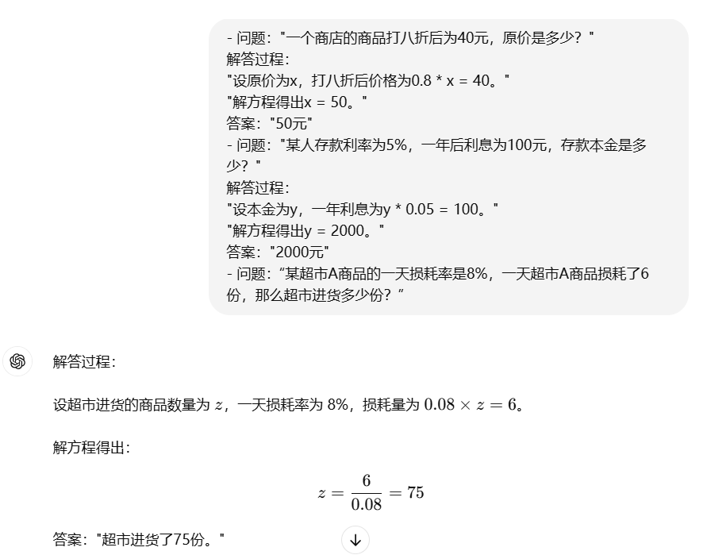
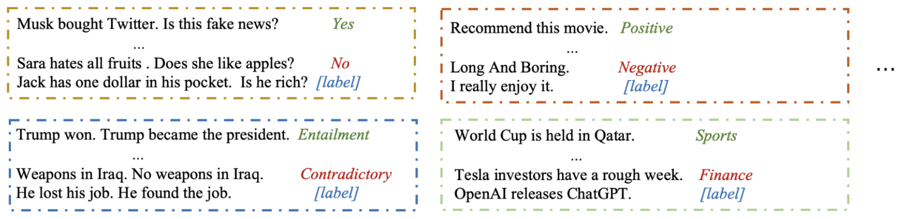
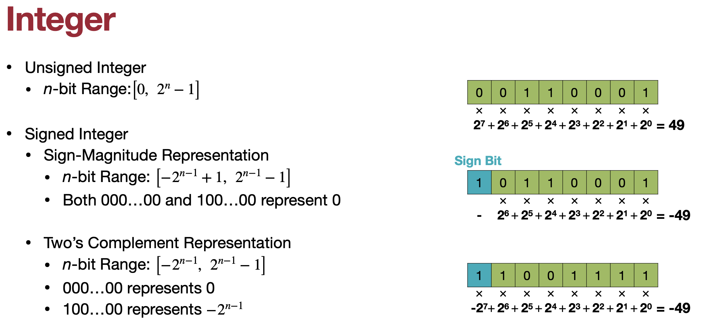
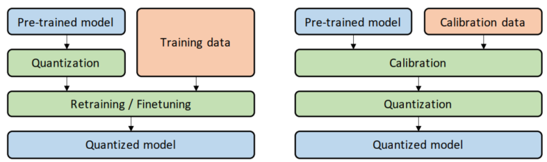
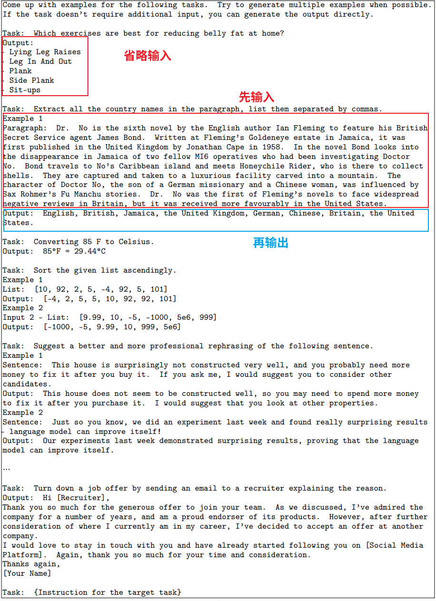

# 基于涌现能力的蒸馏（黑盒蒸馏）

黑盒蒸馏意味着教师模型的输出是我们唯一能获取到的训练资源，因此，黑盒蒸馏整体的思路可以分成两步：
1. 从教师模型收集问答数据 
2. 使用这些数据对学生模型进行微调
   
这份教程会详细介绍三种涌现能力的主流蒸馏方式以及改进方向。

值得一提的是，黑盒蒸馏和监督微调很相似，所以了解监督微调的概念将有利于本节的学习。不过不了解也没关系，只要知道一般模型训练的概念（损失函数、梯度下降等）也足够。


# 1. In-context learning 蒸馏

大模型的一大特有的能力是上下文学习(In-context learning, ICL)，即在**推理阶段**进行少样本学习。
上下文学习的能力是一种类似于“举一反三”的能力，我们可以在Prompt中先给出几个问-答示例，接着给出一个问题，
模型就能按照示例的格式和模式输出回答。

以下是一个简单的ICL例子：


模型成功模仿了示例中的答题思路和答题格式。

然而，由于算力限制，不可能将具有ICL能力的大模型部署到实时推理系统上。
有没有一种技术能够将大模型的ICL能力迁移到一个小模型中呢？这就是本节将要探讨的问题。

## 1.1 ICL
首先，让我们对ICL做一个形式化的定义：ICL是指输入给模型以下格式的内容：
```
x_1, y_1;
x_2, y_2;
x_3, 
```
模型会输出：
```
y_3
```

其中x表示问题，y表示回答。

示例的格式**不一定**在训练时见过，但是模型可以在推理时模仿其中的格式和模式。
即只要在prompt前加几个例子，模型就能学到其中的格式和逻辑，从而不用更新参数就能学习。

训练之前，我们会收集如下含有提示词和标签的数据：


## 1.2 ICL 微调

这一部分将介绍一系列的用于ICL微调的损失函数，需要具备条件概率、熵和交叉熵相关的知识。

一句话概况，ICL微调就是让模型的输出$y_3$的概率尽量大。即在给定模型参数$\theta$, 示例1和2, 以及prompt 3时, 模型输出 $y_3$ 的概率 $p(y_3|x_3, (x_1, y_1, x_2, y_2), \theta)$ 越大越好。
为了计算稳定，可以转变为对数概率，即$log \space p(y_3|x_3, (x_1, y_1, x_2, y_2), \theta)$ 越大越好. 损失函数一般是求最小化，所以再添加一个负号：

$$
-log \space p(y_3|x_3, (x_1, y_1, x_2, y_2), \theta)
$$

上面这个例子有两个示例问答对，所以可以叫做 two-shot, 实际中也可以使用 zero-shot, one-shot, ...。
假设示例问答对的数量是k， k-shot 的示例问答我们可以记作 $S_k$，正式的问题记作 $x$，期望的回答记作 $y$，最终的损失函数可以写成
$$
-log \space p(y|x, S_k, \theta)
$$

以上是一条微调数据的损失，一般微调需要几千到上万条数据，每一条数据都有各自的$x, y, S^x_k$，其中$S^x_k$代表对应于问题 $x$ 的示例前缀。
所以微调时总的损失如下
$$
L_{ICL} = \Sigma_{(x,y)\in D} - log \space p(y|x, S^x_k, \theta)
$$

这就是ICL微调的损失函数，但只是针对一种任务类型的。
一般我们会针对同一个类型的任务收集许多数据微调，所以一个任务$\mathcal{T}$会对应一个数据集 $\mathcal{D_T}$, 所以针对任务$\mathcal{T}$微调的损失函数如下：

$$
L^{ICL}_\mathcal{T} = \Sigma_{(x,y)\in \mathcal{D_T}} - log \space p(y|x, S^x_k, \theta)
$$

## 1.3 Meta-ICL Tuning 和 MultiTask-ICL Tuning
上面我们讲了针对任务$\mathcal{T}$进行ICL微调的损失函数，而实际中往往在多个任务上微调，以获得更好的泛化性能。
因此，对多个任务微调的总损失如下：

$$
L^{ICL}_{train} = \Sigma_{\mathcal{T}\in \mathcal{T_{train}}} \Sigma_{(x,y)\in \mathcal{D_T}} - log \space p(y|x, S^x_k, \theta)
$$

其中$\mathcal{T_{train}}$可以是$\mathcal{T_{meta}}$或$\mathcal{T_{target}}$。 它们有什么区别呢？
如果使用$\mathcal{T_{target}}$，训练时的任务就是我们的目标任务；
而使用Meta-ICL，则是训练时避免使用目标任务，而是希望模型能通过学习其他任务学习到“学习方法”，即学习上下文的能力，然后在我们的目标任务上应用它所学到的学习能力。

## 1.4 In-context Learning Distillation
了解Meta-ICL Tuning 和 MultiTask-ICL Tuning的损失函数将有利于理解ICL蒸馏的损失函数。ICL蒸馏同时使用软目标和硬目标作为损失函数：
$$
\mathcal{L}_{KD} = \alpha(t)\mathcal{L}_{hard} + (1-\alpha(t))\mathcal{L}_{soft} 
$$

让我们分别认识软目标和硬目标。

### 软损失：
$$
\mathcal{L}_{soft} = \mathcal{L}^{ICL}_{soft} + \beta\mathcal{L}^{LM}_{soft} 
$$

其中第一项是学生和老师的交叉熵损失：
$$
\mathcal{L}^{ICL}_{soft} = - \Sigma_{\mathcal{T}\in \mathcal{T_{train}}} \Sigma_{(x,y)\in \mathcal{D_T}} \Sigma_{c \in C_{\mathcal{T}}} P(y=c | x; S^x_k; \theta^t)logP(y=c | x; S^x_k; \theta^s)
$$

其中c是数据中的\<lable\>。后面的 概率*log概率 是计算针对某个可能的Label的交叉熵。

第二项是语言建模损失：
$$
\mathcal{L}^{LM}_{soft} = \Sigma_{x\in \mathcal{D}_{LM}} P(x|\theta^t)logP(x|\theta^s)
$$
这里的训练数据就是一般的网络文本：


### 硬损失
除了学习老师的经验，学生还要学习ground-truth，这就是硬损失的意义。
$$
\mathcal{L}_{hard} = \mathcal{L}^{ICL}_{hard} + \beta\mathcal{L}^{LM}_{hard} 
$$

$$
\mathcal{L}^{ICL}_{hard} = -\Sigma_{\mathcal{T}\in \mathcal{T_{train}}} \Sigma_{(x,y)\in \mathcal{D_T}} log P(y|x; S^x_k; \theta^s)
$$

$$
\mathcal{L}^{LM}_{hard} = -\Sigma_{x\in \mathcal{D}_{LM}} log P(x|\theta^s)
$$

## 1.5 实践


## 1.6 改进方向
模型上下文学习的性能和上下文中的例子质量紧密相关，所以有人研究专门设计了一个例子检索器，检索高质量的示例[6]。


# 2. 指令跟随蒸馏

## 2.1 指令跟随

我们知道大模型的主流训练范式有三步，第一步是预训练，第二步是指令微调，第三步是RLHF。指令跟随的能力是在第二步获得的。

仅仅经过预训练的大模型没有指令微调的能力，它只能续写用户prompt。经过指令微调的模型具有执行prompt中的指令的能力，而不是续写用户的prompt。

指令微调数据包含指令、输入、输出，但是指令和输入没有明确界限，把输入当成指令也可以， 而输入部分可以是空的。比如这是一份[指令微调数据](https://github.com/datawhalechina/self-llm/blob/master/dataset/huanhuan-100.json). Self-Instruct生成的数据输入部分也可能是空的。


如何将指令跟随能力蒸馏到小模型中呢？容易想到的思路是从大模型收集若干<指令-输入-输出>数据，然后用这些数据来微调小模型。
那么如何从大模型收集<指令-输入-输出>数据呢？有没有成本低，效率高的方法？答案是Self-Instruct。


## 2.2 Self-Instruct 范式


要使用Self-Instruct生成数据，我们只需要推理一个经过预训练的大模型（不要经过指令微调哦）就可以了。这是因为预训练的大预言模型具有续写的能力，利用这个能力可以收集新的数据。

首先，人工设计若干任务，针对每个任务，撰写一个初始数据。这形成了初始的数据池。

然后，随机从数据池中抽取8条指令，让大模型续写更多的指令。可以使用如下的模板：

生成指令，直到遇到“Task 16”字符串或达到最大生成字数或模型自动停止生成。

生成指令之后，下一步，就应该生成输入和输出了。但是在此之前，先让大模型自己判断这个生成的每一个指令是否是分类问题。这里还是利用了续写能力。


对于是分类问题的任务，先生成输出，在基于输出生成输入；而对于非分类问题，先生成输入，基于输入生成输出。




## 2.3 指令跟随蒸馏实践


## 2.4 对抗蒸馏
对抗蒸馏(adversarial distillation)提出除了可以让知识单向地从教师注入学生，学生也可以对产生“反馈”，
即通过对比学生的回答和老师的回答，老师可以发现困难的知识，并加生成更多困难知识的供学生学习。具体的细节可以查看[7]

# 3. 思维链蒸馏
和之前说的一样，我们可以从大模型收集<问题-回答>对，然后用这些数据来微调小模型。
但是这时数据收集要注意数据的质量。回答中要包含正确的推理，并且最好是对于一个问题有多样的推理路径。

以下是一个训练gpt2进行时间推理的例子。

## 步骤1：收集数据
从教师模型收集推理样本，作为训练数据。在问题后面，我们加上一句"Let's think step by step."

<span style="color:red">USER:</span> Q: <Question\> A: Let's think step by step.

<span style="color:green">ROBOT:</span> <Reasoning\>

<span style="color:red">USER:</span> Q: <Question> A: Let's think step by step. <Reasoning\>\nTherefore, the answer is

<span style="color:green">ROBOT:</span> <Answer\>

其中第三行的<Reasoning>针对一个问题多次运行后可能有不同的推理路径。

## 步骤2：数据格式化
我们把以上收集的数据整理成某种格式化的数据，让他们具有统一的格式，方便训练。比如可以使用如下的格式：

```python
    input_format = "<Question> ###"
    label_format = "<Reasoning> --> <Answer>"
```
## 步骤3：实践
正式的微调Loss函数是交叉熵损失。


# 4. 扩展和总结
实际上，除了以上三种涌现能力的蒸馏，只要是从教授模型收集某种类型的数据，然后用这些数据微调学生模型，都是黑盒蒸馏的应用范围。
因此，对于一些特定领域和特定需求的任务，也可以使用类似的方法达到希望的效果。比如医学领域和传统的自然语言处理任务（自然语言推理，分类等）。

但是也有研究[5]指出黑盒蒸馏导致仅模仿不理解的问题，要提高学习质量，还需学生有一个良好的天赋（base 模型的能力）。


# 参考资料
1. [In-context Learning Distillation: Transferring Few-shot Learning Ability of Pre-trained Language Models](http://arxiv.org/abs/2212.10670)
2. [MetaICL: Learning to Learn In Context](https://arxiv.org/abs/2110.15943)
3. 交叉熵：https://blog.csdn.net/tsyccnh/article/details/79163834 
4. [Model Compression and Efficient Inference for Large Language Models: A Survey](http://arxiv.org/abs/2402.09748)
5. [The false promise of imitating proprietary llms](https://arxiv.org/abs/2305.15717)
6. [Learning to Retrieve In-Context Examples for Large Language Models](http://arxiv.org/abs/2307.07164)
7. [Lion: Adversarial Distillation of Proprietary Large Language Models](http://arxiv.org/abs/2305.12870)