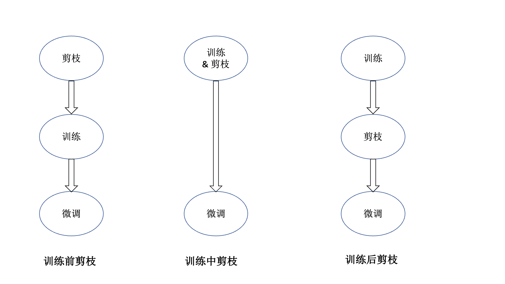

# 3.1 剪枝

## 3.1.1 剪枝简介

&emsp;&emsp;在本章节，我们将介绍LLM剪枝的相关知识。大型语言模型（LLMs）在推理过程中通常需要高计算成本、内存访问成本和大量内存使用，导致效率指标降低，例如在资源受限场景中的延迟、吞吐量、功耗和存储需求增加。这给LLMs在边缘和云端应用带来了挑战。LLM参数量可以轻松达到上万亿，因此需要特殊的压缩技术来降低部署成本和提升推理性能。大模型剪枝是一种有效的模型压缩方法，其目的是通过移除模型中冗余或不重要的参数（例如神经元或连接权重），以减少模型的大小和计算需求，同时尽量保持其性能。

&emsp;&emsp;与普通模型的剪枝相比，大模型剪枝面临的挑战和采取的策略有所不同。普通模型剪枝通常是为了减少模型大小和加速推理过程，而大模型剪枝除了这些目标外，还需要考虑模型巨大的参数量和计算复杂性。

&emsp;&emsp;与量化和蒸馏等其他压缩技术相比，剪枝对于LLMs压缩的有效性虽然有限，但和其他技术是正交的，联合使用可以达到更好效果。由于模型参数较多，微调成本较高，难以达到剪枝的全部效果。但剪枝仍是压缩模型的一项关键技术，具备进一步探索的潜力。

## 3.1.2 剪枝原理

&emsp;&emsp;模型稀疏性指的是模型中存在大量的参数为零或接近于零的情况。稀疏模型通过降低计算和存储需求，提高计算效率，并常常具有更好的泛化能力。这种稀疏结构在模型中体现为：
- 稀疏权重矩阵：大部分权重参数为零，仅有少部分为非零值。
- 稀疏激活：神经元的激活值中很多为零。

&emsp;&emsp;模型剪枝可以视为一种实现模型稀疏性的具体方法。LLM剪枝的原理是通过删除模型中冗余或不重要的元素（权重、神经元、注意力头、层等），剩下的参数形成了稀疏结构。通过剪枝减少模型的大小和计算需求，同时尽量保持其性能。这一过程的核心思想是，在LLM中并非所有的参数都对输出结果具有同等的重要性，移除某些模型性能的贡献较小的参数，不会对模型性能产生显著影响。

## 3.1.3 剪枝分类 

&emsp;&emsp;根据剪枝单元，剪枝可以分为结构化剪枝和非结构化剪枝。两者的主要区别在于剪枝操作的粒度不同。结构化剪枝则通过剔除神经元、通道或层等结构组件，有效简化模型，同时保持整体结构的完整性。而非结构化剪枝通过将低于阈值的特定参数置为0，但会导致模型的稀疏性不规则，需要专业的压缩技术来有效存储和计算剪枝后的模型。

### 3.1.3.1 结构化剪枝

&emsp;&emsp;结构化剪枝考虑了神经网络的层次结构，通过剪枝神经网络的层、通道、神经元或权重矩阵的行/列等组件来简化模型。结构化剪枝的优点是不仅降低模型复杂度，而且剪枝后的模型结构完整，使其更适合硬件部署。

### 3.1.3.2 非结构化剪枝

&emsp;&emsp;非结构化剪枝不考虑模型的固有结构，侧重于LLM的单个神经元或权重，产生了细粒度的稀疏性，通过裁剪网络的特定参数来简化模型。与结构化剪枝相比，它通常可以实现更高水平的稀疏性，同时对模型预测的影响最小。但该方法忽略了整体的结构，会导致最后裁剪后的参数稀疏不规则，导致不规则的内存访问和计算模式，需要专门的软件或硬件才能有效部署与加速。

&emsp;&emsp;根据剪枝时机，可以分为训练前剪枝、训练中剪枝和训练后剪枝。其流程如下图所示：

### 3.1.3.3 训练前剪枝

&emsp;&emsp;训练前剪枝是指首先对初始化网络进行剪枝操作，通过预先确定哪些神经元或连接权重不重要，将其移除，从而减少模型的复杂性和参数量。这样简化后的模型直接用于训练稀疏网络。训练前剪枝的优点是可以在训练之前就确定剪枝后的模型结构，从而减少训练时间。但缺点是剪枝后的模型结构可能不完整，需要进一步的优化和调整。

### 3.1.3.4 训练中剪枝

&emsp;&emsp;训练中剪枝是指同时训练和剪枝密集网络。根据训练过程中实时获得的参数重要性信息，对那些被认为不重要的参数进行剪枝。剪枝通常是逐步进行的，剪枝后的模型继续进行训练，以调整和优化剩余参数。

### 3.1.3.5 训练后剪枝

&emsp;&emsp;训练后剪枝是指在模型训练完成后，对已经训练好的模型进行剪枝。首先使用完整的模型进行训练，达到预期的性能，然后根据模型中参数的重要性进行剪枝，移除冗余的神经元或连接，以获取稀疏模型。剪枝后，通常需要进行微调（fine-tuning）以恢复或提升模型性能。由于LLM参数量较大，迭代剪枝和微调过程不仅需要充足的硬件资源，而且比较耗时。因此，更多的剪枝方法倾向于仅将网络剪枝一次以达到目标稀疏率，从而放弃迭代剪枝和微调轮次。将这些仅剪枝一次的方法被归类为一次性剪枝。

## 3.1.4 剪枝度量

&emsp;&emsp;如何确定要裁剪掉哪些元素呢？这里就要引入剪枝度量了，剪枝度量是LLM剪枝的核心问题之一。它决定了剪枝操作的粒度，即哪些元素需要被剪枝。根据不同的应用场景和需求，剪枝度量方法也有所不同。

&emsp;&emsp;常见的LLM剪枝度量方法包括基于幅度的剪枝、基于损失的剪枝、基于正则化的剪枝等。
- 基于幅度的剪枝：使用元素的幅度（即绝对值）来衡量其重要性。该类方法的基本原理是剪枝单元的权重或激活值的大小直观地反映了其重要性。通常认为值较小的参数对模型的整体性能影响较小，因此可以被剪除。
    - 优点： 实现简单，计算成本较低。
    - 缺点：可能忽略权重间的相互作用和整体重要性，某些情况下性能较低。
- 基于损失的剪枝：使用元素对模型性能的影响程度来衡量其重要性。该类方法旨在将剪枝单元的重要性归因于其对损失的影响。如果修剪某个元素后损失显着增加，则表明该元素不应该被修剪。更准确地说，在对某个元素进行修剪后，损失增加得越大，该元素的重要性就变得越重要。该方法一般利用损失函数的 Hessian 矩阵来选择性地消除特定参数，同时最大限度地减少对损失的影响。
    - 优点：剪枝决策更为精确，能够保留重要的参数。
    - 缺点：计算复杂度较高，需要大量的计算资源。
- 基于正则化的剪枝：通过引入额外的正则化项来惩罚模型中的不重要参数，从而使这些参数逐渐趋向于零。最终，可以根据这些参数的大小来决定哪些连接或神经元可以被剪枝。
    - 优点：正则化剪枝可以防止过拟合，因为它有效地减少了模型的冗余参数，增强了模型的泛化能力。
    - 缺点：在训练过程中加入正则化项会增加训练时间，尤其是L1正则化的收敛速度较慢，可能导致训练过程更加耗时。

## 3.1.5 剪枝问题定义

&emsp;&emsp;由于LLM参数多的特性，一般使用训练后剪枝的方法。剪枝问题可表示为：

$$
\operatorname{argmin}_{\text {mask } \mathbf{M}_\ell, \hat{\mathbf{w}}_{\ell}}\left\|\mathbf{W}_\ell \mathbf{X}_{\ell}-\left(\mathbf{M}_{\ell} \odot \hat{\mathbf{W}}_{\ell}\right) \mathbf{X}_{\ell}\right\|_2^2
$$

&emsp;&emsp;其中，$\mathbf{X}_{\ell}$表示每层$\ell$的输入，$\mathbf{W}_\ell$表示权重，$\mathbf{M}_\ell$表示掩码，$\hat{\mathbf{W}}_{\ell}$表示剪枝后的权重。剪枝的目标是使剪枝前后的损失函数值尽可能接近。

## 3.1.6 剪枝流程

&emsp;&emsp;根据大模型参数量大的特性，LLM剪枝的流程可以分为以下几个步骤：
1. 初始训练：使用完整的模型结构在训练数据上进行标准训练，得到一个性能良好的基准模型。
2. 确定剪枝目标：确定需要剪枝的模型组件，如神经元、通道、层等。
3. 评估目标重要性：使用评估指标（如权重、梯度等）对目标组件进行重要性评估。
4. 实施剪枝：对模型进行剪枝操作，剪掉不重要的组件。
5. 微调剪枝后的模型（可选）：对剪枝后的模型进行再训练，以恢复或提升模型性能。
6. 评估剪枝效果：评估剪枝后的模型性能，并确定是否需要进一步剪枝。

## 参考文献

- [Model Compression and Efficient Inference for Large Language Models: A Survey](https://arxiv.org/abs/2402.09748)