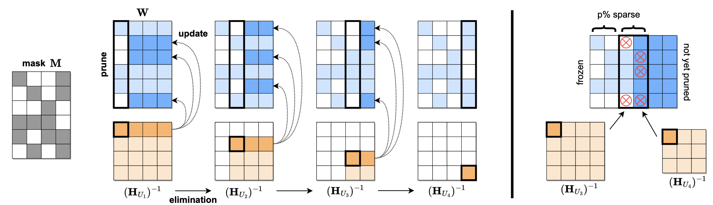
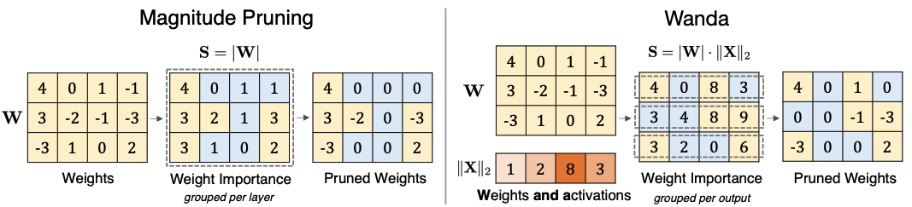

# 3.2 非结构化剪枝

## 3.2.1 介绍

&emsp;&emsp;非结构化剪枝是剪枝的一种形式，非结构化剪枝是对权重参数或单个神经元剪枝，在实现较高稀疏性的同时保证模型的性能。非结构化剪枝通过逐一评估和移除不重要的权重或神经元，使模型中大量参数变为零，达到稀疏化的效果。这种细粒度的剪枝方式允许更灵活地优化模型，使其在减少计算和存储需求的同时，仍能维持较高的准确性和性能。

&emsp;&emsp;与结构化剪枝不同，非结构化剪枝并不遵循预定义的模式或结构来进行剪枝，而是以更为细粒度的方式进行操作。在实现非结构化剪枝时，通常会引入一个掩码（Mask），该掩码与权重矩阵相乘，将选定的权重置为零，而不影响其他权重。

&emsp;&emsp;非结构化剪枝的优点在于它理论上可以达到很高的剪枝比例，实现更大幅度的模型压缩。然而，它的主要缺点在于剪枝后的模型往往无法直接在现有的硬件上高效运行，因为非结构化的稀疏性并不能有效利用现有的矩阵运算加速器（如GPU），这通常需要特殊的支持稀疏运算的硬件或软件库来实现高效的推理。

## 3.2.2 相关基础

### 3.2.2.1 OBD

&emsp;&emsp;最优脑损伤(Optimal Brain Damage, OBD)算法是在1989年提出的一种神经网络剪枝技术。实际上是指一种优化神经网络结构的方法，旨在通过移除对网络输出贡献较小的权重或神经元来减小网络规模，同时尽可能保持网络的性能。理论推导参见[OBD公式推导](chapter3/chapter3_2_1.md)。

&emsp;&emsp;OBD算法的核心思想包括：

1. **权重重要性评估**：OBD算法首先计算每个权重对损失函数的贡献。通过对损失函数进行二阶泰勒展开，评估每个权重的二阶导数（即Hessian矩阵的对角元素）来估计权重的重要性。

2. **计算权重对损失的影响**：对于每个权重，计算其对整体损失的影响，即移除该权重对损失函数增加的近似值。这一过程利用Hessian矩阵的对角线元素，计算公式为：
$$
\Delta E \approx \frac{1}{2} w_i^2 H_{i i}
$$ 
&emsp;&emsp;其中，$w_i$ 是权重，$H_{ii}$ 是Hessian矩阵的对角元素。

3. **剪枝决策**：根据上述计算结果，选择对损失影响最小的权重进行剪枝。一般是选择那些对损失函数影响最小的权重来移除。

4. **剪枝**：删除选定的权重。

&emsp;&emsp;**具体步骤如下：**

1. **训练初始模型**：首先，训练一个完整的神经网络模型，直到其达到满意的性能。

2. **计算Hessian矩阵**：对训练好的模型，计算损失函数相对于每个权重的二阶导数，形成Hessian矩阵。实际操作中，常用对角近似来简化计算。

3. **评估和排序权重重要性**：利用Hessian矩阵的对角元素，评估每个权重的重要性，并进行排序。

4. **剪枝不重要权重**：根据评估结果，删除那些对损失函数影响最小的权重。

&emsp;&emsp;**OBD优点**：
- **精细化剪枝**：OBD算法能够细粒度地评估每个权重的重要性，做到有针对性地删除不重要的权重。
- **保持性能**：通过二阶泰勒展开，OBD能够较好地估计剪枝对模型性能的影响，从而在剪枝后维持较好的性能。

&emsp;&emsp;**OBD局限性**：
- **计算复杂度高**：计算Hessian矩阵及其对角元素在大规模神经网络中非常耗时和复杂。
- **对称假设**：OBD假设Hessian矩阵是对角占优的，这在某些情况下可能不准确，影响剪枝效果。

### 3.2.2.2 OBS

&emsp;&emsp;最优脑手术（Optimal Brain Surgeon，OBS）算法是对OBD算法的改进，旨在更加精确地剪枝神经网络中的冗余权重。OBS算法在评估和删除不重要的权重时，不仅考虑了权重对损失函数的二阶导数，还考虑了各权重之间的相互依赖关系，从而实现更有效的剪枝。理论推导参见[OBS公式推导](chapter3/chapter3_2_2.md)。

&emsp;&emsp;**OBS算法的核心思想包括：**

1. **权重重要性评估**：与OBD类似，OBS也基于对损失函数的二阶泰勒展开，但OBS不仅关注Hessian矩阵的对角元素，还考虑整个Hessian矩阵，从而评估每个权重的实际重要性。

2. **计算剪枝影响**：OBS通过计算权重的变化对损失函数的精确影响来确定最优剪枝策略。具体地，OBS计算剪枝某个权重后需要调整其他权重以最小化对损失函数的影响。

3. **权重调整**：在删除不重要权重的同时，OBS会调整剩余权重以补偿剪枝带来的性能损失。这通过求解一个线性方程组来实现，从而尽量保持模型的性能。

&emsp;&emsp;**具体步骤如下:**

1. **训练初始模型**：首先，训练一个完整的神经网络模型，达到满意的性能。

2. **计算Hessian矩阵**：对于训练好的模型，计算损失函数相对于每个权重的二阶导数，形成完整的Hessian矩阵。

3. **评估权重重要性**：基于Hessian矩阵，评估每个权重的重要性。与OBD不同，OBS考虑Hessian矩阵的全部信息，而不仅仅是对角元素。

4. **计算权重影响**：对于每个候选剪枝的权重，计算其对损失函数的精确影响，以及剪枝后所需的权重调整。具体公式为：
$$
\Delta E \approx \frac{w_i^2}{2\left(H^{-1}\right)_{i i}}
$$
&emsp;&emsp;其中，$H^{-1}$ 是Hessian矩阵的逆矩阵，$\left( H^{-1} \right)_{ii}$ 是对应的对角元素。

5. **剪枝和调整权重**：选择影响最小的权重进行剪枝，并同时调整其他权重以最小化损失函数的变化。

&emsp;&emsp;**OBS优点**：
- **更精确的剪枝**：OBS通过考虑权重之间的相互依赖关系，能够更加精确地评估和剪枝不重要的权重，效果优于OBD。
- **性能保持更好**：通过调整剩余权重，OBS在剪枝后能够更好地保持模型的性能。

&emsp;&emsp;**OBS局限性**：
- **计算复杂度更高**：计算和求解Hessian矩阵的逆在大规模神经网络中非常耗时和复杂，比OBD更具挑战性。
- **实现复杂**：OBS需要求解线性方程组，并在剪枝过程中进行复杂的权重调整，实现起来比OBD更复杂。

&emsp;&emsp;尽管OBS算法计算复杂度较高，但其精确的剪枝策略使其在一些对模型压缩和性能有较高要求的应用中具有重要意义。OBS为后续研究提供了理论基础，并激励了更加高效和准确的剪枝方法的发展。

## 3.2.3 SparseGPT

&emsp;&emsp;剪枝标准之一是最小化模型的重建损失。SparseGPT 是首次针对 100 至 1000 亿参数的模型规模的单次（one-shot）剪枝方法。基于新的近似稀疏回归求解器，用于解决分层压缩问题，其效率足以在几个小时内使用单个 GPU 在最大的 GPT 模型（175B 参数）上执行。同时，SparseGPT 准确率足够高，不需要任何微调，剪枝后所损耗的准确率也可以忽略不计。

&emsp;&emsp;SparseGPT算法的流程如下图所示：

&emsp;&emsp;给定一个固定的剪枝掩码 M，使用 Hessian 逆序列并更新这些行中位于列“右侧”的剩余权重，逐步修剪权重矩阵 W 的每一列中的权重处理。具体来说，修剪后权重（深蓝⾊）“右侧”的权重将被更新以补偿修剪错误，而未修剪的权重不会生成更新（浅蓝⾊）。

&emsp;&emsp;SparseGPT遵循OBS的思想，考虑去除每个权重对网络重建损失的影响。OBS通过迭代确定剪枝掩模来剪枝权重，并重建未剪枝的权重以补偿剪枝损失。SparseGPT通过最优部分更新技术克服了OBS的效率瓶颈，即只更新子集中的所有剩余未修剪权重，使得具有不同修剪掩码的行之间重用Hessian矩阵。如上图所示，在第一步时，第2、3、6行被裁剪，对所在行的未修剪权重进行更新，1、4、5行不会被更新。此外，还提出了自适应Mask选择算法，即使用OBS重建误差的显著性大小计算哪些权重需要被冻结，并通过迭代分块的方式降低计算复杂度。

## 3.2.4 Wanda

&emsp;&emsp;Wanda方法的具体实现涉及两个关键组件：剪枝度量和比较组。剪枝度量是通过权重和输入激活值的乘积来评估权重的重要性。具体地，对于每个权重，其得分由权重的大小和相应输入特征规范的乘积计算而来。比较组是指在每个输出神经元内比较权重的重要性得分。在Wanda方法中，权重是在每个输出神经元内局部比较的，而不是在整个层次内全局比较。

&emsp;&emsp;下图对比了幅度剪枝（左）和Wanda方法（右）。

&emsp;&emsp;举个例子，假设一个具有两个输入和相应权重的神经元。$\mathbf{y}=\mathbf{w}_1 \mathbf{x}_1+\mathbf{w}_2 \mathbf{x}_2$，其中，$\left|\mathbf{w}_1\right| \leq\left|\mathbf{w}_2\right|$，目标是选择一个权重进行移除，同时对输出结果产生的影响最小，如果$x_1$和$x_2$具有相似的幅度，则很明显移除掉权重$W_1$。但如果$\left|\mathbf{x}_1\right| \gg\left|\mathbf{x}_2\right|$，结果是$\left|\mathbf{w}_1 \mathbf{x}_1\right| \gg\left|\mathbf{w}_2 \mathbf{x}_2\right|$，在此情况下，就应该删除权重$W_2$。

&emsp;&emsp;SpareGPT方法的剪枝标准可表示为：
$$\mathbf{S}_{i j}=\left[|\mathbf{W}|^2 / \operatorname{diag}\left(\left(\mathbf{X}^T \mathbf{X}+\lambda \mathbf{I}\right)^{-1}\right)\right]_{i j}$$
其中，$\mathbf{X}^T \mathbf{X}+\lambda \mathbf{I}$是针对分层重建问题的Hessian矩阵，$\lambda$是阻尼因子，以避免Hessian矩阵逆计算崩溃。

&emsp;&emsp;Wanda方法可以看作SparseGPT方法的一种特例。Wanda的剪枝标准可表示为：

$$
\mathbf{S}_{i j}  = \left[|\mathbf{W}|^2 / \operatorname{diag}\left(\left(\mathbf{X}^T \mathbf{X}\right)^{-1}\right)\right]_{i j} \text { = }\left[|\mathbf{W}|^2 /\left(\operatorname{diag}\left(\mathbf{X}^T \mathbf{X}\right)\right)^{-1}\right]_{i j}=\left(\left|\mathbf{W}_{i j}\right| \cdot\left\|\mathbf{X}_j\right\|_2\right)^2
$$

&emsp;&emsp;与SparseGPT相比：
- Wanda保持了幅度剪枝的简单性，不需要通过反向传播或任何二阶Hessian逆进行梯度计算，但在发现预训练中的稀疏网络方面也非常有效。
- Wanda 可以通过 LLM 的一次前向传递来完成。在每一层，剪枝权重可以一次性确定，无需迭代过程。在实践中，计算Wanda的剪枝指标在剪枝LLMs方面比SparseGPT快300倍。
- Wanda不需要对修剪网络进行权重更新，这表明 LLMs 具有精确的有效稀疏子网络，而不是仅仅存在于原始权重的邻域中。

## 3.2.5 实践

- [Wanda实践](https://github.com/datawhalechina/llm-deploy/blob/main/docs/chapter3/jupyter/wanda.ipynb)

## 参考文献

- [Optimal Brain Damage](https://proceedings.neurips.cc/paper_files/paper/1989/file/6c9882bbac1c7093bd25041881277658-Paper.pdf)
- [Optimal Brain Surgeon and general network pruning](https://ieeexplore.ieee.org/abstract/document/298572)
- [SparseGPT: Massive Language Models Can be Accurately Pruned in One-Shot](https://arxiv.org/pdf/2301.00774)
- [A Simple and Effective Pruning Approach for Large Language Models](https://arxiv.org/abs/2306.11695)