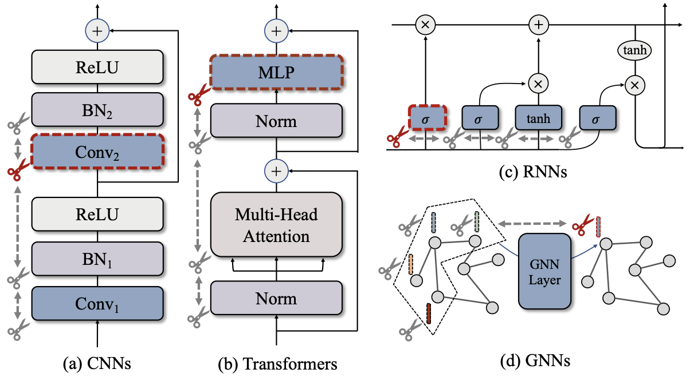
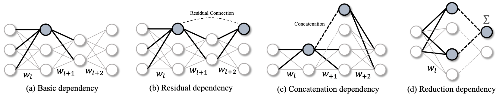
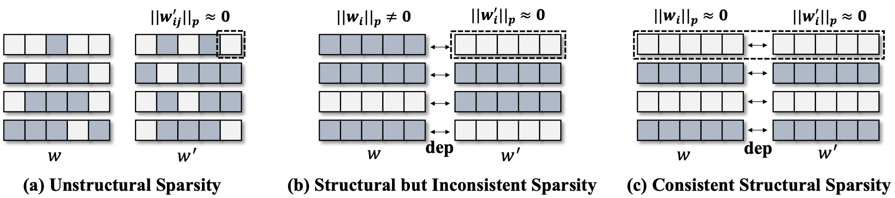
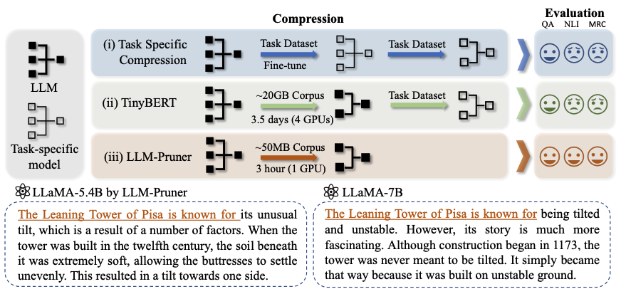
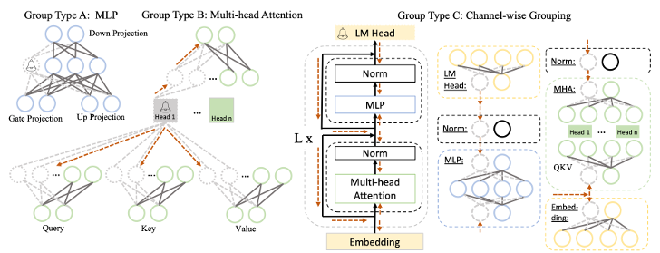
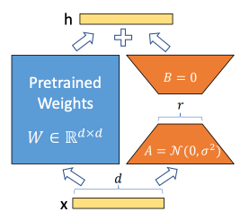

# 3.3 结构化剪枝

## 介绍

&emsp;&emsp;结构化剪枝是一种用于神经网络模型优化的技术，其目的是通过移除神经网络中的整个结构组件（例如神经元、通道或层），而不是单个的权重或连接。这种方法同时针对整组权重，具有降低模型复杂性和内存使用量，同时保持整体权重的优点。与非结构化剪枝不同，非结构化剪枝是针对单个权重进行剪枝，删除一些权重值较小的连接，而结构化剪枝则是根据特定规则针对整个子结构进行剪枝。结构剪枝通过物理去除分组参数来改变神经网络的结构，而非结构剪枝则对部分权值进行归零，而不修改网络结构。结构化剪枝的一个关键优势在于它更适合硬件加速，因为删除整个结构单元比删除单个权重更容易被硬件高效实现。结构化剪枝保持了模型的规则性，这使得模型更容易被硬件优化。例如，某些硬件加速器可能对规则的矩阵运算有更好的支持。

## 相关基础

### DepGraph

&emsp;&emsp;深度神经网络是由网络模块（卷积、归一化等）连接耦合而成。深度神经网络的结构化剪枝可以通过在网络中删除整个模块来实现，例如当删除一个通道的时候，还需要同时处理该通道与所有层的依赖关系。如下图所示，例如，为了修剪(a)中的 $Conv_2$ ，块内的所有其他层{$Conv_1$ , $BN_1$ , $BN_2$ }也必须被修剪。特别是有些复杂的网络结构，比如ResNet，层与层之间存在大量残差结构，更是提升了结构化剪枝的难度。DepGraph提供了一种可用于任何网络的结构化剪枝方法，该方法的核心在于显式地对层之间的依赖关系进行建模，并对耦合参数进行全面分组以进行剪枝。基于DepGraph算法，并开发了PyTorch结构化剪枝框架[Torch-Pruning](https://github.com/VainF/Torch-Pruning)，适用于CNNs, Transformers, RNNs, GNNs等网络，已经能够覆盖Torchvision中95%的预训练模型。

&emsp;&emsp;在一个网络中，每个神经元上通常会存在多个参数连接。如下图（a）所示，当希望通过剪枝某个神经元（高亮表示）实现加速时，与该神经元相连的多组参数需要被同时移除，这些参数就组成了结构化剪枝的最小单元，通常称为组。然而，在不同的网络架构中，参数的分组方式通常千差万别。图1（b）-（d）分别可视化了残差结构、拼接结构、以及降维度结构所致的参数分组情况，这些结构甚至可以互相嵌套，从而产生更加复杂的分组模式。在传统的剪枝流程中，参数的分组通常是手工完成的，不仅费时费力，还具有一定门槛，需要对网络结构以及层间依赖关系非常熟悉。因此，参数分组也是结构化剪枝算法落地的一个难题。

&emsp;&emsp;DepGraph算法主要包括以下几个步骤：
- 参数分组。将网络中的所有神经元分组，并将每个组的参数视为一个整体。
- 依赖图建模。使用依赖图来表示每个组之间的依赖关系。
- 利用依赖图进行剪枝。依赖图的一个重要作用是参数自动分组，从而实现任意架构的模型剪枝。

&emsp;&emsp;**参数分组。** 有没有一种通用方法能够自动分析哪些参数属于同一组呢？为了实现这一目标，DepGraph构建一个二进制的分组矩阵$G$来记录所有参数对之间耦合关系：如果第$i$层的参数和第$j$层参数相互耦合，我们就用$G_{ij}$来进行表示。参数的分组就可以简单建模为一个查询问题：

$$
g(i)=\left\{j \mid G_{i j}=1\right\}
$$

&emsp;&emsp;在分析参数依赖的过程中，有一个重要的现象，即相邻层之间的依赖关系是可以递推的。举个例子，相邻的层A、B之间存在依赖，同时相邻的层B、C之间也存在依赖，那么我们就可以递推得到A和C之间也存在依赖关系，尽管A、C并不直接连接。这就是DepGraph算法的核心，即“利用相邻层的局部依赖关系，递归地推导出我们需要的分组矩阵G”。而这种相邻层间的局部依赖关系我们称之为依赖图（Dependency Graph），记作D。 依赖图是一张稀疏且局部的关系图，因为它仅对直接相连的层进行依赖建模。由此，分组问题可以简化成一个路径搜索问题，当依赖图D中节点i和节点j之间存在一条路径时，我们可以得到$G_{i j}=1$，即i和j属于同一个分组。

&emsp;&emsp;**依赖图建模。** 结构化剪枝中同一个层可能存在两种剪枝方式，即输入剪枝和输出剪枝。对于一个卷积层而言，我们可以对参数的不同维度进行独立的修剪，从而分别剪枝输入通道或者输出通道。然而，上述的依赖图D却无法对这一现象进行建模。为此，我们提出了一种更细粒度的模型描述符，从逻辑上将每一层$f_i$拆解成输入$f_{i}^{-}$和输出$f_i^+$。为了简化问题，我们把同一层的输入和输出也视作相邻。通常而言，每个神经网络中都会存在复杂的依赖关系，但是我们依旧从上式中抽象出两类基本依赖关系，即层间依赖（Inter-layer Dependency）和层内依赖（Intra-layer Dependency）。
- 层间依赖：首先我们考虑层间依赖，这种依赖关系由层和层直接的连接导致，是层类型无关的。由于一个层的输出和下一层的输入对应的是同一个中间特征（Feature），这就导致两者需要被同时剪枝。例如在通道剪枝中，“某一层的的输出通道剪枝”和“相邻后续层的输入通道剪枝”是等价的。
- 层内依赖：其次我们对层内依赖进行分析，这种依赖关系与层本身的性质有关。在神经网络中，我们可以把各种层分为两类：第一类层的输入输出可以独立地进行剪枝，分别拥有不同的剪枝布局（pruning scheme），记作 $sch(f_i^-)$或者 $sch(f_i^+)$。这种情况下，输入和输出 在依赖图中是相互独立、非耦合的；而另一类层输入输出之间存在耦合，例如逐元素运算、Batch Normalization等。他们的参数（如果有）仅有一种剪枝布局，且同时影响输入输出的维度。实际上，相比于复杂的参数耦合类型，深度网络中的层类型是非常有限的，我们可以预先定义不同层的剪枝布局来确定图中的依赖关系。

&emsp;&emsp;在具体剪枝时，我们以任意一个节点作为起始点，例如以 $sch(f_4^+)$
作为起点，递归地搜索能够访问到的所有其他节点，并将它们归入同一个组进行剪枝。值得注意的是，卷积网络由于输入输出使用了不同的剪枝布局（$\operatorname{sch}\left(f_4^{-}\right) \neq \operatorname{sch}\left(f_4^{+}\right)$)。在依赖图中其输入输出节点间不存在层内依赖，但是由于skip连接 $f_7$的存在，递归搜索过程中$f_4^-$和 $f_4^+$会被分入同一组，即他们依旧需要被同时裁剪。其他层例如Batch Normalization的输入输出则存在简单的层内依赖。

&emsp;&emsp;**利用依赖图进行剪枝。** 依赖图的自动分组能力还可以帮助设计组级别剪枝（Group-level Pruning）。在结构化剪枝中，属于同一组的参数会被同时移除，这一情况下我们需要保证这些被移除参数是“一致冗余”的，如果这些参数中包含对网络预测至关重要的参数，那么移除这些参数难免会损伤性能。然而，一个常规训练的网络显然不能满足这一要求。这就需要我们引入稀疏学习方法来对参数进行稀疏化。这里同样存在一个问题，常规的逐层独立的稀疏技术实际上是无法实现这一目标，因为逐层算法并不考虑层间依赖关系，从而导致图(b)中非一致稀疏的情况。为了解决这一问题，我们按照依赖关系将参数进行打包，如图(c)所示，进行一致的稀疏训练（虚线框内参数被推向0），从而使得耦合的参数呈现一致的重要性。

###  LLMPruner

&emsp;&emsp;LLMPruner是第一个提出LLM结构化剪枝的方法。LLMPruner能够“物理地”移除冗余的结构和参数，同时保留大部分原模型已经学习到的参数，实现高效的大语言模型压缩。LLMPruner算法与DepGraph的思想类似。LLMPruner的示例图如下图所示，主要可以概括为：

- 与任务无关的压缩，其中压缩的语言模型保留其作为多任务求解器的能力。
- 减少了对原始训练语料库的需求，压缩只需要 5 万个公开可用的样本，大大减少了获取训练数据的预算。
- 快速压缩，压缩过程在三个小时内完成。
- 自动结构修剪框架，其中所有依赖结构都被分组，而不需要任何手动设计。

&emsp;&emsp;LLMPruner的算法流程主要分为三个阶段：

- 发现阶段。此步骤的重点是识别LLMs中相互依赖的结构组。
- 估算阶段。一旦耦合结构被分组，估计每个组对模型整体性能的贡献，并决定要修剪的组。
- 恢复阶段。此步骤涉及快速的再训练，以减轻因移除结构而导致的潜在性能下降。

&emsp;&emsp;**发现阶段。** 鉴于训练后数据的可用性有限，在压缩模型时必须优先删除损坏最小的结构。这强调了基于依赖关系的结构修剪，确保耦合结构被一致修剪。在发现阶段，主要是发现在LLMs中所有的耦合结构。

- 定义了依赖原则：如果一个神经元A依赖另一个神经元B，修剪A则必须修剪B。
- 根据依赖原则，遍历所有神经元，形成依赖关系图。
- 如下图所示，触发神经元标记为带有铃铛的圆圈，导致依赖性修剪的权重（虚线），这些权重可能会传播（红色虚线）到耦合神经元（虚线）。

&emsp;&emsp;**估算阶段。** 经过发现阶段后，模型中的所有耦合结构都已分组。通过评估整个组的重要性，而不是评估模块的重要性，在评估每个组的重要性后，对每个组的重要性进行排序，并根据预定义的修剪比率修剪重要性较低的组。计算组重要性的方法如下：
- 计算梯度（向量）重要性来估计组的重要性。
- 计算参数（每个元素、对角线元素）重要性来估计组的重要性。
- 用四种方式（求和、求积、求最大值、最后一个执行结构）聚合重要性分数。

&emsp;&emsp;**恢复阶段。** 通过Lora对剪枝后的模型进行微调。Lora的原理是通过低秩分解来模拟参数的改变量，从而以极小的参数量来实现大模型的间接训练。具体原理讲解请参考第四章低秩分解。在涉及到矩阵相乘的模块，在原始的预训练模型旁边增加一个新的通路，通过前后两个矩阵A,B相乘，第一个矩阵A负责降维，第二个矩阵B负责升维。只需在原始预训练模型旁边保存一小部分 LoRA 权重。在推理时，将训练完成的矩阵乘积跟原本预训练模型的权重矩阵W加到一起作为新权重参数替换原本预训练模型的权重$W$。

## 参考文献

- [LLM-Pruner: On the Structural Pruning of Large Language Models](https://arxiv.org/abs/2305.11627)
- [知乎NeurIPS 2023 | LLM-Pruner: 大语言模型的结构化剪枝](https://zhuanlan.zhihu.com/p/630902012)
- [知乎CVPR 2023 | DepGraph 通用结构化剪枝](https://zhuanlan.zhihu.com/p/619146631)
- [Torch-Pruning](https://github.com/VainF/Torch-Pruning)