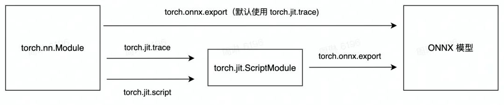

### 5.2 通用模型表示

在深度学习领域，`ONNX`（Open Neural Network Exchange）是一种通用的模型表示格式。它旨在提高不同深度学习框架之间的互操作性，使得模型可以在不同的框架和硬件平台上运行。

#### 5.2.1 ONNX简介

`ONNX` 是由 `Microsoft` 和 `Facebook` 共同创建的开源项目，旨在为神经网络定义一个开放的标准，以便在多个框架之间共享模型。`ONNX` 支持多种运算符，并且可以描述从训练到推理的完整模型。

```python
import onnx

# 加载一个 ONNX 模型
onnx_model = onnx.load("model.onnx")

# 打印模型的信息
print(onnx_model)
```


#### 5.2.2 ONNX的存储方式

`ONNX` 模型文件通常以 `.onnx` 为后缀，存储了模型的结构、权重以及其他元数据。`ONNX` 模型文件是一个标准的二进制文件，便于跨平台传输和部署。

#### 5.2.3 ONNX的组成部分和主要协议

`ONNX` 模型主要由以下几部分组成：

- `Graph`：描述了模型的计算图，包括节点和它们之间的连接关系。
- `Node`：表示计算图中的一个操作，包含操作类型和参数。
- `Tensor`：描述了模型中的数据，包括权重和输入输出数据。
- `Operator`：定义了模型中的计算操作。

`ONNX` 使用 `protobuf`（Protocol Buffers）作为其主要协议，来定义模型的结构和数据。这使得 `ONNX` 模型具有良好的可扩展性和跨平台兼容性。


#### 5.2.4 Pytorch转ONNX格式实践

TorchScript 是一种序列化和优化 PyTorch 模型的格式，在优化过程中，一个torch.nn.Module 模型会被转换成 TorchScript 的 torch.jit.ScriptModule 模型。现在， TorchScript 也被常当成一种中间表示使用。我们在[**其他文章**](https://cloud.tencent.com/developer/tools/blog-entry?target=http%3A%2F%2Fmp.weixin.qq.com%2Fs%3F__biz%3DMzI4MDcxNTY2MQ%3D%3D%26mid%3D2247489703%26idx%3D1%26sn%3D70fb7d9f40dd32349b75222c91a4838e%26chksm%3Debb51045dcc29953b9a2f2de8b482266db6f0b26d0331c8758d153b71591885ebf8b6ac321b5%26scene%3D21%23wechat_redirect&source=article&objectId=2010575)中对 TorchScript 有详细的介绍，这里介绍 TorchScript 仅用于说明 PyTorch 模型转 ONNX的原理。

torch.onnx.export 中需要的模型实际上是一个 torch.jit.ScriptModule。而要把普通 PyTorch 模型转一个这样的 TorchScript 模型，有跟踪（trace）和记录（script）两种导出计算图的方法。如果给 torch.onnx.export 传入了一个普通 PyTorch 模型（torch.nn.Module)，那么这个模型会默认使用跟踪的方法导出。这一过程如下图所示：



##### 安装必需的依赖项

由于 ONNX 导出器使用 `onnx` 和 `onnxscript` 将 PyTorch 运算符转换为 ONNX 运算符，因此我们需要安装它们。

```bash
pip install onnx
pip install onnxscript
```

##### 编写一个简单的图像分类器模型

一旦设置好环境，让我们开始使用 PyTorch 对图像分类器进行建模

```python
import torch
import torch.nn as nn
import torch.nn.functional as F


class MyModel(nn.Module):

    def __init__(self):
        super(MyModel, self).__init__()
        self.conv1 = nn.Conv2d(1, 6, 5)
        self.conv2 = nn.Conv2d(6, 16, 5)
        self.fc1 = nn.Linear(16 * 5 * 5, 120)
        self.fc2 = nn.Linear(120, 84)
        self.fc3 = nn.Linear(84, 10)

    def forward(self, x):
        x = F.max_pool2d(F.relu(self.conv1(x)), (2, 2))
        x = F.max_pool2d(F.relu(self.conv2(x)), 2)
        x = torch.flatten(x, 1)
        x = F.relu(self.fc1(x))
        x = F.relu(self.fc2(x))
        x = self.fc3(x)
        return x
```

##### 将模型导出为 ONNX 格式

现在我们已经定义了模型，我们需要实例化它并创建一个随机的 32x32 输入。接下来，我们可以将模型导出为 ONNX 格式。

```python
torch_model = MyModel()
torch_input = torch.randn(1, 1, 32, 32)
onnx_program = torch.onnx.dynamo_export(torch_model, torch_input)
```

正如我们所看到的，我们不需要对模型进行任何代码更改。生成的 ONNX 模型存储在 `torch.onnx.ONNXProgram` 中，作为二进制 protobuf 文件。

##### 将 ONNX 模型保存在文件中

虽然在许多应用程序中将导出的模型加载到内存中很有用，但我们可以使用以下代码将其保存到磁盘

```python
onnx_program.save("my_image_classifier.onnx")
```

我们可以使用以下代码将 ONNX 文件重新加载到内存中并检查它是否格式正确

```python
import onnx
onnx_model = onnx.load("my_image_classifier.onnx")
onnx.checker.check_model(onnx_model)
```

##### 使用 Netron 可视化 ONNX 模型图

现在我们已经将模型保存在文件中，我们可以使用 [Netron](https://github.com/lutzroeder/netron) 对其进行可视化。Netron 可以安装在 macos、Linux 或 Windows 计算机上，也可以直接从浏览器运行。让我们通过打开以下链接来尝试网络版本：https://netron.app/。

打开 Netron 后，我们可以将 `my_image_classifier.onnx` 文件拖放到浏览器中，或在单击**打开模型**按钮后选择它。


至此，我们已成功将 PyTorch 模型导出为 ONNX 格式，并使用 Netron 对其进行了可视化。

##### 使用 ONNX Runtime 执行 ONNX 模型

最后一步是使用 ONNX Runtime 执行 ONNX 模型，但在执行此操作之前，需要先安装 ONNX Runtime。

```python
pip install onnxruntime
```

ONNX 标准不支持 PyTorch 所支持的所有数据结构和类型，因此我们需要在将 PyTorch 输入馈送到 ONNX Runtime 之前将其调整为 ONNX 格式。在我们的示例中，输入碰巧是相同的，但在更复杂的模型中，它可能比原始 PyTorch 模型有更多输入。

ONNX Runtime 需要一个附加步骤，该步骤涉及将所有 PyTorch 张量转换为 Numpy（在 CPU 中），并将它们包装在字典中，其中键是包含输入名称的字符串，而 numpy 张量为值。

现在，我们可以创建一个*ONNX Runtime 推理会话*，使用经过处理的输入执行 ONNX 模型并获取输出。在本教程中，ONNX Runtime 在 CPU 上执行，但也可以在 GPU 上执行。

```python
import onnxruntime

onnx_input = onnx_program.adapt_torch_inputs_to_onnx(torch_input)
print(f"Input length: {len(onnx_input)}")
print(f"Sample input: {onnx_input}")

ort_session = onnxruntime.InferenceSession("./my_image_classifier.onnx", providers=['CPUExecutionProvider'])

def to_numpy(tensor):
    return tensor.detach().cpu().numpy() if tensor.requires_grad else tensor.cpu().numpy()

onnxruntime_input = {k.name: to_numpy(v) for k, v in zip(ort_session.get_inputs(), onnx_input)}

onnxruntime_outputs = ort_session.run(None, onnxruntime_input)
```

##### 将 PyTorch 结果与 ONNX Runtime 的结果进行比较

确定导出模型是否良好的最佳方法是通过针对 PyTorch 进行数值评估，PyTorch 是我们的真实来源。

为此，我们需要使用相同的输入执行 PyTorch 模型，并将结果与 ONNX Runtime 的结果进行比较。在比较结果之前，我们需要转换 PyTorch 的输出以匹配 ONNX 的格式。

```python
torch_outputs = torch_model(torch_input)
torch_outputs = onnx_program.adapt_torch_outputs_to_onnx(torch_outputs)

assert len(torch_outputs) == len(onnxruntime_outputs)
for torch_output, onnxruntime_output in zip(torch_outputs, onnxruntime_outputs):
    torch.testing.assert_close(torch_output, torch.tensor(onnxruntime_output))

print("PyTorch and ONNX Runtime output matched!")
print(f"Output length: {len(onnxruntime_outputs)}")
print(f"Sample output: {onnxruntime_outputs}")
```

