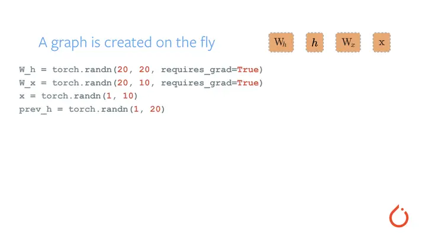

### 5.1.3 PyTorch框架专用模型表示

`PyTorch` 是一个广泛使用的深度学习框架，其专用的模型表示和部署方式在大语言模型（`LLM`）的训练和推理中尤为重要。在这一节中，我们将介绍 `PyTorch` 专用的模型表示格式 `TorchScript` 以及其在 `LLM` 部署中的应用。


#### 5.3.1 TorchScript简介

`TorchScript` 是 `PyTorch` 提供的一种中间表示（`IR`），它允许将 `PyTorch` 模型以脚本形式保存，以便在 `PyTorch` 之外运行。通过将模型转换为 `TorchScript`，我们可以在不依赖 `PyTorch` 的情况下进行推理，从而提高模型的部署灵活性和效率。

PyTorch 无疑是现在最成功的深度学习训练框架之一，是各种顶会顶刊论文实验的大热门。比起其他的框架，PyTorch 最大的卖点是它对动态网络的支持，比其他需要构建静态网络的框架拥有更低的学习成本。PyTorch 还专门为此做了一张动态图：



但是 PyTorch 不适合部署。动态建图带来的优势对于性能要求更高的应用场景而言更像是缺点，非固定的网络结构给网络结构分析并进行优化带来了困难，多数参数都能以 Tensor 形式传输也让资源分配变成一件闹心的事。另外由于图是由 python 代码构建的，一方面部署要依赖 python 环境，另一方面模型也毫无保密性可言。

而 TorchScript 就是为了解决这个问题而诞生的工具。包括代码的追踪及解析、中间表示的生成、模型优化、序列化等各种功能，可以说是覆盖了模型部署的方方面面。


#### 5.3.2 TorchScript模型转换

作为模型部署的一个范式，通常我们都需要生成一个模型的中间表示（IR），这个 IR 拥有相对固定的图结构，所以更容易优化，让我们看一个例子：

```python
import torch 
from torchvision.models import resnet18 
 
# 使用PyTorch model zoo中的resnet18作为例子 
model = resnet18() 
model.eval() 
 
# 通过trace的方法生成IR需要一个输入样例 
dummy_input = torch.rand(1, 3, 224, 224) 
 
# IR生成 
with torch.no_grad(): 
    jit_model = torch.jit.trace(model, dummy_input) 
```

到这里就将 PyTorch 的模型转换成了 TorchScript 的 IR。这里我们使用了 trace 模式来生成 IR，所谓 trace 指的是进行一次模型推理，在推理的过程中记录所有经过的计算，将这些记录整合成计算图。关于 trace 的过程我们会在未来的分享中进行解读。

那么这个 IR 中到底都有些什么呢？我们可以可视化一下其中的 layer1 看看：

```python
jit_layer1 = jit_model.layer1 
print(jit_layer1.graph) 
 
# graph(%self.6 : __torch__.torch.nn.modules.container.Sequential, 
#       %4 : Float(1, 64, 56, 56, strides=[200704, 3136, 56, 1], requires_grad=0, device=cpu)): 
#   %1 : __torch__.torchvision.models.resnet.___torch_mangle_10.BasicBlock = prim::GetAttr[name="1"](%self.6) 
#   %2 : __torch__.torchvision.models.resnet.BasicBlock = prim::GetAttr[name="0"](%self.6) 
#   %6 : Tensor = prim::CallMethod[name="forward"](%2, %4) 
#   %7 : Tensor = prim::CallMethod[name="forward"](%1, %6) 
#   return (%7) 
```

TorchScript 有它自己对于 Graph 以及其中元素的定义，但是没关系，我们还有另一种可视化方式：

```python
print(jit_layer1.code) 
 
# def forward(self, 
#     argument_1: Tensor) -> Tensor: 
#   _0 = getattr(self, "1") 
#   _1 = (getattr(self, "0")).forward(argument_1, ) 
#   return (_0).forward(_1, ) 
```

没错，就是代码！TorchScript 的 IR 是可以还原成 python 代码的，如果你生成了一个 TorchScript 模型并且想知道它的内容对不对，那么可以通过这样的方式来做一些简单的检查。


#### 5.3.3 TorchScript组件

`TorchScript` 模型主要由以下几个组件组成：

- `ScriptModule`：表示由 `Scripting` 或 `Tracing` 转换得到的模块。
- `ScriptFunction`：表示单个函数，通常用于自定义操作。
- `Graph`：表示模型的计算图，包括节点和边。

这些组件共同构成了 `TorchScript` 模型的核心，使其能够在 `PyTorch` 之外的环境中高效运行。

```python
# 调用inline pass，对graph做变换 
torch._C._jit_pass_inline(jit_layer1.graph) 
print(jit_layer1.code) 
 
# def forward(self, 
#     argument_1: Tensor) -> Tensor: 
#   _0 = getattr(self, "1") 
#   _1 = getattr(self, "0") 
#   _2 = _1.bn2 
#   _3 = _1.conv2 
#   _4 = _1.bn1 
#   input = torch._convolution(argument_1, _1.conv1.weight, None, [1, 1], [1, 1], [1, 1], False, [0, 0], 1, False, False, True, True) 
#   _5 = _4.running_var 
#   _6 = _4.running_mean 
#   _7 = _4.bias 
#   input0 = torch.batch_norm(input, _4.weight, _7, _6, _5, False, 0.10000000000000001, 1.0000000000000001e-05, True) 
#   input1 = torch.relu_(input0) 
#   input2 = torch._convolution(input1, _3.weight, None, [1, 1], [1, 1], [1, 1], False, [0, 0], 1, False, False, True, True) 
#   _8 = _2.running_var 
#   _9 = _2.running_mean 
#   _10 = _2.bias 
#   out = torch.batch_norm(input2, _2.weight, _10, _9, _8, False, 0.10000000000000001, 1.0000000000000001e-05, True) 
#   input3 = torch.add_(out, argument_1, alpha=1) 
#   input4 = torch.relu_(input3) 
#   _11 = _0.bn2 
#   _12 = _0.conv2 
#   _13 = _0.bn1 
#   input5 = torch._convolution(input4, _0.conv1.weight, None, [1, 1], [1, 1], [1, 1], False, [0, 0], 1, False, False, True, True) 
#   _14 = _13.running_var 
#   _15 = _13.running_mean 
#   _16 = _13.bias 
#   input6 = torch.batch_norm(input5, _13.weight, _16, _15, _14, False, 0.10000000000000001, 1.0000000000000001e-05, True) 
#   input7 = torch.relu_(input6) 
#   input8 = torch._convolution(input7, _12.weight, None, [1, 1], [1, 1], [1, 1], False, [0, 0], 1, False, False, True, True) 
#   _17 = _11.running_var 
#   _18 = _11.running_mean 
#   _19 = _11.bias 
#   out0 = torch.batch_norm(input8, _11.weight, _19, _18, _17, False, 0.10000000000000001, 1.0000000000000001e-05, True) 
#   input9 = torch.add_(out0, input4, alpha=1) 
#   return torch.relu_(input9) 
```

这里我们就能看到卷积、batch_norm、relu等熟悉的算子了。

上面代码中我们使用了一个名为`inline`的`pass`，将所有子模块进行内联，这样我们就能看见更完整的推理代码。`pass`是一个来源于编译原理的概念，一个 TorchScript 的 pass 会接收一个图，遍历图中所有元素进行某种变换，生成一个新的图。我们这里用到的`inline`起到的作用就是将模块调用展开，尽管这样做并不能直接影响执行效率，但是它其实是很多其他`pass`的基础。

在上一章中，我们已经介绍了ONNX， 它是业界广泛使用的一种神经网络中间表示，PyTorch 自然也对 ONNX 提供了支持。`torch.onnx.export`函数可以帮助我们把 PyTorch 模型转换成 ONNX 模型，这个函数会使用 trace 的方式记录 PyTorch 的推理过程。聪明的同学可能已经想到了，没错，ONNX 的导出，使用的正是 TorchScript 的 trace 工具。具体步骤如下：

1. 使用 trace 的方式先生成一个 TorchScipt 模型，如果你转换的本身就是 TorchScript 模型，则可以跳过这一步。
2. 使用许多 pass 对 1 中生成的模型进行变换，其中对 ONNX 导出最重要的一个 pass 就是`ToONNX`，这个 pass 会进行一个映射，将 TorchScript 中`prim`、`aten`空间下的算子映射到`onnx`空间下的算子。
3. 使用 ONNX 的 proto 格式对模型进行序列化，完成 ONNX 的导出。


#### 5.3.4 推理速度对比

在部署中，推理速度是一个关键因素。以下是一个简单的推理速度对比实验，比较原始 `PyTorch` 模型和 `TorchScript` 模型的推理时间。

```python
import time
import torch
import torch.nn as nn

# 定义一个简单的模型
class SimpleModel(nn.Module):
    def __init__(self):
        super(SimpleModel, self).__init__()
        self.fc1 = nn.Linear(32, 10)
        self.fc2 = nn.Linear(10, 1)

    def forward(self, x):
        x = torch.relu(self.fc1(x))
        x = self.fc2(x)
        return x

# 初始化模型
model = SimpleModel()
scripted_model = torch.jit.script(model)

# 创建随机输入数据
input_data = torch.randn(1000, 32)

# 计算原始模型的推理时间
start_time = time.time()
with torch.no_grad():
    for _ in range(1000):
        model(input_data)
print(f"原始模型推理时间: {time.time() - start_time} 秒")

# 计算 TorchScript 模型的推理时间
start_time = time.time()
with torch.no_grad():
    for _ in range(1000):
        scripted_model(input_data)
print(f"TorchScript 模型推理时间: {time.time() - start_time} 秒")

```

