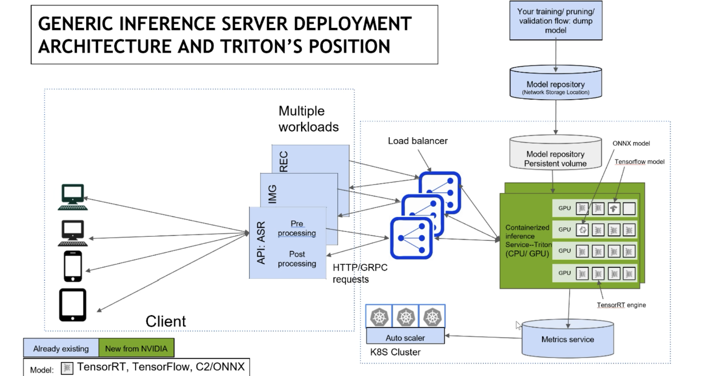

# 7.1 推理框架概述

## 7-1-1 大模型部署框架是什么？

在前面的章节中，我们介绍了量化、蒸馏、剪枝等技术，他们从模型本身入手，通过改变模型的结构和参数，使其变得更小、更快、更高效。这个章节我们会了解推理部署框架（如 `Triton Inference Server, TensorFlow Serving`），这些框架的核心目标是优化模型的推理过程，让模型在实际应用中，面对高流量，高并发的复杂情况，也能够快速、稳定地为用户提供服务，毫不夸张的说，大模型推理框架是模型部署的最后一公里。

试想你是一位大模型工程师，你和你的团队完成了模型的训练以及各种复杂的优化任务（如量化等），但是此时老板想体验一下你们的成果，让你在他的电脑上演示一下，于是你开始下载 `python`、下载 `vscode`、顺便帮老板充值个魔法…… 一天忙活下来撂下一句“用我电脑吧”。这显然不太优雅。

大模型训练完成后，如何将其封装成一个可调用的服务，是模型部署的最后一公里，也是用户使用的第一公里。推理部署框架提供标准化的 API 接口（如 `HTTP`/`gRPC`），将模型包装成服务，使得开发者可以像调用普通函数一样调用你的模型。

上文只是抛砖引玉，其实大模型推理部署框架对与开发者至关重要，是大模型落地过程中的“全能助手”。他们通过提供模型服务化、高性能推理、多框架支持、资源管理、版本管理、监控日志和安全性保障等功能，帮助开发者轻松应对部署中的各种挑战。选择一款合适的推理部署框架，可以让开发者更专注于模型本身的优化和创新，无需被部署的复杂性所困扰。

## 7-1-2 框架宏观上应该包含哪些组分？
` Tirton-Inference-Server` 是目前较为优秀的部署框架，这里用 Triton 的宏观设计图为大家介绍。

推理服务框架从宏观上来看一定会分为两个部分，一部分是 `client` 端，另一部分是服务器的架构(`server`)。也就是说，我们说的Triton 其实不等于推理服务，它只是负责在单节点上进行推理服务。

下面我们来仔细看看这张图，整体来说 `server` 端是一个 k8s集群，也就是图片绿色的部分，为什么一定要用集群呢？因为每个 GPU 上可能挂载的服务不同，每一个小的服务，其启动，生命周期的维护，以及弹性扩容等等操作，都需要一个管理系统做到自动化运维，开发者不可能来手动维护每一个小的容器。下面来具体看看 `server` 端 k8s 的主要组成部分：

- 前端负载均衡--`Load banlancer`：这一模块负责将从客户端（`client`）的推理请求，合理有效的分配给后端推理容器。

- 模型仓库持久化容器--`model repo persistent volume`：真正生产环境推理时，可能涉及到很多模型组合完成任务。例如在现代智能客服系统中，它首先要先识别你的意图，判断你是想咨询、投诉还是下单，这里会有一个意图识别模型，接着，它会根据用户输入和上下文生成文本回答，这里会有一个文本生成模型，可能最后还会跟据聊天内容进行检索，给你推荐你可能需要的商品，这里又会有一个推荐模型。这些模型需首先被单独的加入模型仓库(`Model repository`)中，随后经持久化容器，进入容器化的推理服务设备上。如图 `ONNX model、Tensorflow model`以及 `TensorRT engine`就指代不同的模型实体

- `metrics servic`e：监控整个推理服务是否正常，同时也可以对推理时的一些数据进行观测

## 7-1-3 框架设计的核心理念

在简单了解了推理部署模型架构之后，在我们大脑还没有进入太多芝士之前，不妨把自己当成一位合格的大模型工程师，如果要你设计一个框架，你应该考虑哪些问题，来保证框架高效、灵活和可拓展。

### 深度学习框架与 LLM-Deploy 框架解耦合
模型部署前是模型训练，在之前我们肯定听说过许多的深度学习框架（如 `Pytorch`、`TensorFlow`），这些深度框架底层大有不同，如果要考量训练框架的细节来设计你的框架，是非常困难的，有句古话说得好，自古 `pytorch` 和 `tensorflow` 难两全。同时我们也要保证模型的灵活性，避免与训练框架的绑定。
一般的部署框架提供统一的抽象 API接口，不去考虑训练框架的实现，让训练框架开发者自己写代码来适配我们，这样哪怕训练框架后来迭代到什么程度，你都不需要再烦恼。
### Backend 客制化
什么是 Backend，在这里指的是推理后端，通俗点也就是开发者自己开发的模型。从模型的角度出发，模型的应用场景千变万化，客制化也是保证部署框架可拓展性的重要之处。关于详细怎么来客制化会在后面介绍。
### 模型部署全流程覆盖
大模型的部署不仅仅是推理服务的启动，还涉及模型托管、性能监控、生命周期管理等多个环节。
模型托管：集中化管理模型版本，对训练数据、超参数等元信息进行存储，支持模型的热更新和多版本共存
模型性能监控：观测推理系统的推理性能，如吞吐量、错误率等，在模型服务异常时可以返回日志，并展示模型运行时的性能数据，方便开发者进行问题排查。
模型服务生命周期管理：如推理请求的整合、分发、派送，以及最后推理结果的整合
