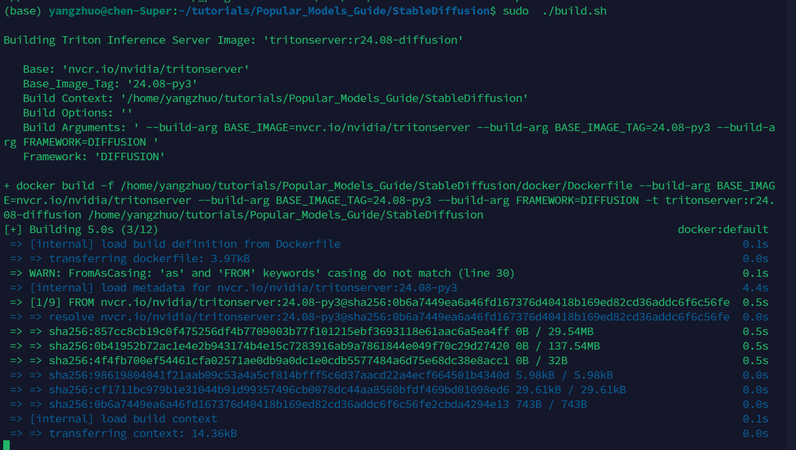

# 使用Triton和TensorRT部署Stable Diffusion模型

本示例演示了如何通过利用 TensorRT pipeline 和 utilities，将Stable Diffusion模型部署到Triton中。

以TensorRT演示为基础，本示例包含一个可重用的基于Python的后端`/backend/diffusion/model.py`，适用于部署多个版本和配置的Diffusion模型，如果不支持 CUDA，应该也可以使用CPU推理，但是本节提供的脚本是使用了GPU的。

## 环境要求

以下指令需要在安装了 Docker 的 Linux 系统中进行。若要支持 CUDA，请确保您的 CUDA 驱动程序符合 pytorch 的官方要求。

在开始一切之前，请确保您的 docker 服务已正常开启。

> [!TIP]

> 作者注：关于复现此示例所需的环境，作者尝试过很多技术方案。包括 autodl 租服务器，虚拟机，podman, docker in docker 以及市面上能看到的各种 notebook 开发环境提供商（kaggle, colab, AI studio）等，因为部署推理服务器需要用到docker，需要sudo权限，并且要在Linux环境下进行，辗转踩坑许久后，都不能让学习者轻松配置，为了避免给学习者带了更多不必要的学习成本，本教程以分享为主，需要自己有本地Linux机器。在此向各位学习者致歉。如果您有好的解决方案，欢迎在issue中分享。

> 当然如果有些小伙伴没有本地linux服务器，不能动手实操，也没有关系，教程贡献者会尽量将教程写得详细清晰，供大家学习。事实上如果不是面向生产学习，这里也不推荐大家进行复现。。。
> 就连triton官方上也写得很详细，文档只供参考，如果真正用在生产环境一定要仔细审查代码

## 构建Triton推理服务器镜像

该示例基于 Docker 镜像 `nvcr.io/nvidia/tritonserver:24.08-py3`。

提供了一组便捷的脚本，用于创建一个包含 TensorRT Stable Diffusion 演示依赖的Docker镜像（`nvcr.io/nvidia/tritonserver:24.01-py3`）。

### Triton推理服务器 + TensorRT OSS

克隆官方示例仓库：

```bash
git clone https://github.com/triton-inference-server/tutorials.git --single-branch
cd tutorials/Popular_Models_Guide/StableDiffusion
```


构建 Tritonserver Diffusion Docker 镜像（nvcr.io/nvidia/tritonserver，这个镜像特别大，在镜像里又要下很多包，下载时间特别长，如果你不听劝实在要下，推荐使用[南大的镜像源](https://doc.nju.edu.cn/books/e1654/page/ngc)）：

```bash
sudo ./build.sh
```

D


下载完成后，可能出现下面这个错误：


如果你本地确认执行`nvidia-smi`命令没有问题，
那这代表运行 Triton Inference Server 容器时，没有正确配置容器运行时以支持 GPU 访问。可以参考下面的步骤解决：

1. 安装和配置 NVIDIA Container Toolkit

```bash
distribution=$(. /etc/os-release;echo $ID$VERSION_ID) \
      && curl -fsSL https://nvidia.github.io/libnvidia-container/gpgkey | sudo gpg --dearmor -o /usr/share/keyrings/nvidia-container-toolkit-keyring.gpg \
      && curl -s -L https://nvidia.github.io/libnvidia-container/$distribution/libnvidia-container.list | \
            sed 's#deb https://#deb [signed-by=/usr/share/keyrings/nvidia-container-toolkit-keyring.gpg] https://#g' | \
            sudo tee /etc/apt/sources.list.d/nvidia-container-toolkit.list
```

2. 更新包列表并安装 NVIDIA Container Toolkit：

```bash
sudo apt-get update
sudo apt-get install -y nvidia-container-toolkit
```
3. 配置docker并重启使用NVIDIA 运行时

```bash
sudo nvidia-ctk runtime configure --runtime=docker
sudo systemctl restart docker
```

这样就可以继续执行下一步啦。

## 构建并运行Stable Diffusion v 1.5

### 启动Tritonserver Diffusion容器

以下命令启动容器，并将当前目录挂载为`.workspace`：

```bash
sudo ./run.sh
```

如图，我们就进入到容器中了：


### 构建Stable Diffusion v 1.5引擎

> [!TIP]
> 本节需要使用到HuggingFace上托管的Stable Diffusion模型，[传送门](https://huggingface.co/benjamin-paine/stable-diffusion-v1-5)。你需要先注册一个账号然后在该仓库下点击同意授权，然后才能下载模型。
> 接着创建一个 HuggingFace Access Token，[传送门](https://huggingface.co/settings/token)，然后将该Token通过以下语句导出

```bash
export HF_TOKEN=<your_hugging_face_token>
```

```bash
./scripts/build_models.sh --model stable_diffusion_1_5
```

**预期输出**：

```bash
diffusion-models
|-- stable_diffusion_1_5
|   |-- 1
|   |   |-- 1.5-engine-batch-size-1
|   |   |-- 1.5-onnx
|   |   |-- 1.5-pytorch_model
|   `-- config.pbtxt
```

### 启动服务器实例

```bash
tritonserver --model-repository diffusion-models --model-control-mode explicit --load-model stable_diffusion_1_5
```

**预期输出**：

```bash
I0229 20:15:52.125050 749 server.cc:676]
+----------------------+---------+--------+
| Model                | Version | Status |
+----------------------+---------+--------+
| stable_diffusion_1_5 | 1       | READY  |
+----------------------+---------+--------+
```

## 构建并运行Stable Diffusion XL

### 启动Tritonserver Diffusion容器

以下命令启动容器，并将当前目录挂载为`.workspace`：

```bash
./run.sh
```

## 发送推理请求

我们提供了一个示例客户端应用程序，使得发送和接收请求变得更加简单。

### 启动Tritonserver Diffusion 容器

在与服务器不同的终端中，启动新容器。

```bash
./run.sh
```

### 发送提示词到Stable Diffusion 1.5

```bash
python3 client.py --model stable_diffusion_1_5 --prompt "butterfly in new york, 4k, realistic" --save-image
```

**示例输出**：

```bash
Client: 0 Throughput: 0.7201335361144658 Avg. Latency: 1.3677194118499756
Throughput: 0.7163933558221957 Total Time: 1.395881175994873
If is given then output images will be saved as jpegs.--save-image
```

```
client_0_generated_image_0.jpg
```


如果你想更加全面的学习，可以参考triton inference server 官方源文档，[传送门](https://docs.nvidia.com/deeplearning/triton-inference-server/user-guide/docs/tutorials/Popular_Models_Guide/StableDiffusion/README.html)。