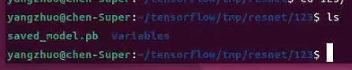

# 在 Docker 中使用 TensorFlow Serving

## 目录

Part 1: 环境设置

- 下载 ResNet SavedModel

Part 2: 在本地 Docker 中运行

  - 提交用于部署的镜像
  - 启动服务器
  - 向服务器发送请求

---

本教程展示了如何使用运行在 Docker 容器中的 TensorFlow Serving 组件来提供 TensorFlow ResNet 模型，并如何使用 Kubernetes 部署服务集群。

要了解更多关于 TensorFlow Serving 的信息，建议阅读 [TensorFlow Serving 基础教程](https://www.tensorflow.org/tfx/serving/tutorials/Basic_TensorFlow_Serving_Tutorial) 和 [TensorFlow Serving 进阶教程](https://www.tensorflow.org/tfx/serving/tutorials/Advanced_TensorFlow_Serving_Tutorial)。

要了解更多关于 TensorFlow ResNet 模型的信息，建议阅读 [TensorFlow 中的 ResNet](https://www.tensorflow.org/tutorials/images/resnet)。

## Part 1: 环境设置

### 安装 Docker

在开始之前，首先需要安装 Docker 并成功运行。

### 下载 ResNet SavedModel

清理本地模型目录（如果已经存在）：

```bash
rm -rf /tmp/resnet
```

ResNet（深度残差网络）引入了身份映射（Identity Mapping），使得训练非常深的卷积神经网络成为可能。我们将下载一个 TensorFlow SavedModel 版本的 ResNet 模型，适用于 ImageNet 数据集。

```bash
# 从 TensorFlow Hub 下载 ResNet 模型
wget https://tfhub.dev/tensorflow/resnet_50/classification/1?tf-hub-format=compressed -O resnet.tar.gz

# 解压 SavedModel 到版本号为 "123" 的子目录
mkdir -p /tmp/resnet/123
tar xvfz resnet.tar.gz -C /tmp/resnet/123/
```

验证 SavedModel 是否下载成功：

```bash
ls /tmp/resnet/*
```

输出应包含：

```
saved_model.pb  variables
```

---

## Part 2: 在 Docker 中运行

### 提交镜像以便部署

首先，我们运行一个 TensorFlow Serving 容器作为守护进程：

```bash
docker run -d --name serving_base tensorflow/serving
```

然后，我们将 ResNet 模型数据复制到容器的模型目录：

```bash
docker cp /tmp/resnet serving_base:/models/resnet
```

提交容器以便提供 ResNet 模型：

```bash
docker commit --change "ENV MODEL_NAME resnet" serving_base \
  $USER/resnet_serving
```

停止并移除基础容器：

```bash
docker kill serving_base
docker rm serving_base
```

### 启动服务器

运行以下命令启动容器并暴露 gRPC 端口 `8500`：

```bash
docker run -p 8500:8500 -t $USER/resnet_serving &
```

### 发送推理请求

首先，克隆 TensorFlow Serving 的 GitHub 仓库：

```bash
git clone https://github.com/tensorflow/serving
cd serving
```

使用 `resnet_client_grpc.py` 发送请求，该客户端会下载一张图片，并通过 gRPC 发送给服务器进行 ImageNet 分类：

```bash
tools/run_in_docker.sh python tensorflow_serving/example/resnet_client_grpc.py
```

示例输出：

```bash
outputs {
  key: "classes"
  value {
    dtype: DT_INT64
    tensor_shape {
      dim {
        size: 1
      }
    }
    int64_val: 286
  }
}
outputs {
  key: "probabilities"
  value {
    dtype: DT_FLOAT
    tensor_shape {
      dim {
        size: 1
      }
      dim {
        size: 1001
      }
    }
    float_val: 0.00129527016543
  }
}
model_spec {
  name: "resnet"
  version {
    value: 123
  }
  signature_name: "serving_default"
}
```

服务器成功分类了一张猫的图片！

---

🎉 你已经成功在 Docker 上部署了 ResNet 模型！