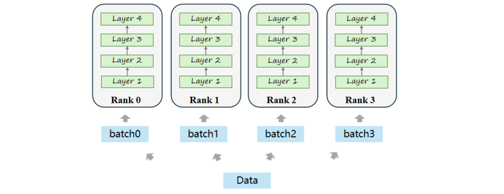
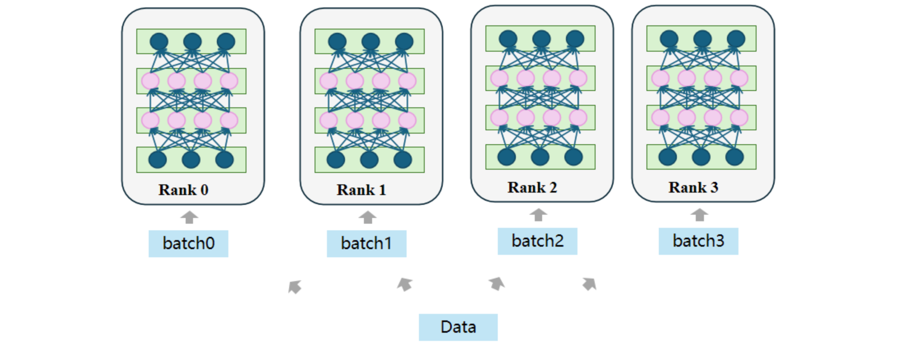

## 数据并行

数据并行算法主要是用于大模型的训练过程，即使用多个计算节点并行训练同一个模型的参数，同时不同节点之间相互通信聚合更新梯度信息，从而提高大模型数据处理的并行度。而大模型推理的数据并行则实现较为简单，如下图所示，在每个计算节点上复制一份完整模型，并将输入数据分成不同 batch 送入不同节点，各计算节点独立完成推理，输出对应的结果。但这种方法由于需要在每台机器上都复制一遍完整模型，因此内存利用率较低，并且如今的大模型通常都为百亿级别的参数规模，单张 GPU 无法加载整个模型，因此数据并行无法单独适用，于是引出模型并行的方法。

