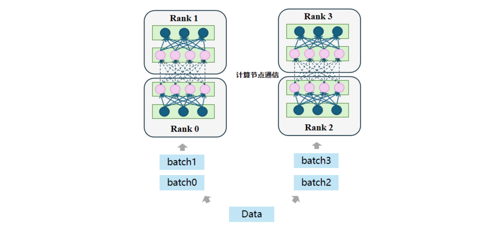
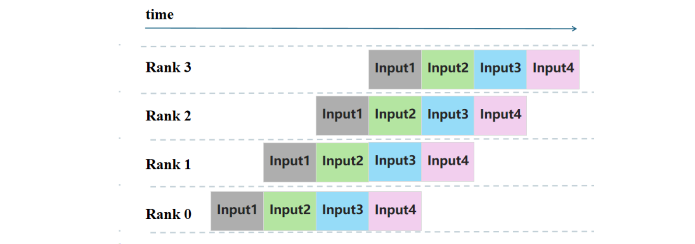
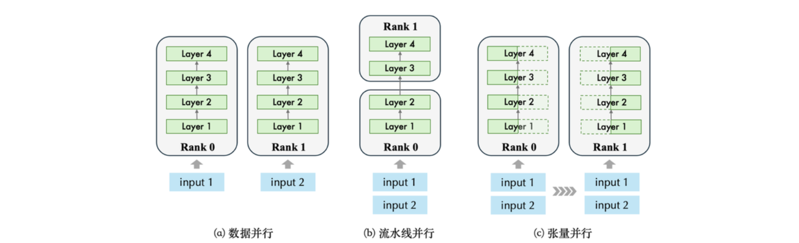

# 8.3 流水线并行

由于当前主流大模型的规模超出单块 GPU 的内存，因此需要将模型分布在不同设备上，这也称为模型并行方法。模型并行方法有两种：流水线并行和张量并行。这里首先介绍流水线并行，如下图所示，流水线并行将模型按层划分到不同 GPU 上，在各层之间并行地执行各自前向计算。
流水线并行的过程以下图为例，假设一个神经网络模型共有四层神经元，我们可以将其切分成两个层，分并别放置到两个不同的计算节点中进行计算，在计算过程中，输入数据input先进入到第一个计算节点Rank 0 中，等计算完毕后，再通过通信将Rank 1计算得到的数据结果传输到第二个计算节点 Rank 1中，再进行 Rank 1 所存储网络层的前向计算。

但这种流水线并行有着明显的缺点：后续的计算节点 Rank 1 在 Rank 0 还没处理完数据的时候会一直处于闲置状态，直到Rank 0 计算节点传来数据，这使得整个计算过程中设备利用率较低，被称为 Bubble 问题。Bubble问题指的是在运行过程中有GPU闲置导致资源浪费的情况，顾名思义，其在整个流程看起来像是一个拱起来的气泡。以上图为例子，假设当前的运行的大模型被分成4个层，且将这4个层分布式的部署在4台GPU设备上，在整个推理过程中，后面阶段的层需要等待前面阶段的层执行完毕后才能继续往下执行，在这个过程中会出现设备闲置的情况。

为了使得流水线并行中的设备利用率达到最佳，流水线并行的调度方式应当让每个阶段的执行时间应尽可能平衡。当当前节点处理完数据后，应当立即有后续数据可以处理，而非让设备限制着。该方式只在相对同构的模型（如 Transformers）中实现起来较为容易，因为其网络模型大多数层的大小通常相同，但在其他模型（如 Resnets 或 UNets）中实现则很困难。

