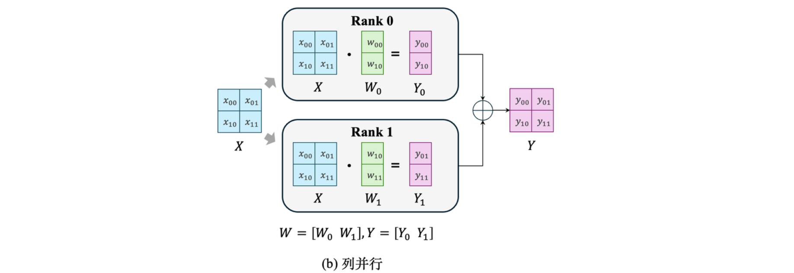
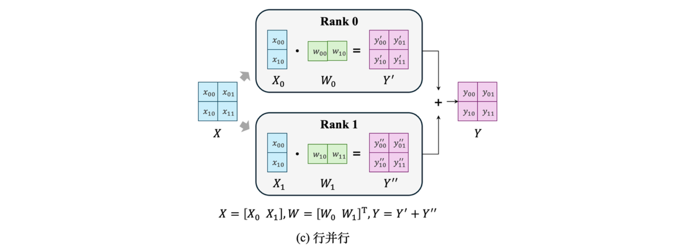
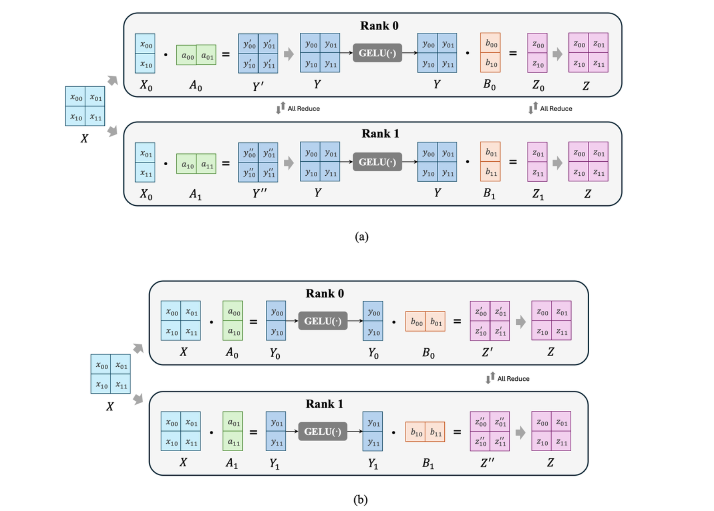
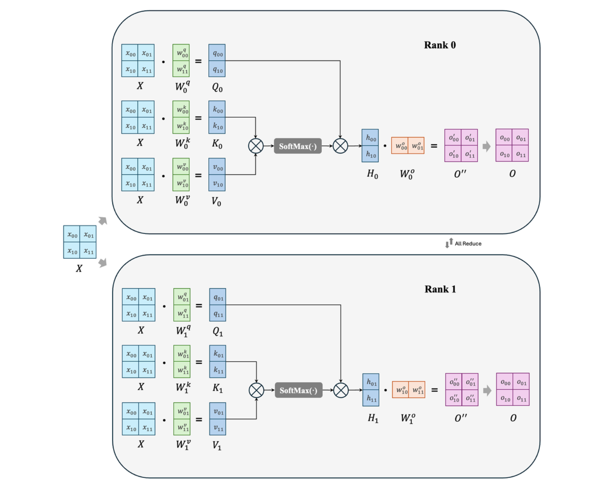
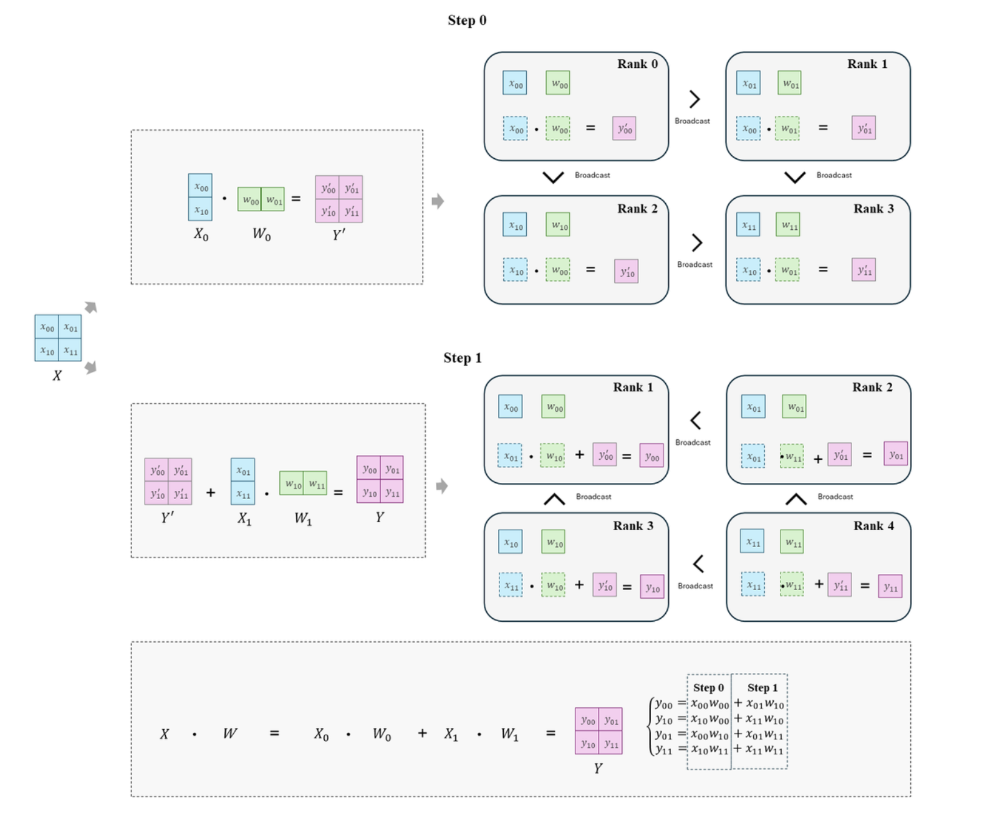

# 8.4 张量并行

与流水线并行不同，张量并行是将模型中的张量进行拆分然后分配到不同的 GPU 上，每块 GPU 都可以得到所有层张量的部分参数。这样在前向计算中有效减少了流水行并行中的空置时间，提高了 GPU 的显存利用率，因此张量并行也成了当下大模型训练和推理的主流并行方法。显存效率：模型并行会根据 worker 数量成比例地减少显存使用量。至关重要的是，这是减少单个网络层的激活显存的唯一方法。DeepSpeed 通过在模型并行 worker 之间划分激活显存来进一步提高显存效率。 计算效率：由于每次前向和反向传播中都需要额外通信激活值，模型并行的计算效率很低。模型并行需要高通信带宽，并且不能很好地扩展到通信带宽受限的节点。此外，每个模型并行worker 都会减少每个通信阶段之间执行的计算量，从而影响计算效率。模型并行性通常与数据并行性结合使用，以在内存和计算效率之间进行权衡。

## 8.4.1 1D 张量并行

从实现上看，张量并行就是把同一层的参数矩阵分块进行相互独立的矩阵乘法计算，然后合并结果，通过不同 GPU 之间的通信，保证计算图的正确性。对一个单独的矩阵，我们可以很自然想到基于行和列进行拆分，称为行并行和列并行。
如图 (a) 所示，以一般矩阵乘法为例，假设我们有 $Y=XW$ ，其中 $X\in\mathbb R^{2\times2}$ 为输入数据，$W\in\mathbb R^{2\times2}$ 为参数矩阵，在两块 GPU 上进行并行计算，输入数据 $X$ 与权重向量 $W$ 进行矩阵相乘时，计算行列对之间的点积是相互独立的。列并行就是将权重参数 $W$ 沿列分割成 $W=[W_0\ W_1]$，每块 GPU 持有一列参数 $W_0, W_1 \in \mathbb R^{2\times1}$，如图 (b) 所示，我们将 $X$ 分别输入 rank 0 和 rank 1 的 GPU 上，然后与 GPU 上的参数进行矩阵相乘，我们将得到 $Y_0, Y_1$ ，然后通过一次拼接操作就可以得到和 (a) 等价的 $Y$。而行并行则是将 $W$ 沿行进行切分 $W=[W_0 \ W_1]^{\mathrm T}$ 放置，每块 GPU 持有一行参数 $W_0, W_1 \in \mathbb R^{1\times2}$ ，然后将输入 $X$ 也沿列切分为 $X_0, X_1 \in \mathbb R^{2\times1}$ 并输入到两块 GPU 上分别进行矩阵乘法运算得到 $Y^\prime,Y^{\prime\prime}\in\mathbb R^{2\times 2}$ ，然后按元素位置相加 $Y^\prime+Y^{\prime\prime}$ 也可以得到等价的 $Y$。






不难看出，无论行并行还是列并行，想要得到最终结果，我们都需要收集所有 GPU 上的计算结果，而神经网络通常包含很多层，也就意味着在进行当前层的张量并行时，我们必须确保所有 GPU 都接收到上一层前向计算的完整计算图结果，而将所有设备的结果统筹收集的过程，称为全收集操作 All Reduce，这也正是张量并行对设备间通信带宽要求较高的原因。而我们可以通过灵活使用行并行和列并行，尽量减少前向计算中的全收集操作。
观察行并行和列并行的输入输出形式，不难发现在不进行全收集操作的情况下，行并行的输出形式恰好是列并行的输入形式，列并行的输出方式恰好是行并行的输入形式，因此不难想到，在前向计算中，这两种并行方式是交替使用的。以 Transformer 中的 FFN 层为例，FFN 层包含两个线性层 nn.linear 以及线性层中间的激活函数 GELU(·)，假设两个线性层参数分别为 $A$ 和 $B$。如果在第一个线性层进行行并行将 $A$ 拆分为 $A=[A_0 \ A_1]^{\mathrm T}$，由于激活单元需要完整计算结果，所以就需要进行一次全收集操作从而得到经过第一个线性层后的完整计算图结果 $Y=Y^\prime+Y^{\prime\prime}$，再经过激活函数 GELU，而在第二个线性层处无论进行行并行还是列并行，都需要在输入下个 Transformer 层的多注意力模块时进行全收集操作，这样在经过 FFN 层时就需要两次全收集操作；而如果在第一个线性层进行列并行 $A = [A_0 \ A_1]$，那么得到的计算图结果 $Y_0=[y_{00} \ y_{01}]^{\mathrm T}, Y_1=[y_{10} \ y_{11}]^{\mathrm T}$ 是可以分别独立经过激活单元的，而后在第二个线性层处进行行并行 $B=[B_0 \ B_1]^{\mathrm T}$，这样就只需要一次全收集操作 $Z=Z^\prime+Z^{\prime\prime}$，下图分别展示了 FFN 层两种张量并行计算步骤。



在此，我们也给出注意力层 MHA 的并行方式，同样地，将 query, key, value 矩阵使用列并行分配到不同 GPU 上，在进行各自注意力计算后，将得到表征 $H_0$和 $H_1$输入与线性层进行行并行运算，然后再将两个矩阵通过一次全收集操作相加，得到 MHA 层的输出 $O$。



Embedding的主要作用是将输入的数据转化为模型可以接受的张量类型，其过程可以看作是一个查表操作，对于Embedding算子，如果总的词表非常大，会导致单卡显存无法容纳Embedding层参数。以GPT2为例，GPT2的词表vocabulary size 为50257，假设hidden size为5120，以FP32存储，就需要50257*5120*4/1024/1024 = 981MB，反向梯度占用相同大小，两者加起来需要将近2GB。所以随着大模型的发展，也需要开始考虑对Embedding层的划分。
Embedding的划分也分为两种策略：按行划分(即，以vocabulary size维度进行划分)和按列划分(即，以hidden_size维度进行划分)
当以vocabulary size维度划分时，将embedding weight矩阵划分到多个节点中，对于每个节点都输入相同的x，查询词表，对于某些没有分配在当下节点的vocabulary相应的vector置为0，全部节点embedding完成后进行一次AllReduce操作，得到最终结果。
当以hidden size维度进行划分时，则是每个节点中存储词表的一部分，例如对于hidden size为128的，可以分为两个节点，第一个节点存储weight[:][0:63]，第二个节点存储weight[:][64-127]，embedding时将两个节点的结果进行AllGather得到最终结果。
这种划分策略主要用在推荐系统领域，因为推荐系统每个输入进行embedding时，会有很多的特征，也就是说hidden size很大，所以这种划分方式会更高效一些。

## 8.4.2 2D 张量并行

Nvidia Megatron-LM 使用的是 1D 张量并行，这种方法虽然将参数划分到多个处理器上，但每个处理器仍需要存储整个中间计算图结果，在每次计算中，每块 GPU 都需要与其他设备通信，在处理大模型时会浪费大量显存空间，通信成本会不断增加。对此，Colossal-AI 提供多维张量并行，与传统的分布式矩阵乘法相比，这些技术更节省内存和通信成本，适用于各种硬件规格。这里先介绍 2D 张量并行。2D 张量并行技术将输入数据、模型权重和层输出拆分成两个维度，与 1D 张量并行相比，内存消耗更低。对于一个 2×2 的矩阵乘法，假设我们有 4 块 GPU，那就可以将矩阵乘法分块到每块 GPU 上。将输入 $X$ 和参数 $W$ 进行如下分块 $X=[X_0\ X_1], W=[W_0\ W_1]^{\mathrm T}$，首先在 Step 1 进行 $X_0$ 与 $W_0$ 的矩阵乘法，将4 个算子分配到 4 块 GPU 上进行计算，同样，Step 2 进行 $X_1$ 与 $W_1$ 的运算，最后将两步的计算结果相加，便得到最终结果。



2D张量并行的实现如图所示，使用SUMMA矩阵乘法来实现，将输入$X$划分为$X=[X_{0},X_{1}]$，参数$W$划分为$W = 
\begin{bmatrix}
W_{0} \\
W_{1}
\end{bmatrix}$,输出就变成了$Y = X \cdot W = X_0 \cdot W_0 + X_1\cdot W_1$。SUMMA将矩阵乘法划分为n步进行，每步内部并行计算，每步之间为串行运算。$2 \times 2$个GPU中只存储输入$X$和参数$W$的部分元素以及输出$Y$的部分元素。在进行运算时，不同GPU间进行broadcast来分发GPU所需输入元素和参数元素。输入$X$按照列进行广播，当第$j$步时，将第$j$列中的$X$广播(broadcast)到同行的GPU中，即第$i$行GPU统一接收$X_{ij}$用于计算。参数$W$按行进行广播，当第$i$步时，将第$i$行的GPU的$W$广播到同一列的GPU中，即第j列的GPU统一接收$W_{ij}$用于计算。例如上图step0中，将第0列中的$X$进行broadcast通信操作，第0行统一接收$x_{00}$,第1行统一接收$x_{10}$。将第0行的进行broadcast通信操作，第0列接收$w_{00}$，第1列接收$w_{01}$。
2D张量并行相较于1D张量并行的计算过程，虽然部分并行化为串行进行计算，但是实现了中间激活activation显存占用的减少，使得能够训练更大的大模型而不受activation导致的显存瓶颈限制。

注意区分2D张量并行和数据并行/流水线+张量并行，后者常被称为混合并行，在有些场景中也被称为"2D并行"。

```python
import colossalai  
import colossalai.nn as col_nn  
import torch  
from colossalai.utils import print_rank_0
from colossalai.context import ParallelMode
from colossalai.core import global_context as gpc
from colossalai.utils import get_current_device

# 并行设置
CONFIG = dict(parallel=dict(
    data=1,
    pipeline=1,
    tensor=dict(size=4, mode='2d'),
))

parser = colossalai.get_default_parser()  
    colossalai.launch(config=CONFIG,  
    rank=args.rank,  
    world_size=args.world_size,  
    local_rank=args.local_rank,  
    host=args.host,  
    port=args.port)  
  
class MLP(torch.nn.Module):  
    def __init__(self, dim: int = 256):  
        super().__init__()  
        intermediate_dim = dim * 4  
        self.dense_1 = col_nn.Linear(dim, intermediate_dim)  
        print_rank_0(f'Weight of the first linear layer: {self.dense_1.weight.shape}')  
        self.activation = torch.nn.GELU()  
        self.dense_2 = col_nn.Linear(intermediate_dim, dim)  
        print_rank_0(f'Weight of the second linear layer: {self.dense_2.weight.shape}')  
        self.dropout = col_nn.Dropout(0.1)  

    def forward(self, x):  
        x = self.dense_1(x)  
        print_rank_0(f'Output of the first linear layer: {x.shape}')  
        x = self.activation(x)  
        x = self.dense_2(x)  
        print_rank_0(f'Output of the second linear layer: {x.shape}')  
        x = self.dropout(x)  
        return x

# 创建模型
m = MLP()

# 随机输入一些数据来运行这个模型
x = torch.randn((16, 256), device=get_current_device())

# partition input
torch.distributed.broadcast(x, src=0)
x = torch.chunk(x, 2, dim=0)[gpc.get_local_rank(ParallelMode.PARALLEL_2D_COL)]
x = torch.chunk(x, 2, dim=-1)[gpc.get_local_rank(ParallelMode.PARALLEL_2D_ROW)]
print_rank_0(f'Input: {x.shape}')

x = m(x)
```

## 8.4.3 3D 张量并行

3D 张量并行是一种更高级的并行技术，当扩展到更多设备时，3D 张量并行相比 1D 和 2D 张量并行可进一步减少内存和通信成本。3D 张量并行技术将张量分割成立方体形状，并对第一个和最后一个维度进行划分。对于矩阵乘法 $Y=XW$，给定 $2\times2\times2=8$个处理器，我们把输入 $X$ 和权重 $W$ 分别划分为 $[X_{000}\ X_{001}\ X_{010}\ X_{011}\ X_{100} \ X_{101}\ X_{110} \ X_{111}]$ 和 $[W_{000}\ W_{001}\ W_{010}\ W_{011}\ W_{100} \ W_{101}\ W_{110} \ W_{111}]$，假设 $a,b,c$分别代表矩阵的三个维度，每个 $X_{abc}$ 和 $W_{cba}$ 都被存储在 $(a,b,c)$ 的节点上，每个节点上的操作如下表所示

|  Rank $$a$$ |  Rank $$b$$ |  Rank $$c$$ | $$X$$ | $$W$$ | All Gather (+)$$X_{ac}$$ | All Gather (+)$$W_{cb}$$ | Reduce-scatter (-)$$Y$$ |
| --- | --- | --- | --- | --- | --- | --- | --- |
| 0 | 0 | 0 | $$X_{000}$$ | $$W_{000}$$ | $$X_{00}=X_{000}+X_{010}$$ | $$W_{00}=W_{000}+W_{001}$$ | $$Y_{000}=X_{00}W_{00}-X_{01}W_{10}$$ |
| 0 | 0 | 1 | $$X_{001}$$ | $$W_{100}$$ | $$X_{01}=X_{001}+X_{011}$$ | $$W_{10}=W_{100}+W_{101}$$ | $$Y_{001}=X_{01}W_{10}-X_{00}W_{00}$$ |
| 0 | 1 | 0 | $$X_{010}$$ | $$W_{010}$$ | $$X_{00}=X_{000}+X_{010}$$ | $$W_{01}=W_{010}+W_{011}$$ | $$Y_{010}=X_{00}W_{01}-X_{01}W_{11}$$ |
| 0 | 1 | 1 | $$X_{011}$$ | $$W_{110}$$ | $$X_{01}=X_{000}+X_{011}$$ | $$W_{11}=W_{110}+W_{111}$$ | $$Y_{011}=X_{01}W_{11}-X_{00}W_{01}$$ |
| 1 | 0 | 0 | $$X_{100}$$ | $$W_{001}$$ | $$X_{10}=X_{100}+X_{110}$$ | $$W_{00}=W_{000}+W_{001}$$ | $$Y_{100}=X_{10}W_{00}-X_{11}W_{10}$$ |
| 1 | 0 | 1 | $$X_{101}$$ | $$W_{101}$$ | $$X_{11}=X_{101}+X_{111}$$ | $$W_{10}=W_{100}+W_{101}$$ | $$Y_{100}=X_{11}W_{10}-X_{10}W_{00}$$ |
| 1 | 1 | 0 | $$X_{110}$$ | $$W_{011}$$ | $$X_{10}=X_{100}+X_{110}$$ | $$W_{01}=W_{010}+W_{011}$$ | $$Y_{110}=X_{10}W_{01}-X_{11}W_{11}$$ |
| 1 | 1 | 1 | $$X_{111}$$ | $$W_{111}$$ | $$X_{11}=X_{101}+X_{111}$$ | $$W_{11}=W_{110}+W_{111}$$ | $$Y_{111}=X_{11}W_{11}-X_{10}W_{01}$$ |

```python
# 并行设置
CONFIG = dict(parallel=dict(  
    data=1,  
    pipeline=1,  
    tensor=dict(size=8, mode='3d'),  
))

...
  
# 创建模型
m = MLP()

# 随机输入一些数据来运行这个模型
x = torch.randn((16, 256), device=get_current_device())

# partition input  
torch.distributed.broadcast(x, src=0)  
x = torch.chunk(x, 2, dim=0)[gpc.get_local_rank(ParallelMode.PARALLEL_3D_WEIGHT)]  
x = torch.chunk(x, 2, dim=0)[gpc.get_local_rank(ParallelMode.PARALLEL_3D_INPUT)]  
x = torch.chunk(x, 2, dim=-1)[gpc.get_local_rank(ParallelMode.PARALLEL_3D_OUTPUT)]  
print_rank_0(f'Input: {x.shape}')  
  
x = m(x)
```