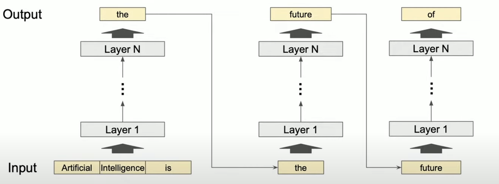
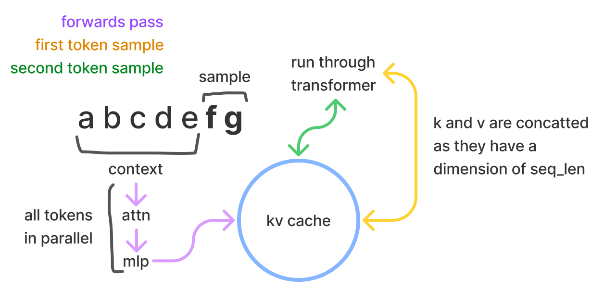
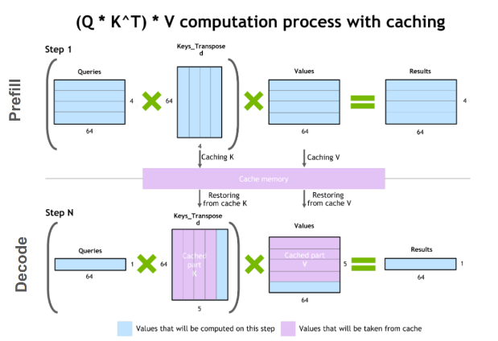
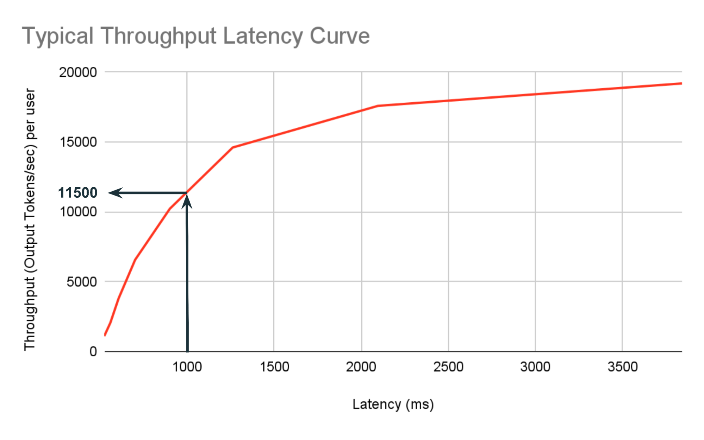
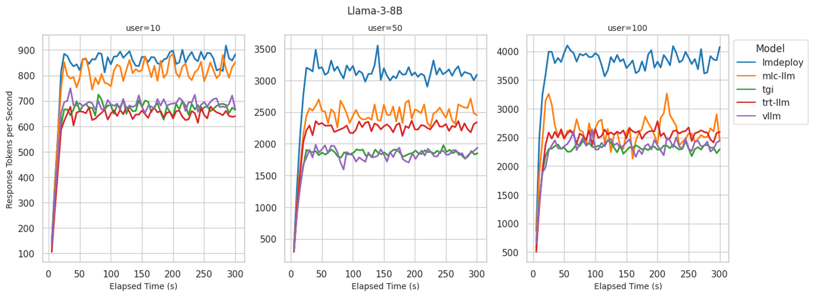

# 9. 并发

&emsp;&emsp;我们日常使用 ChatGPT 等大语言模型（LLM）应用来提升工作效率，或者通过模型厂商提供的 API 来开发项目。那么，这些服务是如何确保在生产环境中应对每分钟数万次乃至更多请求的同时，还能为全球用户提供始终如一的良好体验呢？这离不开先进的**并发处理技术**的支持。

## 1. 推理过程

&emsp;&emsp;LLM 推理分为两部分: 预填充阶段（Prefill） 和生成阶段（Generation）。

### 1.1 预填充阶段

&emsp;&emsp;在预填充阶段所做的事有：处理输入 prompt 的所有 tokens 并行计算所有输入 tokens 的 attention，生成并缓存 Key-Value（KV cache）。通常耗时较长，但只需执行一次。

### 1.2 生成阶段

&emsp;&emsp;该阶段则是自回归生成每个新 token，使用之前生成的 KV cache，只需计算最新 token 的 attention。每个 token 耗时较短，但由于 Transformer 的自回归特性需要串行执行。

&emsp;&emsp;模型从输入序列（例如 “Artificial Intelligence is”）开始，通过多层网络计算生成下一个单词（如 “the”）。每次生成一个新单词后，将其加入到输入序列中，作为下一次推理的输入。这个循环过程一直持续，直到达到预设的最大长度（如 2048 tokens）或生成特定结束标记（如 `<end of sequence>`）。



&emsp;&emsp;由于 Transformer 的自回归特性，其推理是逐步的，每一步都依赖上下文和历史生成结果。因此还需要先前所有 tokens 的表示。

## 2. KV-Cache

在训练过程中，Attention 机制会计算查询（Query）、键（Key）和值（Value）矩阵的所有元素之间的关系。这意味着模型会使用**完整的 QKV 矩阵** 来计算注意力分数和加权和，从而生成所有可能的 next token。



而在推理过程中我们只关心预测 next token，为了提高效率，只需要计算当前最尾的一个查询向量（Q[-1]）与所有的键向量（K[:]）和值向量（V[:]）之间的关系。通过计算好的 k 和 v 值，我们可以用空间换时间。

无 kv-cache 时,

```python
idx = cat(idx, next_idx)
```

开启 kv-cache 后,

```python
idx = next_idx
```



更详细的实现如下：

```python
# 训练时预分配 cache 空间
self.cached_keys = torch.zeros(
    (max_batch_size, max_sequence_length, num_attention_heads, attention_dim)
)
self.cached_values = torch.zeros(
    (max_batch_size, max_sequence_length, num_attention_heads, attention_dim)
)

# 推理时在 forward 中:
# 1. 计算当前输入的 QKV
query = self.query_proj(x).view(batch_size, seq_length, num_heads, attention_dim)
key = self.key_proj(x).view(batch_size, seq_length, num_heads, attention_dim)
value = self.value_proj(x).view(batch_size, seq_length, num_heads, attention_dim)

# 2. cache
if using_cache and not self.training:
    # 将新计算的 key,value 存入 cache 对应位置
    self.cached_keys[:batch_size, start_position:start_position + seq_length] = key
    self.cached_values[:batch_size, start_position:start_position + seq_length] = value
    
    # 获取包含历史和当前的完整 key,value 序列
    key = self.cached_keys[:batch_size, :start_position + seq_length]
    value = self.cached_values[:batch_size, :start_position + seq_length]
```

因此，高效管理 KV-Cache 是实现高吞吐量部署服务的关键，我们会在 **9.2 节** 中详细讨论。

## 3. 重要指标

&emsp;&emsp;为了评估 LLM 的并发推理能力，我们最感兴趣的指标是**延迟**（latency）和**吞吐量**（throughput）。

### 3.1 延迟

&emsp;&emsp;延迟是评价 LLM 对用户查询给出反馈速度的标尺，塑造了用户对生成型 AI 应用的直观体验。因此在即时交互场景中，低延迟极为关键。为了全面评估模型延迟，可采纳以下几种度量方式：

#### 3.1.1 **TTFT**（Time to First Token）

&emsp;&emsp;即从请求发出到接收首个回答 token 的时间间隔。

&emsp;&emsp;影响 TFTT 的主要因素有：

- **网络速度**：取决于系统的带宽以及网络请求在推理时是否拥挤。
- **输入序列长度**：提示（prompt）越长，则模型在输出第一个令牌之前需要更多处理。
- **模型大小**：直观上，模型参数量越大，则执行计算以生成响应会增加，并导致 TFTT 变长。

&emsp;&emsp;这一指标在“在线流式输出模式”下尤为重要，因为它直接影响用户感知的响应速度。

#### 3.1.2 **TPOT**（Time per Output Token）

&emsp;&emsp;即除了首个 token 外，输出每个 token 的平均时长。

&emsp;&emsp;较短的 TPOT 可以提高系统的整体响应速度，特别是在需要生成大量文本的情况下，如离线批处理服务。

#### 3.1.3 总体延迟

&emsp;&emsp;指的是模型的**端到端延迟**：从用户最初输入提示到接收到模型完成的输出之间的时间跨度。

&emsp;&emsp;通常我们说的延迟，实际上指的就是这个指标。其计算方式如下：

$$总体延迟 =  TTFT + (TPOT \times 要生成的\:token\:数量)$$

&emsp;&emsp;从公式中可以看出，影响 TFTT 的主要因素有：

- 输出长度：最重要的影响因素，因为它直接决定了 TPOT 部分的大小。输出越长，即需要生成的 token 数量越多，延迟时间也会相应增加。

- 预填充时间：对应 TTFT。

- 排队时间：由于硬件限制——尤其是 GPU 显存不足时，LLM 可能无法跟上用户的请求速度。这意味着部分输入请求需要先排队等候处理。这也正是 TTFT 成为一项普遍记录指标的原因所在，因为它能揭示模型服务器应对不同数量用户请求的能力如何，进而预示其在实际应用场景中的表现。如何在有限的显存下降低排队时间，便是提升并发的一个方向。
  


### 3.2 吞吐量

&emsp;&emsp;LLM 的“吞吐量”指标衡量的是在给定时间范围内它可以处理的请求数量或产生输出的数量。通常通过两种方式来衡量：**每秒请求数（QPS）** 和 **每秒输出 tokens 数（TPS）**，你一般可以在模型供应商的开发文档中找到这两个指标。

#### 3.2.1 QPS

&emsp;&emsp;这一指标取决于模型的总生成时间和同时处理的请求数量，即模型处理并发请求的能力如何。然而，总生成时间会根据模型输入和输出的长度而变化。

#### 3.2.2 TPS

&emsp;&emsp;由于 QPS 受总生成时间的影响，而总生成时间又依据模型输出的长度（及较小程度上输入的长度），TPS 成为了衡量吞吐量更常用的指标。

&emsp;&emsp;其计算方式为：

$$TPS = (要生成的\:token\:数量) / 延迟$$

## 4 推理框架

&emsp;&emsp;为了优化 Transformer 模型的推理性能，出现了各种推理框架。

&emsp;&emsp;推理框架的主要目标是优化模型的推理过程，以提高效率和降低资源消耗。以下是一些常见的推理框架/引擎的优化方法，其中部分在前面几章有相关介绍：

### 4.1 模型压缩

- 量化：将模型参数从浮点数转换为低精度表示（如 INT8），以减少计算量和内存占用。
剪枝：移除模型中不重要的权重或神经元，以减少模型大小和计算复杂度。
- 蒸馏：使用一个较小的“学生”模型来学习和模仿一个较大的“教师”模型的行为，从而在保持性能的同时减少模型大小。
  
### 4.2 并行化和分布式计算：

- 数据并行：将数据分成多个小批次，并行处理以提高吞吐量。
- 模型并行：将模型分成多个部分，分布在不同的计算节点上并行处理。
- 硬件加速：使用专门的硬件（如 GPU、TPU）并结合高性能算子（如 CUDA、OpneAI Triton）加速模型推理过程。

### 4.3 缓存和重用

高效缓存、管理中间计算结果甚至是直接存储常见输入结果，以减少重复计算。

下面是 BentoML 对几大推理框架的性能测评，以Llama3-8b 部署为例：




## 参考文章

- [Fast, Secure and Reliable: Enterprise-grade LLM Inference](https://www.databricks.com/blog/fast-secure-and-reliable-enterprise-grade-llm-inference)