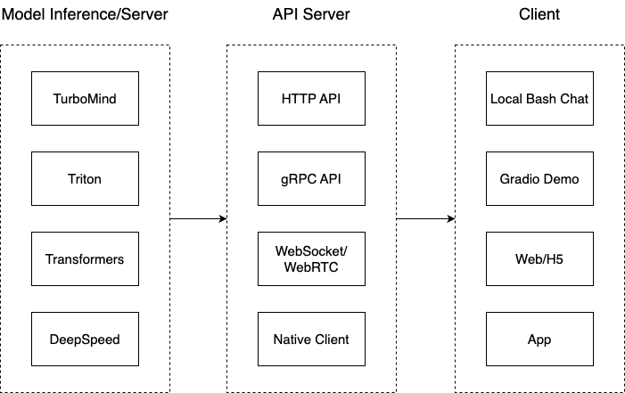

# 9.2 批处理

同样的例子，

举例：
多个用户同时输入：

用户A：“你好，今天的天气怎么样？”
用户B：“请问现在几点了？”
用户C：“能推荐一本好书吗？”

涉及在实际执行推理操作之前，将多个查询整合成一个大批次的请求统一处理，这样就提升了系统整体的处理能力（吞吐量）。


### 静态批处理 (Static Batching)


> 经典图：一个 batch 由 S1-4 这四个请求组成，这里上下文长度是 8，那四个请求一共分配 $4 \times 8 = 32$ 块内存， 

可以看到，序列3在第二次迭代后就完成了，但由于静态批处理的限制，GPU 需要等到所有序列都完成后才能继续处理。

相比之下，动态批处理机制作为动态批处理的一个特例，展现出更高的灵活性。

### 动态批处理（Continuous Batching）
也被称为持续批处理


Orca 论文中采用迭代级调度而不是等待批处理中每个序列完成生成，其中批处理大小由每次迭代确定。这样的好处是，一旦批处理中的一个序列完成生成，就可以插入新序列以取代它，从而比静态分批实现更高的GPU利用率。

## LMDeploy（动手实践）

LMDeploy 由 MMDeploy 和 MMRazor 团队联合开发，是涵盖了 LLM 任务的全套轻量化、部署和服务解决方案。



### TurboMind

TurboMind 推理框架的构造如下：

```txt
┌─────────────────────────────────────────────────────────────────────┐
│                                API                                  │
└───────────────────────────────┬─────────────────────────────────────┘
                                │
              ┌─────────────────┴─────────────────┐
              │                                   │
              ▼                                   │
┌─────────────────────────────┐         ┌─────────┴─────────┐
│     Contunious Batch        │ ◄─────► │   KV Cache 管理器  │
└─────────────┬───────────────┘         └───────────────────┘
              │
              │
              ▼
┌─────────────────────────────┐
│  LLaMa Inference Implement  │
├─────────────────────────────┤
│   FT kernels & utilities    │
└─────────────────────────────┘
```

### vLLM

vLLM 旨在通过动态分配物理块给逻辑块，并优化 key-value 缓存数据的存储和访问，减少内存浪费并提高吞吐量。它旨在通过最大化硬件利用率和最小化延迟来增强 LLM 服务系统的性能。属于大语言模型生态中的**模型服务和部署**部分。


#### 使用示例（待完善）
```python
!pip3 install vllm
```

安装完成后，导入 LLM、SamplingParams 和 destroy_model_parallel

使用参数进行初始化，例如模型和分词器的名称或路径，以及内部处理的数据类型（设置为 'float16' ）。

使用 SamplingParams 类定义采样参数，如 `temperature`、`top_p` 和 `top_k`，以控制文本生成过程中标记的随机性和选择。最后，在考虑输入提示的情况下，使用初始化模型和采样参数执行文本生成。

```python
from vllm import LLM, SamplingParams
from vllm.model_executor.parallel_utils.parallel_state 
import destroy_model_parallel

model = LLM(
    model=model_name,
    tokenizer=tokenizer_name,
    dtype='float16'
    )

sampling_params = SamplingParams(
    temperature=0.5,
    top_p=0.95,
    top_k=50
    )

outputs = model.generate(
    self.prompt,
    sampling_params
    )
```

