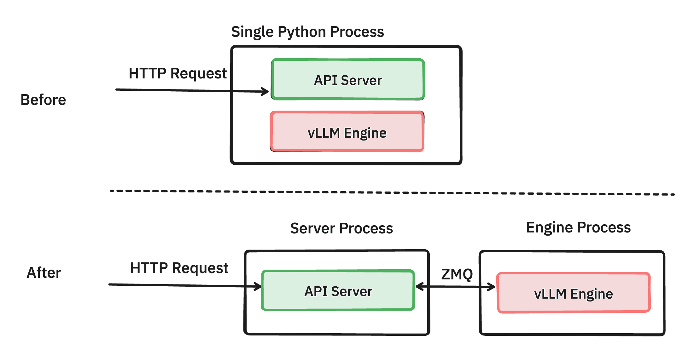
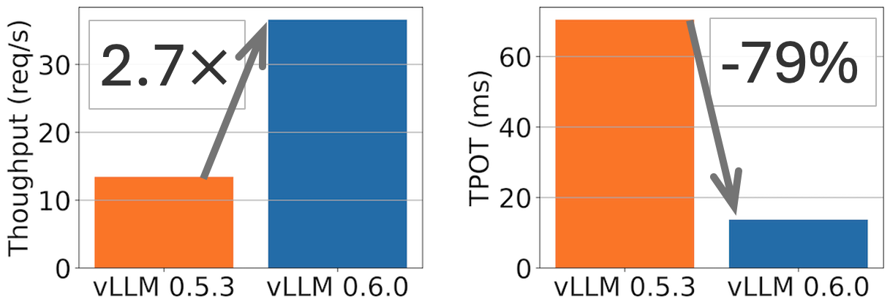
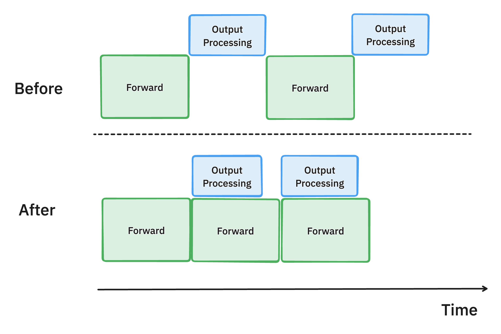

# 9.2 异步

在预填充阶段，模型需要接收和处理来自不同用户的多个输入。这时可以利用**异步处理**技术来提高效率。

先热身一下~

## 9.2.1 流式处理(Streaming)

流式处理采用异步通信方式，减少了不必要的等待和阻塞，提高了系统的并发性能和吞吐量

想象一下,如果用户每次与 ChatGPT 对话时都必须等待整个回答生成完毕再显示结果，这种体验多少不太舒服。因为人类在交流时往往是实时获取信息的，逐字逐句地接收信息更符合自然的交流习惯。

流式处理巧妙地解决了这个问题。它让 LLM 能够"边思考边说话，就像人类交谈一样自然。当模型生成第一个词时，它就立即被发送给用户，紧接着是第二个词，第三个词...这样，用户几乎可以实时地看到回答的形成过程，大大提升了交互体验。

流式处理的魅力不仅仅在于提升用户体验。从技术角度来看，它还大大提高了系统的并发性能。传统的方法可能需要等待整个响应生成完毕才能处理下一个请求，而流式处理允许系统同时处理多个请求的不同部分。想象一下，这就像是一个高效的多任务处理器，能够同时应对多个对话，每个对话都在稳步推进。

vLLM 利用异步生成器 (async generator) 来实现流式输出。这允许模型一边生成 token,一边将其 yield 给调用者,而不需要等待整个响应生成完毕,下面是一个简化的实现:

```python
import asyncio
import random

async def async_word_generator(sentence):
    words = sentence.split()
    for word in words:
        # 模拟推理时间
        await asyncio.sleep(random.uniform(0.3, 1.0))
        yield word

async def stream_sentence():
    sentence = "vLLM 的异步生成器可以实现流式输出 让用户体验更加流畅 同时提高系统效率"
    async for word in async_word_generator(sentence):
        print(word, end=' ', flush=True)
    print()  

async def main():
    await stream_sentence()

if __name__ == "__main__":
    asyncio.run(main())
```

此外,vLLM 官方给出的 API 服务器示例使用了 FastAPI 框架,它原生支持异步编程。这使得服务器可以高效地处理多个并发的流式请求。

不过虽然对用户来说是流式的,但在底层 vLLM 仍然使用批处理来提高效率。它会预先生成一批 token,然后逐个返回给用户。

热身结束!真正的并发性能提升主要来自于服务器架构、算法优化和硬件资源,我们以 vLLM 最近的更新内容为例:


## 9.2.2 异步通信

在早期的 vLLM 架构中，API 服务器（API Server）和推理引擎（vLLM Engine）运行在同一个 Python 进程中。这意味着所有的 HTTP 请求都由同一进程处理，API Server 接收请求后直接调用 vLLM Engine 进行推理。虽然这种方式在负载较低时能够正常工作，但在高并发场景下，会引发性能瓶颈。

- CPU 资源竞争：API Server 和 vLLM Engine 都需要大量的 CPU 资源来处理网络请求、数据解析和模型推理。当它们共享同一个进程时，会导致 CPU 资源争用，降低系统的整体性能。
  
- GIL 限制：由于 Python 的全局解释器锁（GIL），多线程无法真正实现并行执行。这使得在同一进程中处理大量并发请求时，性能受到严重限制。
  
- 响应延迟增加：当 API Server 被繁重的推理任务阻塞时，新的请求可能无法及时得到处理，导致响应延迟增加，影响用户体验。

### 9.2.2.1 解决方案：进程分离与异步通信

为了解决上述问题，vLLM 在 [PR#6883](https://github.com/vllm-project/vllm/pull/6883) 中引入了新的架构，将 API Server 和 vLLM Engine 分离为两个独立的进程。这两个进程之间通过 ZMQ（ZeroMQ）进行高效的异步通信。


> [ZMQ](https://zh.wikipedia.org/wiki/%C3%98MQ) 是一种高性能的异步消息库，能够支持异步消息传递，允许 API Server 非阻塞地将请求发给 vLLM Engine。


- 进程隔离：API Server 专注于接收和解析 HTTP 请求，以及返回响应；vLLM Engine 专注于请求的调度和模型推理。这样，两个进程各自占用不同的 CPU 资源，互不干扰。
- 异步通信：利用 ZMQ 的高性能消息传递机制，实现了进程间的异步通信，避免了同步阻塞，提高了系统的并发处理能力。
- 资源优化：通过进程分离解耦，减少了 Python GIL 对多线程性能的限制，充分发挥多核 CPU 的优势。

采用新的架构后，vLLM 在高并发场景下的性能得到了显著提升：



### 9.2.2.2 异步输出处理

异步处理的引入虽然会带来一定的延迟，但如果用少量延迟换取 GPU 利用率的提升显然是笔划算买卖。随着批量处理请求增加，系统的并发处理能力也随之增强。



在引入异步输出处理之前，GPU 在每次完成前向计算后，必须等待 CPU 完成输出处理才能继续执行下一步。这导致了大量的 GPU 空闲时间，限制了 GPU 计算资源的充分利用。

通过引入异步输出处理，输出处理与模型前向计算并行进行。在执行第 $n$ 步计算时，vLLM 并不会等待第 $n$ 步的输出处理完成，而是立即开始第 $n+1$ 步的模型推理。此时，CPU 会并行处理第 $n$ 步的输出。

由于 GPU 不再需要等待 CPU 处理输出数据，GPU 的计算资源得到了充分利用。这样可以减少 GPU 的空闲时间，提升吞吐量和整体性能，vLLM 的每个输出 token 的处理时间（Time-Per-Output-Token, TPOT）得到了显著优化。例如，在 Llama 70B 模型和 4xH100 GPU 的场景下，TPOT 提升了 8.7%，即 GPU 处理速度提高，使得推理能力大幅度增强。

## 参考文章

- [vLLM v0.6.0: 2.7x Throughput Improvement and 5x Latency Reduction](https://blog.vllm.ai/2024/09/05/perf-update.html)
