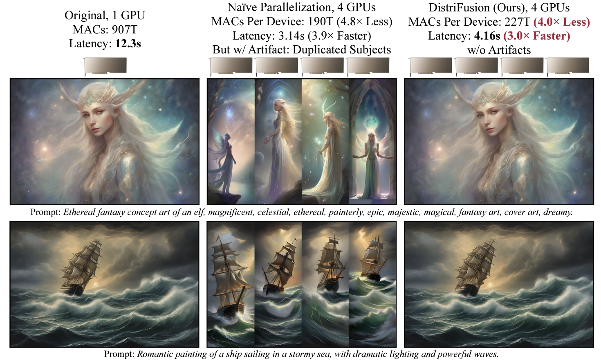
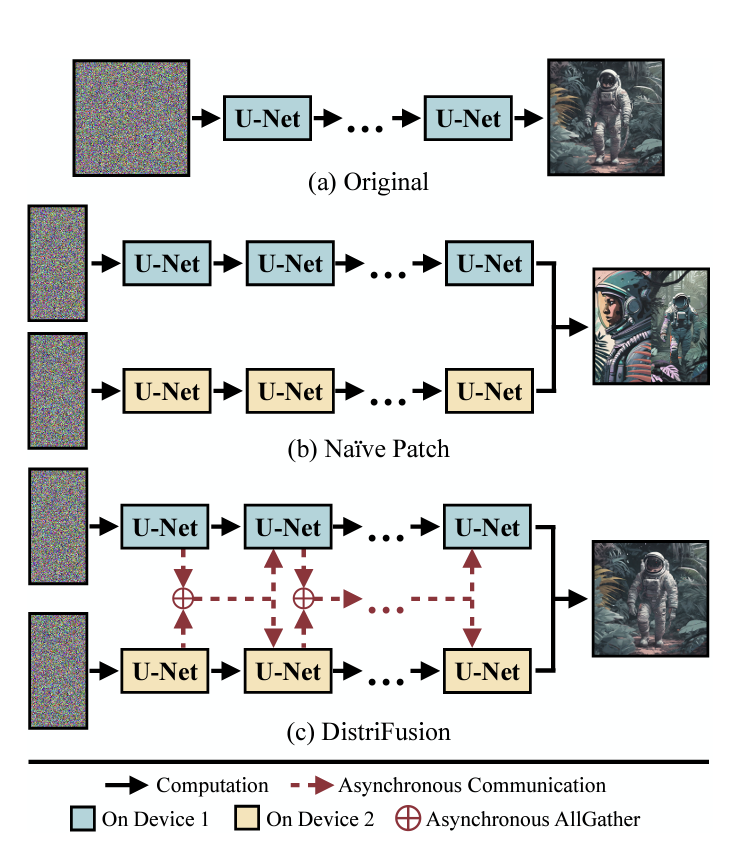

# 9.3 分布式

如今, 像 Llama-3.1-405b 这样的大语言模型显然装在一块 GPU 内,而是通过张量并行实现了分布式推理,大幅降低了训练/推理的延迟。

我们在[第八章](https://datawhalechina.github.io/llm-deploy/#/chapter8/chapter8_4)介绍过,张量并行是一种常见的模型并行技术，它将模型的权重张量切分到多个设备上，使得每个设备只负责计算一部分张量的操作。这样做可以使模型在多个 GPU 上同时计算，加快处理速度。

## Ray-Serve

在传统的生产环境中，部署机器学习模型往往需要构建复杂的基础设施。这通常涉及使用消息队列（如 Redis 或 RabbitMQ）来处理数据流，结合 Celery 等工作线程框架来调度任务。这些系统被精心拼接在一起，以应对负载均衡、工作进程管理以及应用程序各部分之间的通信等关键任务。尽管这种方法在功能上是可行的，但它往往需要大量的工程投入，以确保系统具备容错能力、能够高效扩展并保持低延迟的响应时间。

在这种背景下，Ray Serve 提供了一种更为简洁的解决方案，极大地简化了机器学习模型的部署过程。Ray Serve 的核心优势在于，它将传统上需要独立管理的消息队列和工作进程的功能，巧妙地整合到了一个统一的框架中。这意味着开发人员不再需要处理复杂的基础设施设置，可以将更多精力集中在模型的核心功能上。Ray Serve 通过直观的 API，隐藏了底层的复杂性，同时提供了强大的负载分配、容错和动态扩展能力。结果是，模型的部署不仅变得更快、更简单，还显著提升了系统的可靠性和响应速度。

### Ray Serve 的核心优势

Ray Serve 专为处理并发请求而设计，这使它在生产环境中的表现尤为出色。

- 并发处理能力： 随着请求量的增加，Ray Serve 能够智能地在可用资源之间分配这些请求，确保每个请求都能得到及时处理。这种并发管理能力使得系统在面对高负载时依然能够保持稳定的性能。

- 高效的请求批处理： Ray Serve 支持请求批处理，这意味着它可以将多个输入合并处理，特别适合那些在处理批量数据时比逐一处理更为高效的模型。通过批处理，系统的整体吞吐量得以显著提升。

- 精细的资源管理： Ray Serve 允许对每个模型实例分配的资源（如 CPU、GPU、内存）进行精细控制。这种精细化的资源管理确保了资源的最优利用，避免了资源的浪费，同时防止了性能瓶颈的出现。

- 异步编程的支持： Ray Serve 支持异步编程，这意味着即使在处理长时间运行的推理任务时，系统的其他部分也不会被阻塞。这种设计提高了系统的可扩展性，使得它能够更高效地处理大量并发请求。

使用 vLLM 做张量并行,Ray 做数据并行:

```python
import os
import ray
from typing import List
from vllm import LLM, SamplingParams

os.environ["CUDA_VISIBLE_DEVICES"] = "0,1,2,3,4,5,6,7"

@ray.remote(num_gpus=0)
def infer(model_path: str, prompts: List[str]):
    """
    使用vLLM进行推理并返回结果。

    Args:
        model_path (str): 模型路径
        prompts (List[str]): 输入提示列表

    Returns:
        List: 推理结果列表
    """
    try:
        llm = LLM(
            model=model_path,
            tensor_parallel_size=4,
            dtype="float16",
            seed=42,
            disable_log_stats=True,
            trust_remote_code=True,
            gpu_memory_utilization=0.95,
            enforce_eager=True,
        )

        sampling_params = SamplingParams(
            top_p=1.0,
            top_k=-1,
            n=3,
            temperature=0.5,
            max_tokens=2048
        )

        outputs = llm.generate(prompts=prompts, sampling_params=sampling_params)
        
        return [output.outputs[0].text for output in outputs]

    except Exception as e:
        print(f"推理过程中发生错误: {str(e)}")
        return []

def main(model_path: str, prompts: List[str], num_processes: int = 2):
    """
    主函数，用于初始化Ray并分配任务。

    Args:
        model_path (str): 模型路径
        prompts (List[str]): 所有输入提示
        num_processes (int): 并行进程数
    """
    ray.init()

    try:
        per_process_nums = len(prompts) // num_processes
        output_futures = []

        for idx in range(num_processes):
            start = idx * per_process_nums
            end = start + per_process_nums if idx < num_processes - 1 else len(prompts)
            process_prompts = prompts[start:end]
            
            output_futures.append(infer.remote(model_path, process_prompts))

        # 获取所有任务的结果
        all_outputs = ray.get(output_futures)
        
        for i, outputs in enumerate(all_outputs):
            print(f"进程 {i} 的结果:")
            for j, output in enumerate(outputs):
                print(f"  提示 {j}: {output}")

        print("所有推理任务已完成")

    except Exception as e:
        print(f"运行过程中发生错误: {str(e)}")
    finally:
        ray.shutdown()

if __name__ == "__main__":
    MODEL_PATH = "path/to/your/model" 
    PROMPTS = ["你好，请介绍一下自己", "什么是大语言模型?", "请写一首诗"]
    NUM_PROCESSES = 2  # 并行进程数

    main(MODEL_PATH, PROMPTS, NUM_PROCESSES)
```
## 拓展:DistriFusion

对于 Diffusion 模型来说,张量并行在处理其大规模激活（activation）时会带来较大的通信开销。这是因为在多 GPU 间进行并行计算时，必须频繁地在 GPU 之间传输数据，这种通信开销会抵消了并行带来的速度提升。



图中用红色箭头表示不同设备之间的异步通信。由于Patch 1和Patch 2是并行处理的，因此它们在U-Net处理过程中需要进行通信。这种异步通信有助于在不同设备之间交换激活信息，以确保生成的图像一致性和质量。
通过异步通信，不同设备可以在不完全同步的情况下进行数据交换，从而更高效地利用计算资源。



Displaced Patch Parallelism 算法通过以下方式优化了图像生成模型的并行计算：

分割图像：将输入图像分割为多个patch，分别在不同的设备上进行并行处理。
异步通信：利用设备之间的异步通信来传输数据，确保并行计算的同步性和效率。
激活复用：在计算过程中复用之前的激活值，减少重复计算，提高效率。
通信与计算的重叠：通过异步通信和计算的重叠，实现更高效的资源利用，减少计算等待时间。
