# 9.3 批处理

同样的例子，面对多个提示词输入时：

```python
prompts = [
    "What is the capital of France?", 
    "如何学习人工智能?",
    "今天天气怎么样?"
]
```

涉及在实际执行推理操作之前，我们希望将多个查询整合成一个大批次的请求统一处理，这样就提升了系统整体的处理能力（吞吐量）。

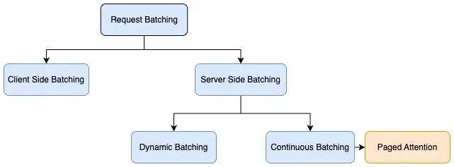

## 静态批处理 (Static Batching)

一个原始的 batching 方式如下图所示：

> 一个 batch 由 S1-4 这四个请求组成，这里上下文长度是 8，那四个请求一共分配 $4 \times 8 = 32$ 块内存， 

可以看到，序列3在第二次迭代后就完成了，但由于静态批处理的限制，GPU 需要等到所有序列都完成后才能继续处理。持续解码会让 latency 低一点，但显然会影响在线部署中的关键指标 TTFT 和吞吐量。

相比之下，动态批处理机制（也被称为持续批处理）作为动态批处理的一个特例，展现出更高的灵活性。

## 动态批处理（Continuous Batching）


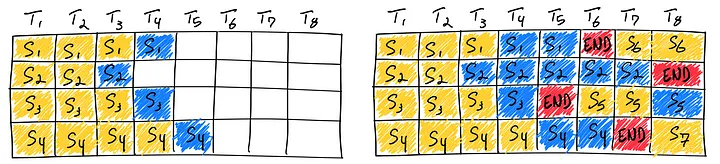

[Orca 论文](https://www.usenix.org/conference/osdi22/presentation/yu) 中采用迭代级调度而不是等待批处理中每个序列完成生成，其中批处理大小由每次迭代确定。这样的好处是，一旦批处理中的一个序列完成生成，就可以插入新序列以取代它，从而比静态分批实现更高的GPU利用率。

加州伯克利大学的 vLLM 项目便应用了该批处理框架，并采用 PagedAttention 技术高效管理 kv-cache ，使其推理效率相比 HuggingFace Transformers(基于 Static batching) 的实现提升了24倍。

## Chunked Prefill
> sarathi 论文

另一个思路就是让 prefill 和 decode 能在一个 batch 中一起做，通过增加计算量大的 prefill 的请求，来达到充分利用 GPU 算力的目的。

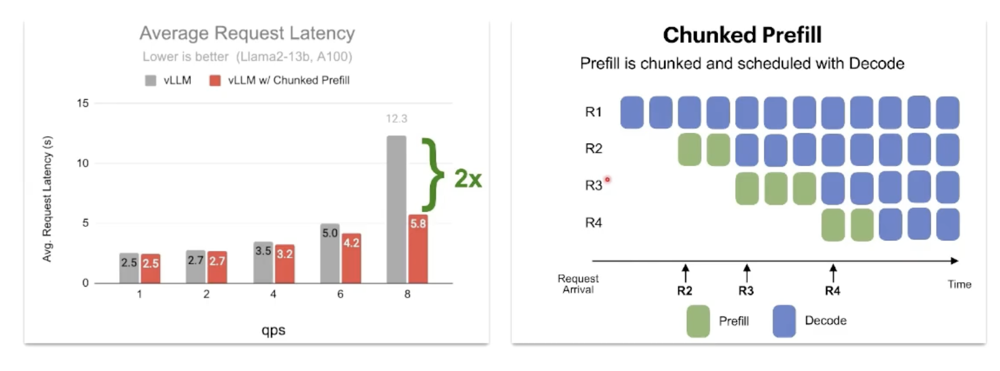

## 传统方式的内存浪费

那么传统部署系统中哪些低效问题呢？下面是传统部署系统中面对多个请求时内存分配的示意图：

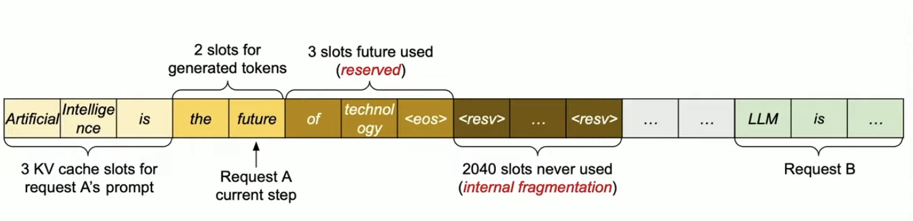

其中可以看到三种内存浪费：

- “内部碎片”（internal fragmentation）发生是因为难以预测生成过程的长度，因此内存被过度预留以应对最大序列长度。
- “预留”（reserved）表示为未来使用而预留的内存，这些内存在整个请求期间被保留。
- “外部碎片”（external fragmentation）表示由于批处理中的请求需要不同的预分配大小而导致的低效问题。

### 内存碎片化

内存碎片化（Memory Fragmentation）是指在内存分配过程中由于内存块的大小和使用方式不均匀，导致的内存浪费问题。

在实际应用中，为了应对模型支持的最大输入序列长度（例如 2,048），内存被过度预留。即使实际请求的大小可能远小于 2,048，系统依然会预留 2,048 的内存空间。这种预留的内存空间在整个请求的生命周期内被保留，导致内存浪费。特别是在高并发情况下，多个请求的内存需求可能变化较大，这种浪费和碎片化问题变得更加明显。

### 分页内存管理

而分页（Paging） 是操作系统的一种内存管理技术，可以有效减少内存碎片。

具体来说，分页技术将内存分成固定大小的块，称为“页”（pages）。这些页可以在需要时从磁盘加载到物理内存中，而不必一次性加载整个程序。这就像你需要看某个章节时，再从书架上拿下这本书。这样，操作系统能够更好地管理内存，**减少内存碎片**问题（碎片指的是内存中没有被充分利用的部分）。

### PagedAttention

这样的思想下，我们把前面所说的页称作块（block），把字节看作 token，把进程看作序列。
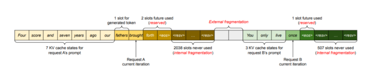


| Block | 内容                    | 状态                                        |
|-------|-----------------------|--------------------------------------------|
| Block 1 | Four, Score, and, Seven| 完整使用，无碎片                            |
| Block 2 | years, ago, our, <空闲>| 内部碎片化，最后一个槽位未使用                |
| Block 3 | you, only, live, <空闲> | 内部碎片化，最后一个槽位未使用                |
| Block 4 | <空闲>, <空闲>, <空闲>, <空闲>| 完全未使用，没有产生外部碎片              |

可以看到分页后，外部碎片被消除了，原先 2,038 + 507 的内部碎片只剩 1 + 1，内存浪费只会发生在最后一个块中，十分接近最优利用率（约损耗 4%）。
。


> 序列生成示例，每个块内部的数据是连续存储的，而通过块表的索引，不同的块又可以分散地存储在内存中。

总的来说，PagedAttention 的核心思想是将 KV Cache 分成固定大小的块，每个块可以存储固定数量的 token。这种分块策略不仅减少了内存碎片，还提高了内存利用率。

## vLLM

[https://github.com/vllm-project/vllm](https://github.com/vllm-project/vllm)

vLLM 从传统操作系统的概念如分页和虚拟内存中获得灵感，允许在预填充阶段计算的 KV 缓存在物理上非连续地存储，通过分配固定大小的“页面”或块来实现。然后可以重写注意力机制以操作块对齐的输入，允许在非连续的内存范围内执行注意力操作。

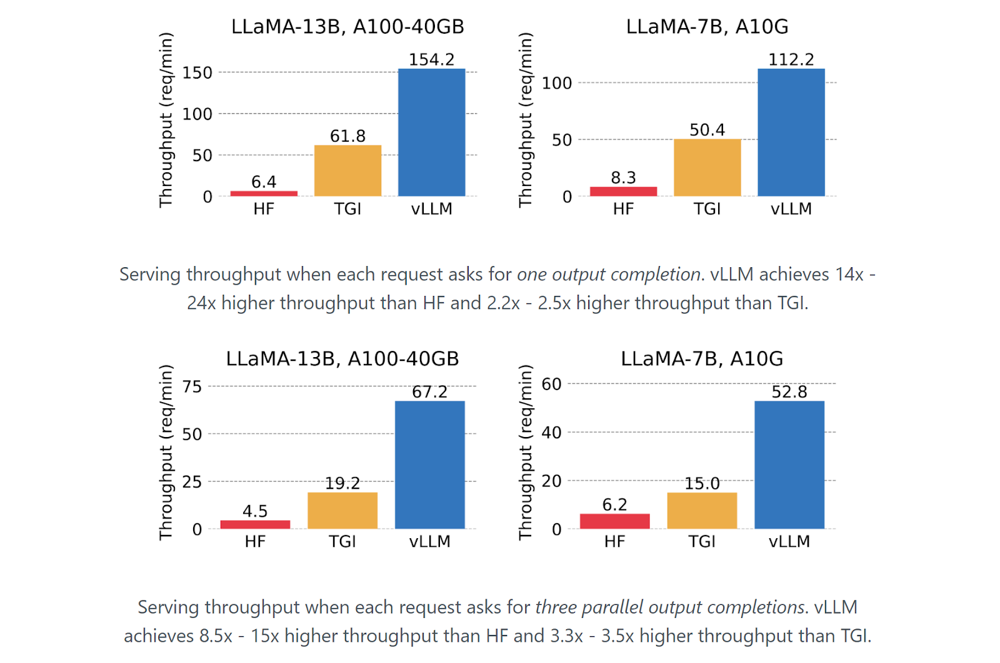

```python
from vllm import LLM, SamplingParams

def create_qwen_prompts(system_prompt: str, user_prompts: list[str]) -> list[str]:
    """为Qwen模型从用户提示列表创建格式化的提示"""
    prompts = []
    for user_prompt in user_prompts:
        prompt = f'''<|im_start|>system
{system_prompt}<|im_end|>
<|im_start|>user
{user_prompt}<|im_end|>
<|im_start|>assistant'''
        prompts.append(prompt)
    return prompts

# 提示词示例
system_prompt = "You are a helpful assistant."
user_prompts = [
    "What is the capital of France?", 
    "如何学习人工智能?",
    "今天天气怎么样?"
]
prompts = create_qwen_prompts(system_prompt, user_prompts)

# 创建采样参数对象
sampling_params = SamplingParams(
    temperature=0.9,    # 控制生成文本的随机性
    top_p=0.95,      # 控制采样时考虑的概率质量
    max_tokens=300,   # 生成文本的最大长度
)

llm = LLM(model="models/Qwen/Qwen2.5-0.5B-Instruct", trust_remote_code=True)

outputs = llm.generate(prompts, sampling_params)

for output in outputs:
    prompt = output.prompt
    generated_text = output.outputs[0].text
    print(f"Prompt: {prompt!r}, Generated text: {generated_text!r}")
```

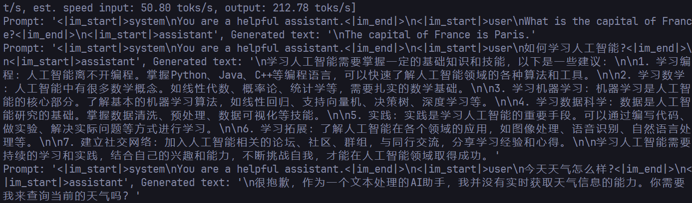

### 解码算法

vLLM 使用三种关键方法实现各种解码算法：

- fork：从现有序列创建一个新序列。

- append：向序列追加一个新令牌。

- free：删除序列。

#### Parallel Sampling

在像 ChatGPT 这样的对话助手应用中，有 LLM 为单一输入提示生成多个采样输出，允许用户选择他们偏好的输出的功能。当多个输出共享相同的输入提示时，vLLM 只为提示的 KV 缓存保留一个副本的空间。所有序列的提示的逻辑块被映射到相同的物理块。这允许共享提示的 KV 缓存只存储一次，节省了内存。

对于生成的输出，vLLM 在块级别使用写时复制机制。通过 fork 方法从单个输入序列创建多个输出序列，在每次迭代中使用 append 向这些序列添加新令牌，并使用 free 删除满足停止条件的序列。

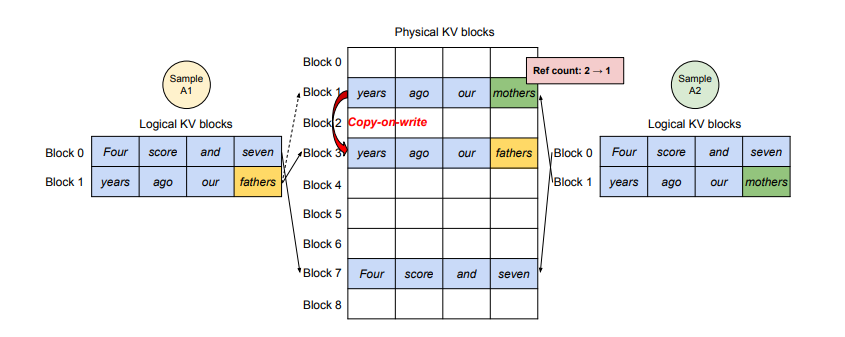

当序列需要修改一个共享块时，vLLM 创建一个新的物理块，从原始块复制数据，并更新该序列的映射。这确保了每个序列都拥有修改块的自己的副本，同时仍然共享未改变的块。

相同的策略应用于束搜索和前缀共享。

#### Beam Search

束搜索是一种解码算法，它在每一步保持一组最可能的前 k 个部分序列（候选者），它允许大型语言模型（LLM）探索多个高概率路径并找到最有可能的输出序列。

通过 PagedAttention，vLLM 不仅能够共享初始提示块的内存，还能在不同候选者之间共享其他块的内存。随着束搜索的进行，候选者共享公共块，并且只在必要时分歧。

vLLM 使用引用计数机制来跟踪每个物理块被多少候选者共享。当一个候选者被丢弃时，其块的引用计数会减少。当引用计数达到零时，相应的物理块被释放，并可以被重新用于其他候选者或序列。

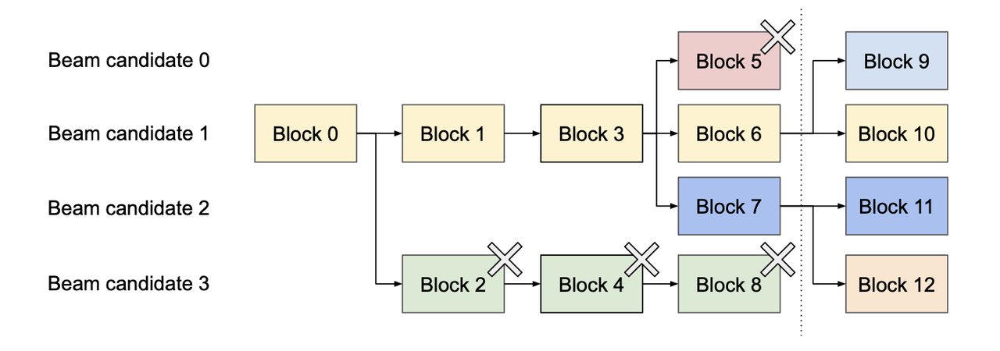

在束搜索的例子中，vLLM 使用引用计数机制有效地管理不同束候选者之间物理块的共享。
> 引用计数是一种内存管理技术，用于跟踪对特定资源的引用次数，在这里是物理块。当资源不再需要时，可以安全地释放它。类似 C++ 中的 `std::shared_ptr` 智能指针。

每个物理块都有一个相关的引用计数，代表当前引用它的逻辑块（即束候选者）的数量。当创建一个新的束候选者并与现有候选者共享一个物理块时，该物理块的引用计数增加。随着束搜索的进行，当候选者被丢弃（例如，在例子中的候选者 0 和 3），与这些候选者相关的物理块的引用计数被减少。当物理块的引用计数达到零时，意味着当前没有束候选者正在使用该块，它可以被安全地释放（例如，在例子中的块 2、4、5 和 8）。当新的候选者需要修改一个共享的物理块（例如，在生成新令牌时），vLLM 应用写时复制机制。它创建一个新的物理块，复制原始块的数据，并相应地更新引用计数。

引用计数机制允许 vLLM 高效地管理束候选者使用的内存，因为它使系统能够：

- 在可能的情况下在候选者之间共享物理块，减少内存使用。

- 跟踪物理块何时不再需要并可以被释放，防止内存泄漏。

- 实现写时复制机制，允许候选者修改共享块而不影响其他候选者，同时最小化所需的内存复制量。

#### Prefix Caching

前缀缓存是一种实验性的优化技术，通过缓存前缀的计算结果（预计算）来减少重复计算，从而加速生成过程。这种方法特别适用于需要生成长文本的场景

在某些场景（如机器翻译）中，多个输入提示可能共享一个常见的前缀，例如任务描述或示例：

> 你是一个精通中英翻译的专家，请你将下面的内容翻译为中文，风格为{目标风格}...

vLLM 允许 LLM API 服务提供商提前存储共享前缀的 KV 缓存，减少重复计算。

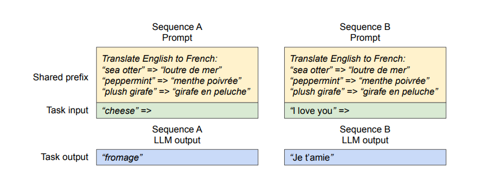

#### 混合解码

vLLM 的 PagedAttention 允许同时处理具有不同解码偏好的请求，包括但不限于上述介绍的几种算法。

这是通过一个共同的映射层实现的，该层将逻辑块转换为物理块。LLM 及其执行内核使用调度器提供的物理块 ID 工作，无需处理序列间复杂的内存共享模式。这种抽象使 vLLM 能够高效地批量处理具有不同解码需求的请求，提高了整体系统吞吐量。

#### 投机解码(Speculative Decoding)

使用投机解码可以加快生成文本的过程，而不会改变最终结果。推测解码涉及并行运行两个模型，这已被证明有望将语言模型推理的速度提高 2-3 倍。

自回归采样解码 k 个标记需要对模型进行 k 次串行运行,因此速度较慢.

投机解码通过并行运行两个模型:目标模型(真正用于生产的大模型)和近似模型(一个小很多的模型,甚至可以是 n-gram 模型)，以加速主 LLM 的推理过程。

在预测token 预测难度不同
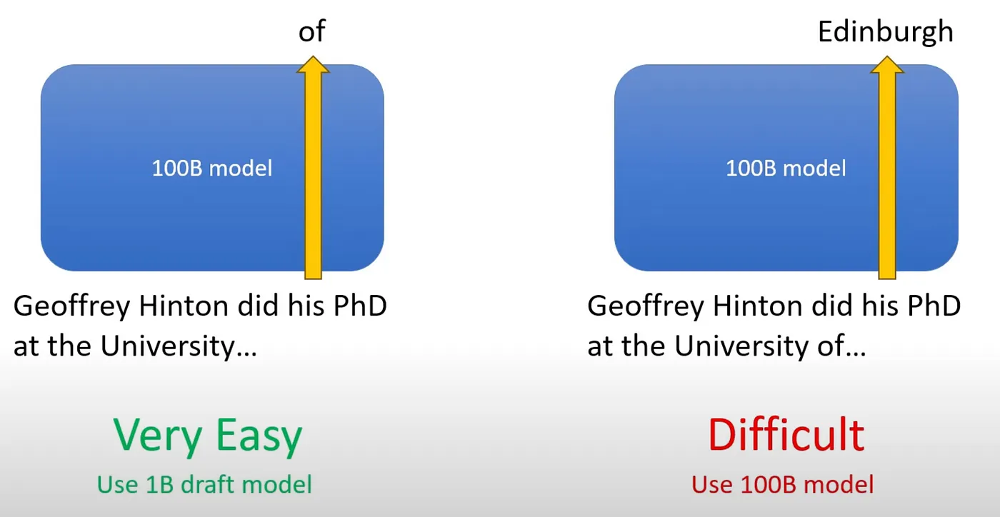

预测标记 'of ' 真的很容易，并且可以通过小得多的模型轻松预测，而标记 'Edinburg' 的预测相对来说很困难，而较小的模型可能无法预测

尽管 Transformer 一次生成一个 token，但可以一次处理多个 token。在生成下一个 token 时，模型可以一次检查序列中的所有 token, 通过计算序列中每个 token 的概率来实现此目的。在上图的例子中,假设较小的模型预测结果为 “Toronto”，但正确的单词是“Edinburgh”，较大的模型可以看到“Toronto”的概率很低，拒绝该采样后将其更正为“Edinburgh”。

除了 draft model，还可以使用更简单的 n-gram 来做投机解码：
```python
from vllm import LLM, SamplingParams

prompts = [
    "The future of AI is",
]
sampling_params = SamplingParams(temperature=0.8, top_p=0.95)

llm = LLM(
    model="facebook/opt-6.7b",
    tensor_parallel_size=1,
    # speculative_model="facebook/opt-125m", 使用 draft model
    speculative_model="[ngram]", # 使用 n-gram 模型
    num_speculative_tokens=5, # 预测 5 个 token
    ngram_prompt_lookup_max=4, # 使用前 4 个 token 来预测下一个 token
)
outputs = llm.generate(prompts, sampling_params)

for output in outputs:
    prompt = output.prompt
    generated_text = output.outputs[0].text
    print(f"Prompt: {prompt!r}, Generated text: {generated_text!r}")
```


## 参考文章

- [Mastering LLM Techniques: Inference Optimization](https://developer.nvidia.com/blog/mastering-llm-techniques-inference-optimization/)
- [vLLM: Easy, Fast, and Cheap LLM Serving with PagedAttention](https://blog.vllm.ai/2023/06/20/vllm.html)
- [Fast, Secure and Reliable: Enterprise-grade LLM Inference](https://www.databricks.com/blog/fast-secure-and-reliable-enterprise-grade-llm-inference)
- [猛猿：图解大模型计算加速系列：分离式推理架构2，模糊分离与合并边界的chunked-prefills](https://mp.weixin.qq.com/s/_nm2Fwz2FlkcLuXnWDB9PA)
